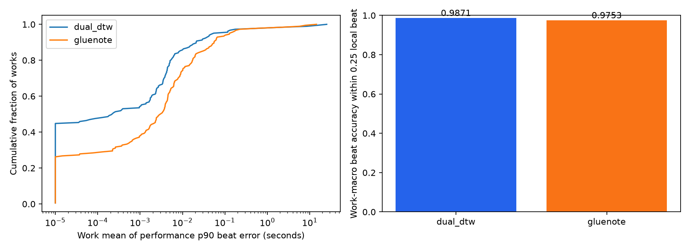

# ASAP: DualDTW와 TheGlueNote 정렬 비교

## 결과와 선택

선택한 정렬기: **dual_dtw**.

선택 근거: `work-macro beat accuracy paired CI < 0`. 이 선택은 이번 입력 형식·ASAP 관측 결과에 대한 선택이며 ATEPP에서의 우월성을 입증하지 않는다.

1차 지표인 0.25박 이내 beat 정확도는 DualDTW 98.707%, TheGlueNote 97.530%다. 선택한 방법의 note reference F1은 99.318%다.

**모든 지표에서 같은 방법이 우세한 것은 아니다.** 큰 오류의 영향을 받는 beat MAE는 gluenote가 더 낮다. 선택은 사전 고정한 0.25박 정확도와 paired CI에 따른 것이며, MAE와 큰 오차 사례도 함께 공개한다.

사용자의 요청에 따라 전수 비교를 중단하고, 두 방법의 결과가 모두 저장된 **836개 동일 연주 / 183개 작품**을 비교했다. 전체 평가 가능 corpus는 1036개 연주다. 한쪽 결과만 저장된 연주는 주 비교에서 제외하고 unpaired_observations.csv에 보존했다. 원본 1067개 중 31개는 aligned flag 등 입력 조건으로 평가 전 제외했다.

**부분 평가의 선택 편향:** 작곡가·작품명 순으로 실행하던 중 중단한 표본이다. 무작위·시대별 층화 표본이 아니며 뒤 순서의 작곡가/작품과 처리 시간이 긴 사례가 덜 포함될 수 있다. 따라서 아래 결과는 이번 관측 subset에서의 운영상 선택이며 ASAP 전체 또는 ATEPP 전체에 대한 우월성 판정이 아니다.

포함된 작곡가별 비교 연주 수:

| composer | performances | works |
| --- | --- | --- |
| Bach | 169 | 59 |
| Balakirev | 10 | 1 |
| Beethoven | 259 | 62 |
| Brahms | 1 | 1 |
| Chopin | 285 | 36 |
| Debussy | 3 | 2 |
| Glinka | 2 | 1 |
| Haydn | 44 | 12 |
| Liszt | 63 | 9 |

| 지표 | dual_dtw | gluenote |
| --- | --- | --- |
| 시도한 연주 | 836.00000 | 836.00000 |
| 완료한 연주 | 836.00000 | 836.00000 |
| 실행 실패 | 0.00000 | 0.00000 |
| 작품 수 | 183.00000 | 183.00000 |
| 0.25박 이내 beat 정확도 (작품 macro) | 0.98707 | 0.97530 |
| 100ms 이내 beat 정확도 (작품 macro) | 0.97985 | 0.96586 |
| Beat 평가 범위 coverage | 0.99992 | 0.99983 |
| Beat MAE (초, 성공/범위 안) | 0.08356 | 0.05924 |
| 연주별 beat p90의 중앙값 (초) | 0.00000 | 0.00130 |
| 1박 초과 오류 비율 (범위 안) | 0.00513 | 0.00867 |
| 정렬 runtime 중앙값 (초) | 1.65052 | 8.08152 |
| Note 평가 가능한 연주 | 494.00000 | 494.00000 |
| Note reference precision | 0.99442 | 0.98640 |
| Note reference recall | 0.99196 | 0.97932 |
| Note reference F1 (작품 macro) | 0.99318 | 0.98282 |
| 대응 note onset MAE (초, 비교 가능한 음) | 0.00198 | 0.00530 |
| 충돌로 제외한 pair 수 | 67.00000 | 124.00000 |
| 기존 quality gate 통과율 | 0.98565 | 0.97368 |

`beat_within_quarter`: **모든 유효 annotated beat 중 오차가 그 지점의 실제 다음 박 간격의 0.25배 이하인 비율**. 추정 범위 밖의 beat는 오답, 실행 실패한 연주는 0점으로 계산한다. 연주별 비율을 작품 안에서 평균한 뒤 작품별 동일 가중치로 평균한다.
`beat_within_100ms`도 같은 방식이다. MAE/p90은 추정 범위 안의 성공 사례에만 계산하므로 coverage·실패율과 함께 읽어야 한다. `beat_catastrophic_fraction`은 범위 안에서 1박 초과 오차의 비율이며 범위 밖은 coverage에 나타난다.
`note_f1`은 아래 조건을 만족한 note reference 부분집합의 작품별 평균이다. 초 단위 숫자는 seconds, 나머지 비율은 0~1이다.
Note onset MAE는 동일 reference score note에 모델이 연결한 performance note의 시작 시간과 reference performance note의 시작 시간 차이다. 미대응 음은 이 MAE에서 제외되므로 recall/F1과 함께 읽는다.



## 같은 작품에서의 차이와 불확실성

TheGlueNote − DualDTW, 0.25박 이내 beat 정확도: **-0.01177 (95% CI -0.01424 ~ -0.00924; 183개 작품)**.

TheGlueNote − DualDTW, 양쪽 모두 note 평가 가능한 동일 연주의 F1: **-0.01035 (95% CI -0.01371 ~ -0.00744; 116개 작품)**.

작품 단위 paired bootstrap 2,000회를 사용한다. beat 정확도를 사전 고정한 1차 기준으로 사용한다. 그 CI가 0을 포함하면 note F1의 paired CI를 2차로 사용한다. 둘 다 판별되지 않으면 runtime으로 운영상 선택하며 정확도 우월성을 주장하지 않는다. 작품별 runtime/실패/작곡가 차이는 CSV로 공개한다.

## 공정한 입력과 정렬 실행

- 두 방법에 **동일한 원본 score MIDI와 performance MIDI**에서 읽은 음높이·시작·길이를 제공했다.
- score 위치는 MIDI tick을 4분음표 단위로 바꿨다. score MIDI의 임의 재생 tempo를 표현 tempo로 사용하지 않았다. performance 시간은 초 단위다.
- 정답 beat, 정답 note pair, 정답 기반 anchor를 정렬기에 제공하지 않았다. 예측을 저장한 뒤 reference match 파일을 읽었다.
- 동일 score/performance note에 서로 다른 대응을 출력한 경우, 충돌한 edge를 **모두 제외**했다. 어떤 대응이 맞는지 임의로 고르거나 새로운 대응을 추가하지 않았다. 동일한 pair의 단순 중복은 한 번만 센다. 양쪽 정렬기에 동일하게 적용하며 제거 수는 `conflicting_prediction_pairs_removed`에 기록한다.
- MIDI에는 장식음/성부의 충분한 악보 주석이 없으므로 DualDTW의 `process_ornaments=False`를 사용했다. 이는 **ATEPP에서 사용 가능한 MIDI 입력 조건의 비교**이며, MusicXML 장식음 정보를 추가한 DualDTW 최적 설정의 비교가 아니다.
- 정렬기 출력 note pair로 동일한 tempo map을 구성했다: 같은 악보 onset의 연주 onset 중앙값 → 순증가하는 최장 부분열 → 선형 보간. 정렬기 차이와 후처리 차이가 섞이지 않도록 했다.
- beat 오차는 이 map을 원본 ASAP score beat 위치에서 평가하고 원본 performance beat 시간과 비교했다. `bR` 및 다음 박 간격이 양수가 아닌 위치는 제외했다. 범위 밖 외삽은 하지 않았다.
- 기존 ATEPP 품질 gate는 별도로 기록했다. **benchmark 점수는 gate 통과 여부로 필터링하지 않았다.** gate는 정렬 정확도의 정답 검증이 아니다.
- TheGlueNote는 Parangonar에 포함된 **small 공개 checkpoint**를 사용했다. medium/large checkpoint와 별도 재학습 모델은 이번 비교 대상이 아니다.
- TheGlueNote는 처음 PyTorch CPU로 평가하다가 Intel Iris Xe에서 **OpenVINO FP32**로 동일 network graph의 inference를 가속했다. 가중치/구조/DTW 후처리는 유지했고 FP16 압축·quantization을 하지 않았다. 변환 forward의 최대 절대 차이는 약 1e-5 이하, 평균 약 2e-9였으며 실제 짧은 4개 연주와 8천 음표 규모 1개 연주에서 native PyTorch와 **최종 note pair가 완전히 일치**했다. GPU와 CPU의 부동소수점 계산은 bit-exact 같다는 뜻은 아니다. backend별 기록은 `inference_backend`와 runtime_conditions.csv에 있다. native와 변환 경로를 모두 지원한다.
- 공개 구현의 0/1 pitch-membership 누적 비용 및 pitch별 scalar onset DTW에는 Python 이중 반복문이 있다. 같은 float64 거리식·전체 matrix·누적 재귀식을 Numba로 컴파일하고 원본 traceback을 유지해 가속했다. 1차원 Euclidean 거리는 같은 abs(x-y)로 계산했다. band/pruning/근사 정렬을 추가하지 않았다. 원본 matrix와의 완전 일치 테스트 및 기존 실제 MIDI 예측 pair와의 완전 일치 여부를 검증했다. 이전 예측이 있는 사례의 일치 결과는 `exact_kernel_previous_pairs_equal`이다. **양쪽 runtime은 이 가속 구현 기준**이며 원본 Python loop 속도로 일반화하지 않는다.
- per-file runtime에서 checkpoint 초기 로딩을 제외했다. 첫 호출의 JIT 비용이 남을 수 있으므로 중앙값을 보고했다. 메모리 경합 때문에 CPU worker 4/torch thread 2에서 worker 2/thread 4로 조정해 이어서 실행했다. resource 조건별 표는 [runtime_conditions.csv](runtime_conditions.csv)다. 전체 중앙값은 여러 자원 조건의 기술적 요약이며 통제된 hardware speed benchmark가 아니다. 정확도 선택을 우선하며 속도는 운영 참고치로 해석한다.

## Note reference와 ID 대응

원본 ASAP beat annotation을 독립적인 시간 reference로, 로컬 (n)ASAP `.match`의 note 대응을 note reference로 사용했다. (n)ASAP note reference는 자동 생성·검수 조건을 가진 데이터로 **모든 음표가 독립적으로 수작업 검증된 정답이라는 뜻은 아니다**.

서로 다른 파일의 note ID를 그대로 비교하지 않았다. score 쪽은 pitch·score onset으로, performance 쪽은 pitch·실제 onset으로 파일 내부 identity를 대응시켰다. score-only 좌표 변환(scale/offset)은 score 음표만 이용해 찾았으며 performance 정답 대응을 사용하지 않았다. tolerance는 score 0.002 quarter, performance 0.005초다. 같은 pitch/onset이 중복되어 identity가 모호하면 해당 음표를 제외했다.

`robust_note_alignment=true`, score identity 대응률 ≥95%, performance identity 대응률 ≥98%인 경우만 주 note 평가에 사용했다. 대응된 note domain 안에서 예측 pair와 reference pair의 집합 교집합으로 precision/recall/F1을 계산한다. 따라서 F1은 **평가 가능한 부분집합의 reference 일치도**이며 MIDI에 표현되지 않은 장식음 등을 포함한 전체 악보 정확도가 아니다. 대응률·좌표 변환과 평가 domain pair 수는 per_performance.csv에 남겼다.

| model | reference_score_mapping_median | reference_perf_mapping_median | eligible_note_performances |
| --- | --- | --- | --- |
| dual_dtw | 0.97225 | 1.00000 | 494 |
| gluenote | 0.97225 | 1.00000 | 494 |

## 해석의 한계

1. **TheGlueNote의 공개 학습 데이터에 (n)ASAP이 포함되어 있다.** 이번 결과는 완전히 독립적인 미학습 작품의 일반화 성능 평가가 아니다. ASAP를 학습 데이터에서 제거한 재학습을 수행하지 않았다.
2. note reference 역시 기존 알고리즘의 영향을 받는다. 동일 reference에 대한 F1이 실제 인간 판단의 우월성과 같다고 보지 않는다. 독립 beat 평가를 우선한 이유다.
3. ATEPP는 자동 전사 MIDI이므로 실제 건반 MIDI인 ASAP와 오류 분포가 다르다. ASAP에서 선택된 방법을 적용하되 ATEPP quality gate와 극단값 검증을 다시 수행해야 한다.
4. 정렬기가 누락음·잘못된 음의 대응을 추정할 수 있어도, 전사에서 잃은 velocity/note-off/pedal의 실제 연주 정보를 복원하는 것은 아니다.

## 큰 오차 사례

| key | model | beat_p90_seconds | beat_p90_relative | beat_coverage | accepted |
| --- | --- | --- | --- | --- | --- |
| Beethoven/Piano_Sonatas/26-3/Tysman01.mid | dual_dtw | 51.87570 | 13283.95020 | 1.00000 | False |
| Beethoven/Piano_Sonatas/32-1/FALIKS01_2004.mid | gluenote | 55.35585 | 12152.55958 | 1.00000 | False |
| Beethoven/Piano_Sonatas/18-2/Schmitt01.mid | dual_dtw | 50.52704 | 7218.11448 | 1.00000 | False |
| Beethoven/Piano_Sonatas/32-1/Faliks01.mid | gluenote | 14.20224 | 4282.68343 | 1.00000 | False |
| Beethoven/Piano_Sonatas/26-3/Huang02.mid | gluenote | 19.40493 | 3960.26964 | 1.00000 | False |
| Beethoven/Piano_Sonatas/32-1/POTAMO01.mid | gluenote | 54.12804 | 3156.01154 | 1.00000 | False |
| Beethoven/Piano_Sonatas/32-1/POTAMO01.mid | dual_dtw | 50.66721 | 2954.22299 | 1.00000 | False |
| Beethoven/Piano_Sonatas/32-1/Faliks01.mid | dual_dtw | 9.54459 | 2847.76026 | 1.00000 | False |
| Beethoven/Piano_Sonatas/32-1/Park01.mid | dual_dtw | 8.08145 | 2434.99956 | 1.00000 | False |
| Beethoven/Piano_Sonatas/18-2/Schmitt01.mid | gluenote | 15.69490 | 2246.23670 | 1.00000 | False |
| Beethoven/Piano_Sonatas/32-1/Park01.mid | gluenote | 6.54907 | 1974.61126 | 1.00000 | False |
| Beethoven/Piano_Sonatas/32-1/FALIKS01_2004.mid | dual_dtw | 8.76815 | 1920.49604 | 1.00000 | False |

전체 결과: [per_performance.csv](per_performance.csv), [작곡가별](by_composer.csv), [제외 목록](excluded_inputs.csv), [선택 결과](selection.json). 개별 예측과 beat 오차 배열은 predictions 폴더에 저장한다.

## 연구·공식 구현 출처

- [Parangonar 공식 구현](https://github.com/sildater/parangonar): DualDTWNoteMatcher / TheGlueNoteMatcher.
- [TheGlueNote 논문, Peter & Widmer, ISMIR 2024](https://arxiv.org/abs/2408.04309).
- [TheGlueNote 코드·공개 가중치·(n)ASAP 학습 안내](https://github.com/sildater/thegluenote).
- [Automatic Note-Level Score-to-Performance Alignments in the ASAP Dataset, 2023](https://carloscancinochacon.com/documents/peer_reviewed/PeterEtAl-TISMIR-2023.pdf).

## 재현

저장소 루트에서 실행:

```powershell
.venv/Scripts/python.exe classicfy-ai/scripts/benchmark_research_alignment.py --summarize-only --paired-only
.venv/Scripts/python.exe classicfy-ai/scripts/write_research_alignment_reports.py --benchmark-only
```

results.jsonl에 완료한 작업을 추가 저장하므로 중단 후 같은 명령으로 이어서 실행할 수 있다. 이전 실패도 보존하며, 수정한 설정을 비교하려면 별도의 output 경로를 사용한다.

이번처럼 저장된 paired subset만 비교하려면 benchmark에 `--summarize-only --paired-only`를 사용한다. reference를 다시 읽어 동일 평가 로직으로 갱신하려면 `--refresh-reference --paired-only`를 사용한다. 남은 ASAP inference를 실행하지 않고 ATEPP 단계로 넘어가는 runner 옵션은 `--skip-benchmark --paired-only`다.

이미 reference 오차가 저장된 이번 subset을 그대로 사용해 바로 다음 단계로 진행한 옵션은 `--skip-benchmark --skip-reference-refresh --paired-only`다. 정렬과 정답 오차를 다시 계산하지 않고 동일 paired subset을 집계한다.

환경: `{"parangonar": "3.3.3", "partitura": "1.9.0", "torch": "2.14.1", "numpy": "2.5.3"}`. NumPy에서 제거된 `row_stack` 이름을 동일 기능인 `vstack`에 연결한 호환 shim과 torch inference_mode를 사용했다. 알고리즘·가중치는 변경하지 않았다.

Intel 가속 재현 시 requirements-alignment-openvino.txt를 추가 설치하고 `probe_gluenote_acceleration.py`로 FP32 IR을 생성/검증한다. Intel GPU가 없는 환경은 `--glue-backend torch`를 사용한다. [OpenVINO 공식 precision 제어](https://docs.openvino.ai/2026/openvino-workflow/running-inference/optimize-inference/precision-control.html), [PyTorch graph 변환](https://docs.openvino.ai/2026/openvino-workflow/model-preparation/convert-model-to-ir.html).
