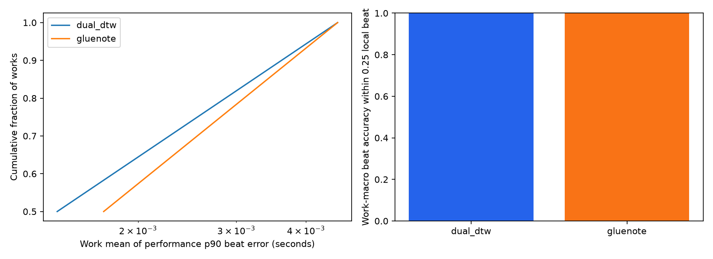

# ASAP: DualDTW와 TheGlueNote 정렬 비교

## 결과와 선택

선택한 정렬기: **dual_dtw**.

선택 근거: `accuracy comparison inconclusive; practical runtime tie-break, no accuracy superiority claim`. 이 선택은 이번 입력 형식·ASAP 관측 결과에 대한 선택이며 ATEPP에서의 우월성을 입증하지 않는다.

평가 대상은 ASAP의 `score_and_performance_aligned=true`인 **2개 연주**, 2개 악보/작품이다. 원본 33개 중 31개는 평가 전 제외했다. 전체 대상에 두 방법을 모두 시도했으며 실행 실패를 성공 데이터에서 몰래 제거하지 않았다.

| model | attempted | completed | failures | works | beat_within_quarter | beat_within_100ms | beat_coverage | beat_mae_seconds | median_performance_p90_seconds | beat_catastrophic_fraction | median_runtime_seconds | eligible_note_performances | note_f1 | accepted_fraction |
| --- | --- | --- | --- | --- | --- | --- | --- | --- | --- | --- | --- | --- | --- | --- |
| dual_dtw | 2 | 2 | 0 | 2 | 1.00000 | 1.00000 | 1.00000 | 0.00157 | 0.00300 | 0.00000 | 3.87624 | 2 | 0.99311 | 1.00000 |
| gluenote | 2 | 2 | 0 | 2 | 1.00000 | 1.00000 | 1.00000 | 0.00186 | 0.00315 | 0.00000 | 6.64993 | 2 | 0.99250 | 1.00000 |

`beat_within_quarter`: **모든 유효 annotated beat 중 오차가 그 지점의 실제 다음 박 간격의 0.25배 이하인 비율**. 추정 범위 밖의 beat는 오답, 실행 실패한 연주는 0점으로 계산한다. 연주별 비율을 작품 안에서 평균한 뒤 작품별 동일 가중치로 평균한다.
`beat_within_100ms`도 같은 방식이다. MAE/p90은 추정 범위 안의 성공 사례에만 계산하므로 coverage·실패율과 함께 읽어야 한다. `beat_catastrophic_fraction`은 범위 안에서 1박 초과 오차의 비율이며 범위 밖은 coverage에 나타난다.
`note_f1`은 아래 조건을 만족한 note reference 부분집합의 작품별 평균이다. 초 단위 숫자는 seconds, 나머지 비율은 0~1이다.



## 같은 작품에서의 차이와 불확실성

TheGlueNote − DualDTW, 0.25박 이내 beat 정확도: **0.00000 (95% CI 0.00000 ~ 0.00000; 2개 작품)**.

TheGlueNote − DualDTW, 양쪽 모두 note 평가 가능한 동일 연주의 F1: **-0.00061 (95% CI -0.00535 ~ 0.00413; 2개 작품)**.

작품 단위 paired bootstrap 2,000회를 사용한다. beat 정확도를 사전 고정한 1차 기준으로 사용한다. 그 CI가 0을 포함하면 note F1의 paired CI를 2차로 사용한다. 둘 다 판별되지 않으면 runtime으로 운영상 선택하며 정확도 우월성을 주장하지 않는다. 작품별 runtime/실패/작곡가 차이는 CSV로 공개한다.

## 공정한 입력과 정렬 실행

- 두 방법에 **동일한 원본 score MIDI와 performance MIDI**에서 읽은 음높이·시작·길이를 제공했다.
- score 위치는 MIDI tick을 4분음표 단위로 바꿨다. score MIDI의 임의 재생 tempo를 표현 tempo로 사용하지 않았다. performance 시간은 초 단위다.
- 정답 beat, 정답 note pair, 정답 기반 anchor를 정렬기에 제공하지 않았다. 예측을 저장한 뒤 reference match 파일을 읽었다.
- 동일 score/performance note에 서로 다른 대응을 출력한 경우, 충돌한 edge를 **모두 제외**했다. 어떤 대응이 맞는지 임의로 고르거나 새로운 대응을 추가하지 않았다. 동일한 pair의 단순 중복은 한 번만 센다. 양쪽 정렬기에 동일하게 적용하며 제거 수는 `conflicting_prediction_pairs_removed`에 기록한다.
- MIDI에는 장식음/성부의 충분한 악보 주석이 없으므로 DualDTW의 `process_ornaments=False`를 사용했다. 이는 **ATEPP에서 사용 가능한 MIDI 입력 조건의 비교**이며, MusicXML 장식음 정보를 추가한 DualDTW 최적 설정의 비교가 아니다.
- 정렬기 출력 note pair로 동일한 tempo map을 구성했다: 같은 악보 onset의 연주 onset 중앙값 → 순증가하는 최장 부분열 → 선형 보간. 정렬기 차이와 후처리 차이가 섞이지 않도록 했다.
- beat 오차는 이 map을 원본 ASAP score beat 위치에서 평가하고 원본 performance beat 시간과 비교했다. `bR` 및 다음 박 간격이 양수가 아닌 위치는 제외했다. 범위 밖 외삽은 하지 않았다.
- 기존 ATEPP 품질 gate는 별도로 기록했다. **benchmark 점수는 gate 통과 여부로 필터링하지 않았다.** gate는 정렬 정확도의 정답 검증이 아니다.
- TheGlueNote는 Parangonar에 포함된 **small 공개 checkpoint**를 사용했다. medium/large checkpoint와 별도 재학습 모델은 이번 비교 대상이 아니다.
- per-file runtime에서 checkpoint 초기 로딩을 제외했다. 첫 호출의 JIT 비용이 남을 수 있으므로 중앙값을 보고했다. CPU에서 각 torch thread 2개로 실행했다. 실제 worker 수와 실행 설정은 environment.json에 있다.

## Note reference와 ID 대응

원본 ASAP beat annotation을 독립적인 시간 reference로, 로컬 (n)ASAP `.match`의 note 대응을 note reference로 사용했다. (n)ASAP note reference는 자동 생성·검수 조건을 가진 데이터로 **모든 음표가 독립적으로 수작업 검증된 정답이라는 뜻은 아니다**.

서로 다른 파일의 note ID를 그대로 비교하지 않았다. score 쪽은 pitch·score onset으로, performance 쪽은 pitch·실제 onset으로 파일 내부 identity를 대응시켰다. score-only 좌표 변환(scale/offset)은 score 음표만 이용해 찾았으며 performance 정답 대응을 사용하지 않았다. tolerance는 score 0.002 quarter, performance 0.005초다. 같은 pitch/onset이 중복되어 identity가 모호하면 해당 음표를 제외했다.

`robust_note_alignment=true`, score identity 대응률 ≥95%, performance identity 대응률 ≥98%인 경우만 주 note 평가에 사용했다. 대응된 note domain 안에서 예측 pair와 reference pair의 집합 교집합으로 precision/recall/F1을 계산한다. 따라서 F1은 **평가 가능한 부분집합의 reference 일치도**이며 MIDI에 표현되지 않은 장식음 등을 포함한 전체 악보 정확도가 아니다. 대응률·좌표 변환과 평가 domain pair 수는 per_performance.csv에 남겼다.

| model | reference_score_mapping_median | reference_perf_mapping_median | eligible_note_performances |
| --- | --- | --- | --- |
| dual_dtw | 0.98235 | 1.00000 | 2 |
| gluenote | 0.98235 | 1.00000 | 2 |

## 해석의 한계

1. **TheGlueNote의 공개 학습 데이터에 (n)ASAP이 포함되어 있다.** 이번 결과는 완전히 독립적인 미학습 작품의 일반화 성능 평가가 아니다. ASAP를 학습 데이터에서 제거한 재학습을 수행하지 않았다.
2. note reference 역시 기존 알고리즘의 영향을 받는다. 동일 reference에 대한 F1이 실제 인간 판단의 우월성과 같다고 보지 않는다. 독립 beat 평가를 우선한 이유다.
3. ATEPP는 자동 전사 MIDI이므로 실제 건반 MIDI인 ASAP와 오류 분포가 다르다. ASAP에서 선택된 방법을 적용하되 ATEPP quality gate와 극단값 검증을 다시 수행해야 한다.
4. 정렬기가 누락음·잘못된 음의 대응을 추정할 수 있어도, 전사에서 잃은 velocity/note-off/pedal의 실제 연주 정보를 복원하는 것은 아니다.

## 큰 오차 사례

| key | model | beat_p90_seconds | beat_p90_relative | beat_coverage | accepted |
| --- | --- | --- | --- | --- | --- |
| Bach/Fugue/bwv_846/Shi05M.mid | dual_dtw | 0.00456 | 0.00368 | 1.00000 | True |
| Bach/Fugue/bwv_846/Shi05M.mid | gluenote | 0.00456 | 0.00368 | 1.00000 | True |
| Bach/Fugue/bwv_848/Denisova06M.mid | gluenote | 0.00174 | 0.00340 | 1.00000 | True |
| Bach/Fugue/bwv_848/Denisova06M.mid | dual_dtw | 0.00143 | 0.00261 | 1.00000 | True |

전체 결과: [per_performance.csv](per_performance.csv), [작곡가별](by_composer.csv), [제외 목록](excluded_inputs.csv), [선택 결과](selection.json). 개별 예측과 beat 오차 배열은 predictions 폴더에 저장한다.

## 연구·공식 구현 출처

- [Parangonar 공식 구현](https://github.com/sildater/parangonar): DualDTWNoteMatcher / TheGlueNoteMatcher.
- [TheGlueNote 논문, Peter & Widmer, ISMIR 2024](https://arxiv.org/abs/2408.04309).
- [TheGlueNote 코드·공개 가중치·(n)ASAP 학습 안내](https://github.com/sildater/thegluenote).
- [Automatic Note-Level Score-to-Performance Alignments in the ASAP Dataset, 2023](https://carloscancinochacon.com/documents/peer_reviewed/PeterEtAl-TISMIR-2023.pdf).

## 재현

저장소 루트에서 실행:

```powershell
.venv/Scripts/python.exe classicfy-ai/scripts/benchmark_research_alignment.py --workers 4
.venv/Scripts/python.exe classicfy-ai/scripts/write_research_alignment_reports.py --benchmark-only
```

results.jsonl에 완료한 작업을 추가 저장하므로 중단 후 같은 명령으로 이어서 실행할 수 있다. 이전 실패도 보존하며, 수정한 설정을 비교하려면 별도의 output 경로를 사용한다.

환경: `{"parangonar": "3.3.3", "partitura": "1.9.0", "torch": "2.14.1", "numpy": "2.5.3"}`. NumPy에서 제거된 `row_stack` 이름을 동일 기능인 `vstack`에 연결한 호환 shim과 torch inference_mode를 사용했다. 알고리즘·가중치는 변경하지 않았다.
