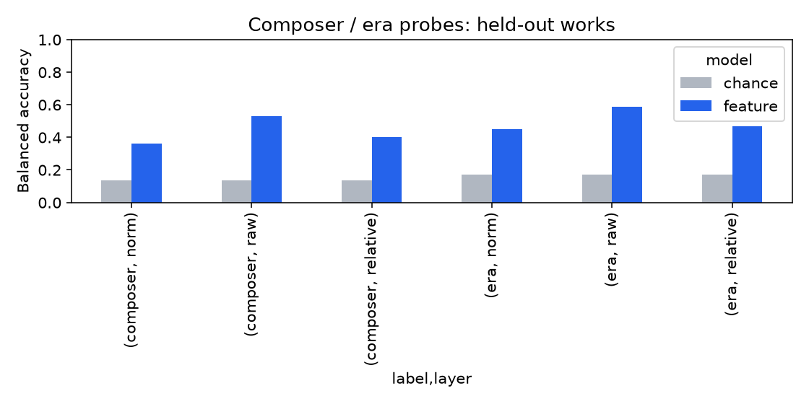
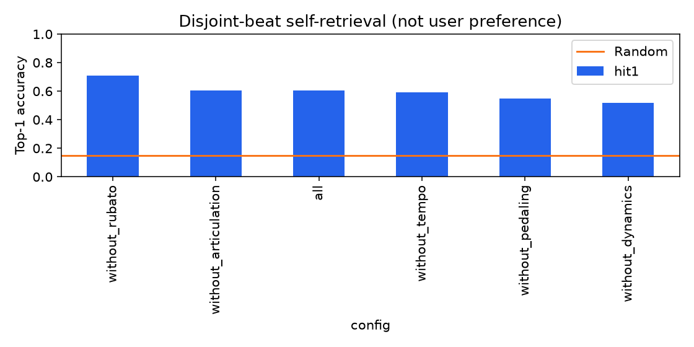

# ATEPP 확장 및 연주 취향 추천 피처 검증

작성일: 2026-10-06. 모든 수치는 이 폴더의 CSV/JSON에서 계산했다.

## 판정

**ATEPP 다운로드, 사용 가능한 악보-연주 쌍의 자동 정렬, 기존 5종 피처 추출·공통 패턴 제거·정규화와 검증을 완료했다.**
정규화 결과는 2,366개 연주 / 225개 작품 / 46명 연주자다.
다섯 음악 요소 중 Pedaling을 3개 지표로 나누므로 실제 배열은 `T × 7`이다.

**피처로 메타데이터와 다른 추천 순위를 생성하는 기준선은 구현됐다. 실제 사용자의 취향을 더 잘 맞춘다는 결론은 아직 검증할 수 없다.**
실제 좋아요/청취 선호 라벨이 없고, ATEPP MIDI와 새 정렬 모두 자동 추정 결과이기 때문이다.
같은 연주를 부분 관측으로 다시 찾는 결과는 표현의 구별·안정성 근거이며, 사용자 추천 정확도가 아니다.
작곡가·시대 효과, 잔여 정보, 극단값·구간 변화의 영향을 아래에서 수치로 공개한다.
주요 제한: 극단값 진단 제거 시 nearest Top1이 35.7% 바뀌었고,
Rubato를 빼면 부분 관측 재식별이 60.5%에서 70.6%로 개선됐다.
따라서 현재 다섯 요소를 무조건 동일 가중으로 사용하는 방식은 최적이라고 검증되지 않았다.

## 1. 전체 목적과 현재 단계

`AI_파트_업무_정리.pdf`의 목표는 작품의 특징을 외우는 모델보다 **연주 해석의 차이를 표현하는 모델**을 만드는 것이다.

`악보 + 연주 MIDI → 정렬 → Tempo/Rubato/Dynamics/Articulation/Pedaling → 공통 작품 패턴 제거 + mask/정규화 → Feature-only baseline → Encoder/Metric learning → 선호 연주 집계 → 동일 작품 후보 순위화 → 실제 선호 평가`

이번 작업은 ATEPP 전처리·피처 데이터와 Feature-only baseline, 데이터·표현 검증 단계까지다.
BiLSTM/Transformer/Contrastive encoder 학습이나 실제 사용자 실험은 수행하지 않았다.
PDF의 작품/연주자 분리, Leave-One-Favorite-Out, 외부 데이터 검증을 다음 모델 단계의 평가 기준으로 유지해야 한다.

## 2. 다운로드·데이터 선별

- 공식 ATEPP 1.2: https://github.com/tangjjbetsy/ATEPP
- 다운로드 안내: https://github.com/tangjjbetsy/ATEPP/blob/master/disclaimer.md
- 논문: https://archives.ismir.net/ismir2022/paper/000053.pdf
- 원본 ZIP, 공식 metadata, README/disclaimer는 `../ATEPP_dataset`에 보관했다.
- metadata 11,674행을 모두 검사했다. ZIP에 남아 있지만 공식 metadata에서 제외된 잔여 MIDI는 학습·통계에 추가하지 않았다.
- `low quality`, `background noise`, `corrupted`, `applause`는 보수적으로 제외했다. 빈 quality는 '검증된 고품질'이 아니라 별도 문제 표기가 없는 원본 행이다.
- metadata에 악보 경로가 없으면 악보 정렬을 만들어 낼 수 없으므로 연주 MIDI 품질검사만 수행한다.
- 일부 빠진 악보 MIDI를 원래 MusicXML에서 생성했다. 원본 음표 없는 악보 MIDI 복구 기록 1건은 `../ATEPP_dataset/score_repairs.csv`에 있다.
- 일부 MusicXML은 파싱 오류 때문에 복구할 수 없다. 해당 연주는 제외 사유에 남겼다.
- ZIP의 잘못된 Unicode flag와 Windows 파일명 제약은 경로 resolver로 처리한다. 연주 ID와 metadata 대응을 사용하며, 다른 악장을 이름이 비슷하다는 이유로 연결하지 않는다.

| 상태 | 연주 수 |
| --- | --- |
| no_score_midi | 5098 |
| excluded_quality | 2845 |
| aligned | 2389 |
| rejected_alignment | 1322 |
| invalid_score_midi | 20 |

정렬 통과라도 같은 작품/악보 구조에서 연주가 1개뿐이면 공통 패턴·정규화 대상에 넣지 않는다.
정규화 그룹·제외 기록은 `normalization_groups.csv`, metadata/정렬 검사 전수 결과는 `inventory.csv`, `midi_audit.csv`다.
정규화된 데이터는 25명 원본 작곡가 중 13명에 한정된다. 악보·정렬 선별로 생긴 표본 편향 때문에 모든 작곡가·시대로 결론을 일반화할 수 없다.

## 3. 기존 ASAP 계산을 어떻게 확장했는가

ATEPP는 작품별 분류 metadata와 악보를 제공하지만 ASAP의 정답 beat/note alignment를 제공하지 않는다.
새 adapter가 pitch-class DTW로 초벌 정렬하고, 같은 pitch의 중복 없는 note match를 통해 단조 tempo map을 추정한다.
score note recall ≥ 0.70, performance precision ≥ 0.60, score span ≥ 0.90, monotone anchor ratio ≥ 0.90,
note-count ratio 0.65~1.60, timing p90 ≤ 0.5 beat, 비정상 beat 폭 비율 ≤ 0.02를 요구한다.
이 기준은 실제 정렬 정답과의 정확도를 보장하지 않는 품질 휴리스틱이다.

시간축은 악보 quarter-note grid다. tempo map 밖은 외삽하지 않고, 같은 작품 연주들의 공통 겹침 범위만 비교한다.
각 연주의 보존 범위는 `performance_summary.csv`의 `retained_grid_fraction`에 기록했다.
Tempo의 악보 기준 시간은 quarter 당 0.5초(120 BPM)로 고정한다. 같은 위치의 공통값을 빼면 이 임의 기준은 상대 Tempo에서 소거된다.

기존 `features` 함수를 직접 재사용했다.

| 요소 | raw 정의 | 공통 패턴 제거 | 모델/거리 비교용 scale |
| --- | --- | --- | --- |
| Tempo | log2(score 구간 시간 / 연주 구간 시간) | 같은 작품·위치의 중앙값 | MAD → IQR → SD fallback |
| Rubato | Tempo에서 연주 자체의 전체 중앙값 제거 | 같은 작품·위치의 중앙값 | MAD → IQR → SD fallback |
| Dynamics | beat에서 시작한 음들의 평균 velocity / 127 | 같은 작품·위치의 중앙값 | 기존 정책 MAD |
| Articulation | note 실제 길이 / local tempo로 환산한 악보 음가의 log2, beat 중앙값 | 같은 작품·위치의 중앙값 | 기존 정책 MAD |
| Pedal depth/down ratio/changes | 시간 가중 CC64 깊이 / on 비율 / 전환 수 | 각 채널별 같은 작품·위치 중앙값 | 기존 정책 SD |

`relative = raw - common`, `normalized = relative / scale`이다. residual을 다시 center하지 않으며 clipping/winsorization은 없다.
페달 3개 채널이 각각 1표씩 더해지는 대신 **Pedaling 묶음 전체가 1개 음악 요소의 가중치**를 갖도록 baseline 거리를 구성했다.

주의: ATEPP는 자동 오디오 전사라 velocity/offset/CC64가 센서 MIDI와 같은 신뢰도를 갖지 않는다.
특히 score MIDI만으로는 MusicXML의 모든 ornament/grace 속성을 복원할 수 없어 Articulation에 장식음 영향이 남을 수 있다.
CC64 채널이 없으면 ATEPP에서는 페달 미사용을 확정하지 않고 해당 피처를 결측 mask로 둔다.

## 4. 자동 정렬의 독립 검증

ASAP의 서로 다른 40개 작품을 고정 seed로 선택해, 새 자동 정렬을 정답 beat annotation과 비교했다.
품질 기준 통과 33개에서 각 곡의 90% beat timing error / 그 곡의 median annotated beat duration을 계산했다.

- 곡별 p90 상대 오차의 중앙값: 0.1516 beat
- 곡별 p90 상대 오차의 최댓값: 1.0495 beat
- p90 오차 < 0.25 annotated beat인 통과곡: 21/33

**자동 품질 gate를 통과해도 큰 beat 오차가 남은 곡이 있다. ATEPP 결과를 정답 정렬 데이터로 간주하지 않는다.**
이 표본은 ASAP 센서 MIDI이므로 ATEPP 자동 전사에서의 정확도를 직접 증명하지도 않는다.
`alignment_calibration_asap.csv`에 전체 곡/오차/quality 지표가 있다. 다음 단계에서 대표 ATEPP 곡의 수동 note/beat 정렬 검토가 필요하다.

## 5. 예외값·결측·극단값 검증

- 정상 파싱된 MIDI에서 범위를 벗어난 note: 0개, pedal event: 0개.
- 정규화 NPZ 전체의 shape/channel/grid/mask/finite 검증에서 잘못된 피처 항목: **0건**.
- `mask=True` 값은 유한하며, `mask=False` 값은 NaN이다. 결측값은 오류가 아니라 계산 불가능한 관측이다.
- raw Dynamics/Pedal 범위 [0,1], pedal 전환 수의 음수/비정수도 검사했다.
- metadata 중복 ID 0개. 정확히 같은 MIDI SHA256 중복 행 4개는 통계/추천 실험에서 제외했다.
- NaN을 0으로 바꾸거나 극단값을 자동 삭제하지 않았다. 원시값·상대값·정규화값을 함께 보관했다.

| channel | valid_cells | missing_cells | abs_gt_6 | abs_gt_10 | max_abs |
| --- | --- | --- | --- | --- | --- |
| articulation | 1295017 | 111949 | 21170 | 6550 | 158.9327 |
| dynamics | 1310453 | 96513 | 2780 | 957 | 54.3340 |
| pedal_changes | 1406966 | 0 | 1568 | 354 | 42.4336 |
| pedal_depth | 1406966 | 0 | 536 | 1 | 10.4599 |
| pedal_down_ratio | 1406966 | 0 | 129 | 0 | 8.9048 |
| rubato | 1405476 | 1490 | 51696 | 19530 | 1546.0701 |
| tempo | 1405476 | 1490 | 25906 | 9886 | 1812.6819 |

`|normalized| > 6`과 `> 10`은 분포 검토용 플래그다. 정규화된 값의 정의역은 [-1,1]이 아니므로 이것만으로 입력 오류라고 판단할 수 없다.
작품별 scale이 작거나, 장식음/정렬/전사 오류 또는 실제 표현 차이가 크면 극단값이 생긴다.
`feature_quality.csv`, `scales.csv`, `invalid_feature_values.csv`로 연주 ID까지 추적할 수 있다.
`max |x|>20` 또는 `|x|>6` 구간 비율이 2%를 넘는 경우를 **검토용**으로 표시했다.
해당 조건은 1752개 연주의 3021개 채널 행에 해당한다.
`feature_review_queue.csv`, `extreme_beat_examples.csv`에 연주 ID·악보 quarter 위치·raw/relative/normalized/scale을 제공한다.
이 플래그는 손상 데이터의 확정 판정이 아니며, 정규화값이 유한하다는 사실만으로 바로 학습·추천에 적합하다고 판단해서는 안 된다.

## 6. 공통 요소를 제거한 뒤 남는 연주 차이

raw 차이를 공통 중앙값 제거 후에도 보존하는지 각 그룹의 anchor 연주와 모든 다른 연주를 비교했다.
최대 pair difference 오차: 1.78e-15. 공통값 제거는 같은 곡 안의 두 연주 차이를 없애지 않는다.

| channel | layer | total_variance | within_work_variance | within_fraction |
| --- | --- | --- | --- | --- |
| tempo | raw | 0.4823 | 0.0168 | 0.0348 |
| tempo | relative | 0.0172 | 0.0168 | 0.9766 |
| tempo | norm | 3.2140 | 2.5740 | 0.8008 |
| rubato | raw | 0.0030 | 0.0008 | 0.2687 |
| rubato | relative | 0.0009 | 0.0008 | 0.8904 |
| rubato | norm | 0.2910 | 0.2066 | 0.7099 |
| dynamics | raw | 0.0053 | 0.0014 | 0.2654 |
| dynamics | relative | 0.0014 | 0.0014 | 0.9922 |
| dynamics | norm | 0.4588 | 0.4490 | 0.9787 |
| articulation | raw | 0.2313 | 0.0217 | 0.0938 |
| articulation | relative | 0.0225 | 0.0216 | 0.9591 |
| articulation | norm | 0.2456 | 0.2308 | 0.9400 |
| pedal_depth | raw | 0.0102 | 0.0025 | 0.2400 |
| pedal_depth | relative | 0.0026 | 0.0025 | 0.9481 |
| pedal_depth | norm | 0.1438 | 0.1380 | 0.9598 |
| pedal_down_ratio | raw | 0.0561 | 0.0125 | 0.2224 |
| pedal_down_ratio | relative | 0.0175 | 0.0125 | 0.7138 |
| pedal_down_ratio | norm | 0.1475 | 0.1015 | 0.6882 |
| pedal_changes | raw | 1.7207 | 0.2504 | 0.1455 |
| pedal_changes | relative | 0.2713 | 0.2504 | 0.9229 |
| pedal_changes | norm | 0.0648 | 0.0585 | 0.9017 |

`within_fraction`은 연주 요약값의 전체 분산 중 같은 작품 내부 분산 비중이다.
정규화가 작품 정보 전부를 제거하는 것은 아니다. temporal shape, 장식음, 악보 구조, 곡별 후보 분포 등의 잔여 요인이 남는다.
같은 곡 예시:

| composition_id | track | slow_perf | fast_perf | slow_artist | fast_artist | tempo_residual_gap |
| --- | --- | --- | --- | --- | --- | --- |
| 1067 | Keyboard Sonata in C Major, Hob.XVI:48: I. Andante con espressione | 04932 | 04936 | Vladimir Horowitz | Emanuel Ax | 1.9949 |
| 1068 | Piano Sonata in C Major, Hob.XVI: 48: 2. Rondo (Presto) | 04942 | 04941 | Alfred Brendel | Glenn Gould | 2.4433 |
| 1113 | Piano Sonata No. 18 in D, K.576: 3. Allegretto | 05175 | 05189 | Daniel Barenboim | Friedrich Gulda | 2.1601 |
| 1115 | Piano Sonata No. 18 in D, K.576: 1. Allegro | 05181 | 05170 | Claudio Arrau | Martha Argerich | 1.8153 |
| 1116 | Piano Sonata No.12 in F, K.332: 3. Allegro assai | 05237 | 05276 | Alfred Brendel | Robert Casadesus | 1.7359 |

`within_work_distances.csv`에 같은 작품의 nearest/median/furthest feature 거리,
`pair_difference_preservation.csv`에 차이 보존 검사를 제공한다.
거리 단위는 음악 요소별 요약값의 mean-square distance를 동일 가중으로 집계한 상대 단위이며, 지각상의 '얼마나 다른가' 정답 척도가 아니다.

## 7. 작곡가·시대 정보가 얼마나 남는가

작곡가/시대 예측은 같은 작품을 train/test에 함께 넣지 않는 5-fold `StratifiedGroupKFold`를 사용했다.
최소 5개 작품이 있는 label만 검사했다. 요약값의 imputation과 RobustScaler, classifier는 fold의 train에만 fit한다.
다만 입력 residual/normalized는 각 작품의 원래 후보 pool 전체로 만든 **transductive 표현 진단**이므로 새 연주에 대한 완전한 inductive 검증이 아니다.
balanced accuracy는 클래스별 recall 평균이며, `chance`는 label 비율을 따르는 무작위 분류 기준이다.

| label | layer | model | mean | std |
| --- | --- | --- | --- | --- |
| composer | norm | chance | 0.1353 | 0.0213 |
| composer | norm | feature | 0.3627 | 0.0237 |
| composer | raw | chance | 0.1353 | 0.0213 |
| composer | raw | feature | 0.5316 | 0.1207 |
| composer | relative | chance | 0.1353 | 0.0213 |
| composer | relative | feature | 0.3995 | 0.0999 |
| era | norm | chance | 0.1722 | 0.0209 |
| era | norm | feature | 0.4500 | 0.0272 |
| era | raw | chance | 0.1722 | 0.0209 |
| era | raw | feature | 0.5852 | 0.0687 |
| era | relative | chance | 0.1722 | 0.0209 |
| era | relative | feature | 0.4697 | 0.0720 |

시대는 **작곡가 단위의 거친 분류**다. Beethoven은 Classical/Romantic 전환기로 구분했고,
Rachmaninoff/Scriabin은 Late Romantic, Debussy/Ravel은 Impressionist로 표시했다.
곡별 작곡 연도가 확인된 시대 정답이 아니며 같은 작곡가의 모든 곡이 같은 시대 특성을 갖는다고 단정할 수 없다.

추가로 작품별 요약 평균을 독립 단위로 삼아 시대/작곡가의 eta-squared와 499회 label permutation p값,
다중 검정 보정 BH q값을 계산했다. `metadata_effect_sizes.csv`, `era_composer_feature_comparison.csv`를 확인한다.

| label | layer | mean_eta_squared | max_eta_squared | significant_coordinates |
| --- | --- | --- | --- | --- |
| composer | norm | 0.1429 | 0.3538 | 10 |
| composer | raw | 0.3278 | 0.6788 | 12 |
| composer | relative | 0.2437 | 0.4691 | 12 |
| era | norm | 0.1304 | 0.3540 | 12 |
| era | raw | 0.3088 | 0.6335 | 13 |
| era | relative | 0.2307 | 0.4518 | 12 |

eta-squared는 해당 metadata가 설명하는 작품별 요약값의 분산 비율이다. `significant_coordinates`는 14개 요약 좌표 중 BH q<0.05 개수다.
통계적 차이와 실제 청취 선호의 차이는 별개다. 시대/작곡가별 signed mean·작품 간 SD·피처 변화 폭은 `era_composer_feature_comparison.csv`에 모두 제공한다.



## 8. 메타데이터 순위와 해석 피처 순위의 차이

**같은 작품의 후보 연주는 작곡가·시대 metadata가 같으므로 그 정보만으로는 모두 동점이다.**
피처 기반 순위는 후보마다 다른 거리를 생성한다. 이 차이의 존재 자체는 추천 성능의 우월성을 증명하지 않는다.
artist metadata까지 쓰면 특정 연주자 선호로 후보를 구분할 수 있으므로, 연주자 기준도 별도로 비교했다.

다른 작품 후보에서 feature Top-10 이웃의 metadata 동질성을 검사했다.

| 메타데이터 | 피처_이웃_동일비율 | 전체후보_동일비율 | 순위_상관 |
| --- | --- | --- | --- |
| artist | 0.1300 | 0.0626 | 0.0250 |
| composer | 0.3842 | 0.2929 | 0.0803 |
| era | 0.4067 | 0.3074 | 0.0789 |

`피처_이웃_동일비율`이 `전체후보_동일비율`보다 높으면 피처에 해당 metadata 편향이 남는다는 근거다.
이웃이 다른 시대/작곡가를 섞는다고 해서 곧바로 취향에 잘 맞는다는 뜻도 아니다.

## 9. 표현의 구별력·안정성·Feature ablation

같은 작품의 후보 전체에서 **7개 채널이 모두 유효한 공통 beat**를 선택했다.
공통 beat ≥ 32개, 원래 grid 대비 ≥25%인 그룹만 검사해 mask/결측 패턴으로 정체성을 맞추는 효과를 줄였다.
동일한 공통 beat를 모든 후보에 사용하고, 겹치지 않는 무작위 50%/50% beat로 query/gallery를 구성했다.
동점은 랜덤 순서의 기대 Top1/MRR로 계산했다. 95% CI는 곡 단위 1,000회 bootstrap이다.
한 고정 beat split의 bootstrap이며 다양한 split seed의 불확실성 전부를 나타내지는 않는다.

| 구성 | Top1 | CI_low | CI_high | works | MRR |
| --- | --- | --- | --- | --- | --- |
| all | 0.6048 | 0.5735 | 0.6377 | 192 | 0.7427 |
| without_articulation | 0.6055 | 0.5742 | 0.6375 | 192 | 0.7397 |
| without_dynamics | 0.5189 | 0.4860 | 0.5516 | 192 | 0.6795 |
| without_pedaling | 0.5456 | 0.5131 | 0.5774 | 192 | 0.6983 |
| without_rubato | 0.7060 | 0.6795 | 0.7301 | 192 | 0.8206 |
| without_tempo | 0.5930 | 0.5627 | 0.6213 | 192 | 0.7340 |

전체 피처에서 곡 균등 random Top1 기준: 0.1473.
**여기서 Top1은 '같은 녹음을 다른 구간 표본에서 다시 찾는 비율'이며, 사용자 추천 HitRate가 아니다.**
Rubato 제외 시 Top1이 70.6%로 증가했다. 이 요약/정렬 조건에서 Rubato가 잡음 또는 불안정성을 추가할 수 있다는 근거다.
`paired_ablation_comparisons.csv`에 동일 query·작품 단위의 paired 비교가 있다.
이 관찰만으로 실제 사용자의 Rubato 선호가 중요하지 않다고 판단하지는 않는다.



다른 검증은 다음과 같다.

| 검증 | 지표 | 값 | CI_low | CI_high | works |
| --- | --- | --- | --- | --- | --- |
| section_retrieval | hit1 | 0.3928 | 0.3624 | 0.4249 | 192 |
| section_retrieval | mrr | 0.5690 | 0.5435 | 0.5958 | 192 |
| section_retrieval | chance_hit1 | 0.1473 | 0.1329 | 0.1622 | 192 |
| outlier_sensitivity | rank_spearman | 0.7343 | 0.6937 | 0.7703 | 162 |
| outlier_sensitivity | top1_unchanged | 0.6435 | 0.6069 | 0.6791 | 162 |
| profile_20pct_dropout | rank_spearman | 0.9811 | 0.9770 | 0.9849 | 192 |
| profile_20pct_dropout | top1_unchanged | 0.9132 | 0.8896 | 0.9337 | 192 |

- `section_retrieval`: 실제 곡 전반부 vs 후반부. 무작위 구간보다 낮으면 전체 해석을 평균/범위만으로 표현하는 데 한계가 있다.
- `profile_20pct_dropout`: 다른 작품의 선호 프로필에서 beat 20%를 빼고 같은 작품 후보 순위가 유지되는지 확인.
- `outlier_sensitivity`: 표준화값 |x|>6을 **진단용으로만** 제거해 nearest 추천 순위 변화를 검사. 원본 저장값은 변경하지 않는다.
- `feature_redundancy.csv`: 채널 간 Spearman 상관. 높은 상관 채널을 독립 선호축으로 중복 가중하면 안 된다.

## 10. 다른 작품으로 선호를 옮기는 proxy 실험

같은 artist의 다른 작품 3~5개를 가상 선호 목록으로 사용하고, 목표 작품에서 그 artist의 연주를 찾았다.
profile에 목표 작품을 포함하지 않았다. 이는 **연주자 스타일의 일관성 proxy**이며 실제 사용자의 좋아요 라벨이 아니다.
artist를 기억하는 metadata baseline이 유리한 과제라는 점을 공개하기 위해 artist 기준을 함께 넣었다.

| 기준 | Top1 | MRR | NDCG | works |
| --- | --- | --- | --- | --- |
| artist_metadata | 0.6757 | 0.8151 | 0.8622 | 192 |
| composer_era_metadata | 0.1473 | 0.3480 | 0.4950 | 192 |
| feature | 0.1746 | 0.3714 | 0.5137 | 192 |

이 결과만으로 Unseen Performer 추천 성능을 말할 수 없다.
작곡가·시대 동점 기준보다 Feature proxy Top1 개선은 약 2.7%p인 반면, artist metadata 기준이 훨씬 높았다.
`paired_proxy_comparisons.csv`와 JSON의 paired bootstrap CI로 차이의 크기를 확인할 수 있다.
같은 artist가 항상 같은 해석을 하거나 사용자가 항상 같은 artist를 선호한다는 가정은 실제 추천 정답이 아니다.
`cross_work_performer_proxy.csv`, `ranking_examples.csv`가 전체 사례다.

## 11. 데이터·추천 기준선 사용

`../ATEPP_dataset/features/raw/<perf_id>.npz`에는 자동 정렬과 raw D/P/A,
`../ATEPP_dataset/features/normalized/<perf_id>.npz`에는 아래 배열이 있다.

```python
channels = ['tempo','rubato','dynamics','articulation','pedal_depth','pedal_down_ratio','pedal_changes']
score_beats  # (T+1,) quarter-note positions
raw          # (T,7)
relative     # (T,7), common pattern removed
normalized   # (T,7), per-work/channel denominator
mask         # (T,7), bool
```

학습/추천 inventory는 `performance_summary.csv`다. 모든 원본 파일을 같은 score-pair 학습 데이터로 취급하지 않는다.
학습 전에 `mask`를 유지하며 결측 입력을 모델에서 처리하고, padding 역시 별도 mask로 처리해야 한다.

재현 명령(저장소 루트, Windows):

```powershell
./.venv/Scripts/python.exe -m pip install -r requirements-atepp.txt
./.venv/Scripts/python.exe classicfy-ai/scripts/extend_atepp.py --workers 6
./.venv/Scripts/python.exe classicfy-ai/scripts/calibrate_atepp_alignment.py
./.venv/Scripts/python.exe classicfy-ai/scripts/validate_atepp_recommendation.py
./.venv/Scripts/python.exe classicfy-ai/scripts/write_atepp_report.py
```

좋아하는 연주 ID를 주면 실제 Feature-only 후보 순위를 생성할 수 있다.

```powershell
./.venv/Scripts/python.exe classicfy-ai/scripts/recommend_atepp.py --favorites <ID1> <ID2> --work <composition_id> --output classicfy-ai/analysis/atepp/my_ranking.csv
```

다섯 음악 요소를 동일 가중으로 비교하며 요약 벡터는 14차원(각 채널의 평균/범위, Rubato 첫 좌표는 절대편차 중앙값)이다.
이 baseline은 결과 설명용 요소별 거리도 반환한다.

## 12. 최종 활용 판단과 다음 실험 기준

1. **동일 작품 안에서 해석 차이를 구분하고 설명 가능한 추천 순위를 만드는 실험용 피처로 활용 가능하다.** 수치 무결성과 pair 차이 보존·부분 관측 구별력을 확인했다. 극단값 민감도와 자동 정렬 실패 사례 때문에 현재 그대로 최종 학습/서비스 데이터로 승인하지는 않는다.
2. **작품·시대·작곡가 정보가 완전히 사라진 표현은 아니다.** raw/relative/normalized의 예측·분산 결과로 잔여 정보를 확인하고 모델 leakage probe를 계속해야 한다.
3. **실제 사용자 취향 추천 성능의 검증은 미완료다.** 실제 favorite/listening 비교 라벨로 Leave-One-Favorite-Out의 HR@K/MRR/NDCG를 metadata/feature/encoder와 비교해야 한다.
4. 현재 작품별 common/scale은 비교 후보 전체로 fit한 descriptive/transductive 값이다. 사용자/평가 query를 추가할 때 재fit해서 평가 정보가 섞이지 않도록 frozen reference cohort를 정해야 한다.
5. 새 작품 평가에서는 작품 전체를 분리하고, 새 연주자 평가에서는 artist도 분리해야 한다. 반복/동일 녹음/앨범과 ASAP-ATEPP 작품 중복을 함께 관리해야 한다.
6. 자동 정렬·전사 오차가 큰 채널과 대표 극단값은 수동 검토 후 encoder 학습 데이터에 넣는 편이 타당하다. ASAP와 ATEPP를 합칠 때 dataset domain leakage를 별도 검사해야 한다.

기존 ASAP 코드/분석 결과는 보존했다. 확장 adapter와 ATEPP 산출물을 별도로 추가했다.
테스트: 실제 ASAP/nASAP를 연결한 기존+신규 150개 테스트 통과. 원본/코드 hash와 환경 provenance는 `provenance.json`에 있다.
