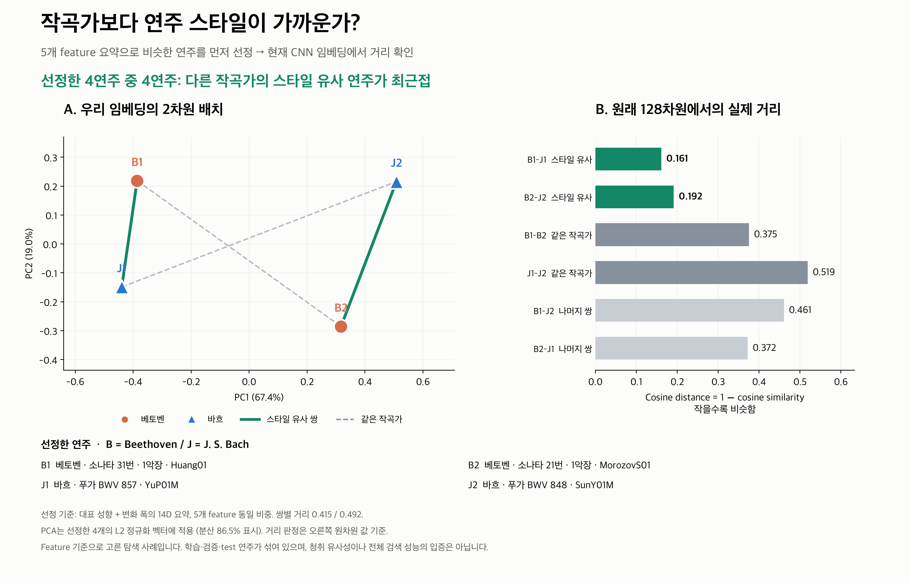

# 작곡가와 연주 스타일: 실제 네 연주의 CNN 배치

선정한 네 연주 중 **4/4**가 같은 작곡가보다 다른 작곡가의 스타일 유사 파트너에 가깝다.



[발표용 PDF](composer_vs_style.pdf)

| ID | 실제 연주 키 | 모델 split |
|---|---|---|
| B1 | `Beethoven/Piano_Sonatas/31-1/Huang01.mid` | validation |
| J1 | `Bach/Fugue/bwv_857/YuP01M.mid` | train |
| B2 | `Beethoven/Piano_Sonatas/21-1_no_repeat/MorozovS01.mid` | test |
| J2 | `Bach/Fugue/bwv_848/SunY01M.mid` | train |

## 선정과 해석

베토벤 132연주·바흐 82연주, cross-composer 10824쌍에서
기존 작품 공통 제거/표준화된 feature 요약 거리가 작은 순서로 탐색했다.
파일명 연주자 ID가 다른 쌍 10771개를 거리·파일명으로 정렬하고,
첫 쌍을 고른 후 사용한 작품/연주자 ID가 겹치지 않는 첫 번째 쌍을 고른다.
순위는 각각 1위·8위다. 전역 두 쌍 거리 합 최소화는 아니다.
베토벤의 같은 소나타 다른 악장/반복 변형은 같은 작품으로 취급했다.
연주자 ID는 파일명의 첫 숫자 이전 문자열이며 별도의 실명 확인은 수행하지 않았다.

선정에는 CNN 거리를 사용하지 않았다. 14D 요약은 7채널 각각 대표값과 p95−p5 폭이다.
대표값은 평균이고 Rubato만 절댓값 중앙값이다. Tempo/Rubato/Dynamics/Articulation은
각 2좌표의 평균 제곱차, Pedaling은 6좌표의 평균 제곱차를 사용한 후 다섯 블록을 평균하고
제곱근을 취한다. 원 feature/학습 모델/가중치는 변경하지 않았다.
같은 입력 feature에서 나온 요약과 CNN의 일치 사례이며 독립적인 스타일 정답은 아니다.

## 실제 거리

| 비교 | 선정용 14D feature 거리 | 현재 CNN 128D cosine 거리 |
|---|---:|---:|
| B1–J1 | 0.414525 | 0.161302 |
| B1–B2 | 0.633433 | 0.375357 |
| B1–J2 | 0.904120 | 0.460644 |
| J1–B2 | 0.666542 | 0.372211 |
| J1–J2 | 0.871296 | 0.519031 |
| B2–J2 | 0.492345 | 0.191627 |

두 거리 열은 서로 다른 단위다. 작은 값일수록 해당 표현에서 가깝다.
네 점 PCA는 L2 정규화한 현재 best epoch 18의 128D 전곡 벡터에만 적합했고
두 축의 표시 분산은 86.48%다. 축의 비율은 동일하게 유지했다.
PCA 거리 자체를 cosine 거리로 해석하지 않고 원차원 거리 6쌍을 모두 함께 보여준다.
작곡가 정보는 점 색/기호와 같은 작곡가 연결선에만 사용했다. 별도 metadata embedding은 계산하지 않았다.

## 범위

Feature 기반으로 가까운 쌍을 골라 구성한 탐색 사례로, 전체 성능 추정이 아니다.
Train/validation/test가 섞이고 현재 split에는 Bach test 작품이 없으므로 독립 test 4연주 실험도 아니다.
청취자가 느끼는 스타일/선호는 평가하지 않았다. 대표값과 폭으로 선택했으므로
세밀한 구절/시간 변화 패턴의 유사성까지 입증하지 않는다.
작품별 reference에 후보 연주가 포함되는 기존 정규화 조건을 유지했다.
현재 CNN 검증 보고서의 checkpoint/NPZ hash를 확인하고, CSV 벡터가 NPZ와 일치하며
선정용 feature 요약이 현재 CNN 분석 요약과 일치함을 확인했다. 이번 실행에서 재학습하지 않았다.

## 재현

저장소 루트에서 새 출력 폴더를 지정한다.

```bash
.venv/bin/python classicfy-ai/scripts/plot_composer_style_example.py --out /tmp/classicfy-composer-style
```

[선정 연주·14D·PCA 좌표](selected_performances.csv) · [원차원 6쌍 거리](pairwise_distances.csv) ·
[선정 연주의 CNN 원벡터](selected_cnn_embeddings.csv) · [조건·source hash](stats.json) ·
[스크립트](../../scripts/plot_composer_style_example.py)
