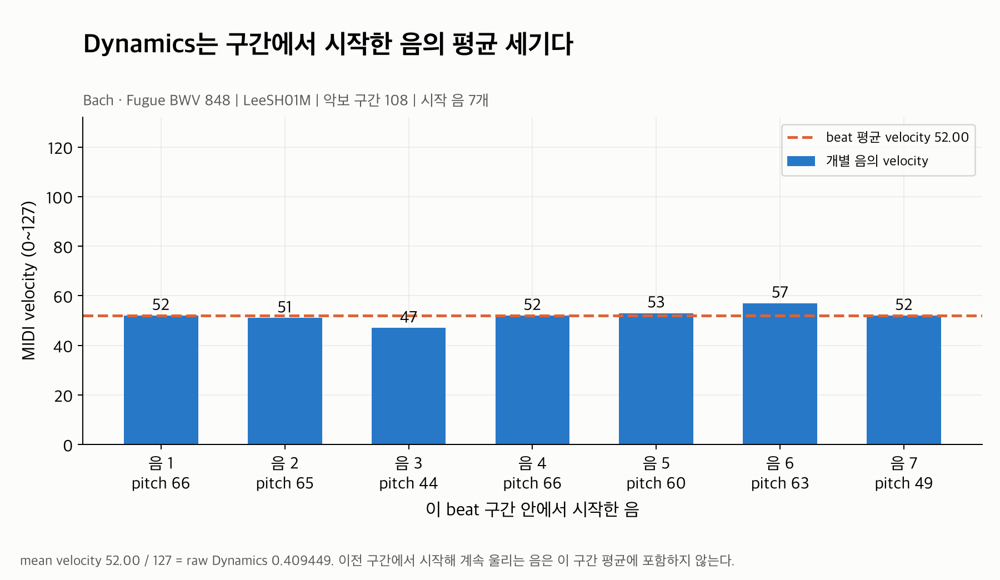
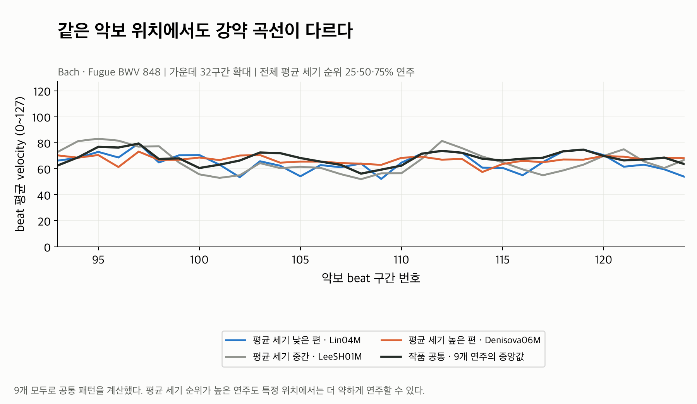
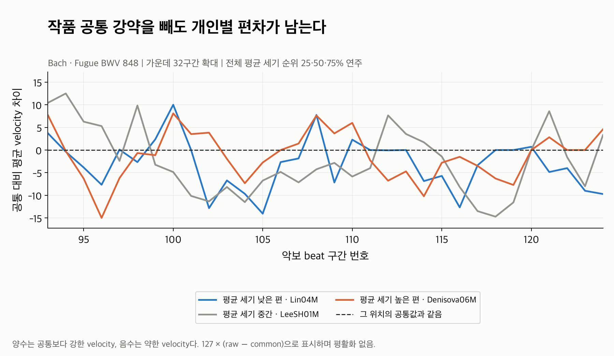
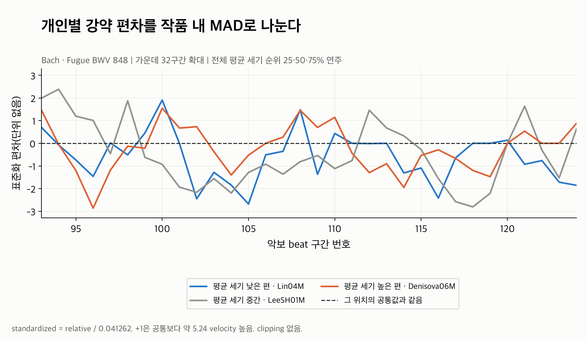
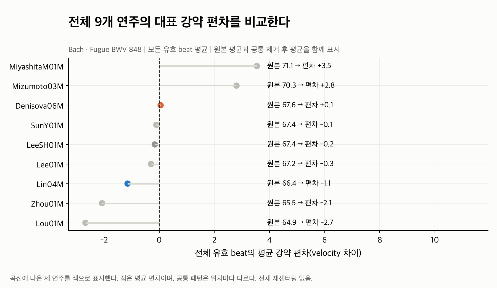
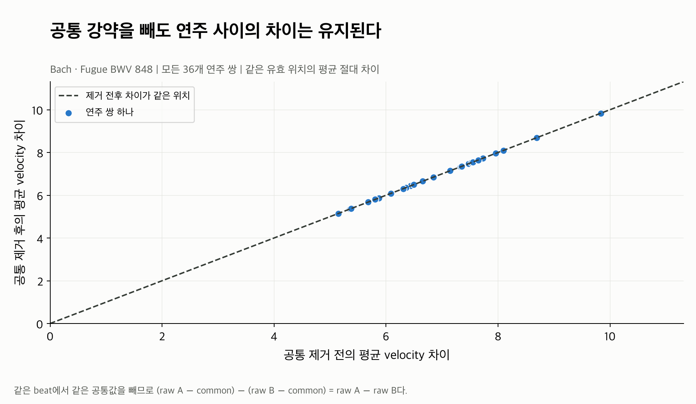
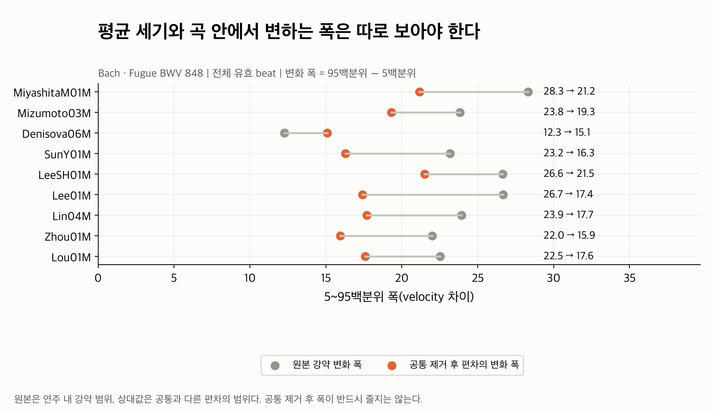

# Dynamics: 같은 작품에서도 강약 해석이 다른가?

Tempo·Rubato·Pedaling과 같은 **Bach 푸가 BWV 848의 실제 정렬 연주 9개**를 사용했다.
파일마다 그래프 하나씩, 총 **7개 PNG**다. 먼저 **01 → 02 → 03 → 04**로 추출과
정규화 과정을 보고, 05·07에서 전체 연주를 비교하면 된다. 06은 차이 보존 확인용이다.

Dynamics는 각 beat 구간에서 시작한 음들의 평균 MIDI velocity를 나타낸다.
전체 평균이 비슷해도 **어느 위치에서 더 강하게 또는 약하게 연주하는지**는 다를 수 있다.
그림에서는 0~1 값보다 이해하기 쉬운 원래 velocity 눈금으로 되돌려 표시했다.

## 그림 목록

| 파일 | 이 그림이 답하는 질문 |
|---|---|
| [01_note_velocity_to_beat.png](01_note_velocity_to_beat.png) | 음표 여러 개의 velocity가 beat 하나의 Dynamics로 어떻게 요약되나? |
| [02_raw_and_common.png](02_raw_and_common.png) | 같은 악보 위치에서 실제 강약 곡선이 어떻게 다른가? |
| [03_relative.png](03_relative.png) | 작품 공통 강약을 빼도 개인별 편차가 남나? |
| [04_standardized.png](04_standardized.png) | 상대값을 MAD로 나누면 모델 입력이 어떻게 바뀌나? |
| [05_all_performance_means.png](05_all_performance_means.png) | 전체 연주의 평균 강약 편차는 어느 정도인가? |
| [06_pairwise_difference_preserved.png](06_pairwise_difference_preserved.png) | 공통 제거가 연주 사이의 차이를 보존하나? |
| [07_all_performance_ranges.png](07_all_performance_ranges.png) | 평균 세기가 비슷해도 변화 폭은 다른가? |

## 01. 음표 velocity에서 beat Dynamics로



LeeSH01M의 **108번 구간**에서 시작한 음은 7개다. Velocity가
`52, 51, 47, 52, 53, 57, 52`이고 평균은 **52**다. 코드의 raw Dynamics는 다음과 같다.

```text
raw = 평균 velocity / 127 = 52 / 127 ≈ 0.409449
```

막대 하나는 음 하나, 주황 점선은 beat 평균이다. 특정 음 하나의 강조를 그대로 복사하지
않고 구간 내 시작 음들을 동일 가중으로 평균한다. 이전 구간에서 시작해 계속 울리는 음은
이번 구간의 평균에 넣지 않는다. 구간은 `[beat 시작 시각, 다음 beat 시각)`으로 정의한다.

이 예시는 전체 평균 세기 순위의 중간 연주에서 중앙에 가장 가까운 유효 beat를 골랐다.
강약 차이가 가장 큰 구간을 검색하지 않았다. MIDI velocity는 강약의 기록상 대리 지표이며
데시벨이나 실제 소리 크기에 정확히 비례하는 값으로 읽지 않는다.

## 02. 원본과 위치별 공통 강약



가로축은 악보 beat 구간 번호, 세로축은 **구간 평균 velocity(0~127)**다.
높을수록 그 구간에서 시작한 음들의 평균 velocity가 크다.

- 파랑: 전체 평균 세기가 낮은 편인 Lin04M.
- 회색: 전체 평균 세기가 중간인 LeeSH01M.
- 주황: 전체 평균 세기가 높은 편인 Denisova06M.
- 검정: **9개 모두**로 계산한 같은 위치의 Dynamics 중앙값.

세 연주는 전체 평균 세기 순위의 **25·50·75%**에서 선택했다. 가장 강한 연주와 가장 약한
연주를 고르지 않았다. 이 색의 역할은 다른 feature 그림의 속도·페달 순위와 별개다.
전체 평균이 높은 연주도 특정 위치에서는 낮을 수 있어 선의 순서가 바뀐다.

곡선은 전체 216구간 중 가운데 **93~124번, 32구간**을 확대했다. 앞선 feature와 같은
위치이며, 큰 차이를 찾는 대신 가운데를 고정했다. 평활화·보간·값 clipping은 하지 않았다.
모든 구간과 마지막 구간은 [beat_features.csv](beat_features.csv)에 보존했다.

검정 선은 현재 연주 데이터의 중앙 패턴이다. 악보의 강약 지시나 음악적 정답이 아니며,
공통값에는 대상 연주 자신도 포함한다. 각 연주의 beat 평균을 집계하므로 음표가 많은
연주에 더 큰 가중치를 주어 모든 음표를 한꺼번에 평균하는 방식과는 다르다.

## 03. 공통값을 뺀 개인별 강약 편차



02와 **같은 연주·같은 위치**다. 세로축은 이제 `원본 평균 velocity - 공통 velocity`다.

- 0: 그 위치의 공통 강약과 같음.
- +5: 평균 velocity가 공통보다 5 높음.
- -5: 평균 velocity가 공통보다 5 낮음.

LeeSH의 108번 구간은 원본 **52**, 공통 **56.25**라 개인 편차는 **-4.25**다.
그 위치에서는 공통보다 약한 평균 velocity로 연주했다는 뜻이다. 음수가 실제 velocity가
음수라는 뜻은 아니다. 값은 퍼센트나 배율이 아니라 **velocity 차이**다.

공통 강약을 제거해도 세 선이 모두 0으로 붕괴하지 않는다. 회색 선은 초반에 위에 있다가
뒤에서 아래로 내려가는 등 **어느 위치를 더 강하게 또는 약하게 표현했는지**가 남는다.
상대값의 양수·음수는 앞 구간 대비 crescendo/decrescendo 방향을 뜻하지 않는다.

## 04. MAD로 scale 맞추기



03의 상대값을 **이 작품의 모든 유효 residual로 계산한 하나의 MAD scale**로 나눈 결과다.
연주마다 별도 scale을 쓰지 않으며, 공통 패턴도 다시 제거하지 않는다.

| 후보 | raw의 0~1 단위 | velocity 단위로 환산 |
|---|---:|---:|
| MAD scale | 0.041262 | 5.24 |
| IQR scale | 0.041118 | 5.22 |
| SD | 0.046084 | 5.85 |

이번 작품에서는 MAD와 IQR이 비슷하고 둘 다 양수다. Pedaling 예시와 달리 residual의
0 비율은 약 **12.0%**라 MAD가 0으로 퇴화하지 않는다. 기존 Dynamics 기본 정책인 MAD를
그대로 적용했다. 더 넓은 데이터에서 선택한 근거는 [전체 정규화 보고서](../feature_normalization/README.md)에 있다.

**+1은 해당 위치의 공통값보다 약 5.24 velocity 높다는 뜻**이다.
LeeSH의 108번 구간은 `-4.25 / 5.240285 ≈ -0.81`로 표현된다.
03과 곡선 모양은 같고 숫자의 단위만 달라진다. 그림의 높이가 줄었다고 정보가 사라진 것은 아니다.

MAD는 `1.4826 × median(abs(R - median(R)))`로 계산한다. 중앙값은 scale 추정에만 쓰고
residual 자체를 다시 center하지 않는다. 표준화값은 단위가 없으며 확률이나 평가 점수가 아니다.
전체 beat의 최대 |standardized|는 **5.50**이고 값을 잘라내지 않았다.
MAD가 0이면 IQR→SD, 모든 spread가 0이면 scale=1을 사용하는 기존 fallback을 유지했다.

## 05. 전체 평균으로 보면 얼마나 다른가?



점 하나는 한 연주의 전체 유효 **relative 값 평균**이다. 오른쪽에는 원본 평균도 함께 썼다.
각 beat를 동일 가중으로 평균하며, 음표 수나 beat 시간에 따른 가중 평균은 아니다.

| 연주 | 원본 평균 velocity | 공통 대비 평균 편차 | 원본 변화 폭 | 상대 편차의 변화 폭 |
|---|---:|---:|---:|---:|
| MiyashitaM01M | 71.08 | +3.54 | 28.32 | 21.16 |
| Mizumoto03M | 70.35 | +2.80 | 23.83 | 19.32 |
| Denisova06M | 67.59 | +0.05 | 12.26 | 15.08 |
| SunY01M | 67.44 | -0.10 | 23.17 | 16.28 |
| LeeSH01M | 67.38 | -0.16 | 26.64 | 21.51 |
| Lee01M | 67.25 | -0.29 | 26.68 | 17.40 |
| Lin04M | 66.39 | -1.15 | 23.94 | 17.70 |
| Zhou01M | 65.47 | -2.07 | 22.01 | 15.94 |
| Lou01M | 64.87 | -2.67 | 22.52 | 17.58 |

원본 평균은 **64.87~71.08**로 비교적 가깝고, 공통 제거 후 평균은 **-2.67~+3.54**다.
하지만 평균 0 근처가 모든 구간에서 차이가 없다는 뜻은 아니다. 위아래 편차가 평균에서
상쇄될 수 있다. 예를 들어 Denisova의 평균 편차는 +0.05지만 상대 변화 폭은 15.08이다.
따라서 평균 요약만으로 전체 강약 해석을 대표하지 않고 03과 07도 함께 본다.

## 06. 연주 사이의 차이 보존



9개 연주의 모든 **36개 쌍**을 동일한 유효 위치에서 비교했다. 가로축은 공통 제거 전,
세로축은 제거 후의 평균 절대 velocity 차이다. 점들이 대각선 위에 있어 차이가 보존됐다.

```text
(raw_A - common) - (raw_B - common) = raw_A - raw_B
```

36쌍의 `mean(abs(velocity_A - velocity_B))` 중앙값은 **6.50 velocity**다.
이는 곡 전체 평균 세기의 차이가 아니라 **같은 위치별 차이의 크기를 평균한 값**이다.
05의 평균 편차가 가까워도 어느 위치에서 강약을 달리하는지에 따라 이 거리는 커질 수 있다.
공통 제거 후 이 거리가 유지되고, 표준화 후에는 동일 scale로 나눈 차이가 된다.

## 07. 평균 세기와 변화 폭을 구분하기



한 줄은 한 연주이고, 회색은 원본 강약의 5~95백분위 폭, 주황은 상대 편차의 같은 폭이다.
최댓값-최솟값 대신 양 끝 5%의 영향이 작은 범위를 사용했다. 원본 데이터는 그대로 남아 있다.

Denisova와 LeeSH는 평균 velocity가 모두 약 67대지만 원본 변화 폭은 **12.26과 26.64**로
다르다. 이 예시에서는 Denisova의 beat 평균 강약이 상대적으로 좁은 범위에서 변한다.
이는 음 하나하나의 강약 범위와는 다르다.

공통 제거 후 폭은 대부분 줄지만 Denisova는 **12.26→15.08**로 커진다. 원본은 연주 내
강약 범위, 상대값은 위치별 공통 패턴과 다른 편차의 범위라 두 통계가 다르다.
이 연주가 공통의 강약 움직임을 작게 따라가는 경우에도 상대 편차는 남을 수 있다.
공통 제거 후 모든 연주의 폭이 반드시 줄어야 하는 것은 아니다.

## 계산·mask와 검증 범위

```text
raw[p, i] = mean(해당 beat에서 시작한 음의 velocity) / 127
common[i] = 동일 작품·위치의 유효 raw 값 중앙값
relative[p, i] = raw[p, i] - common[i]
scale = 1.4826 × median(abs(R - median(R)))
standardized[p, i] = relative[p, i] / scale

01·02 표시값 = 127 × raw
03 표시값 = 127 × relative
04 표시값 = standardized
```

그림용 velocity 환산은 추가 정규화가 아니다. 기존 raw/common/relative/standardized와
각 mask/support를 모두 CSV로 보존했다. 악보 velocity와 나누어 대비하는 계산은 하지 않는다.

- 구간에서 시작한 음이 없으면 **NaN + mask=False**다. 무조건 Dynamics 0으로 채우지 않는다.
  계속 울리는 음이 있어도 onset이 없으면 이 feature에는 새 값이 없다.
- 0폭 performance 구간도 mask=False다. 공통 집계에는 finite raw와 양수 score 구간만 사용한다.
- 최소 support는 2다. 지원 미달 common/relative는 NaN + mask=False다.
- 이번 작품은 연주당 216구간, 총 **1,944개가 모두 유효**이고 위치별 support는 9다.
  다른 작품의 빈 구간과 mask 정책은 관련 테스트에서 확인했다.
- Tempo의 bR/suspicious mask를 Dynamics에 새로 적용하지 않았다. 원본 Dynamics mask를 유지한다.
  반복 구조가 다른 no_repeat/extra_repeat 대응 연주는 같은 그룹에 넣지 않았다.

현재 Dynamics는 모든 시작 음을 평균해 오른손·왼손·성부별 강조를 분리하지 않는다.
시작 음의 수와 종류가 연주마다 달라지면 평균에도 영향을 줄 수 있어 onset count를 함께 저장했다.
MIDI velocity에서 실제 음량으로의 관계나 악기·기록 장치의 보정 차이는 검증하지 않았으므로,
이 수치 차이를 모두 청각적 차이 또는 의도된 해석이라고 단정하지 않는다.

Onset을 구간별로 직접 필터링해 개수와 평균을 별도 재계산했고, common/residual/MAD/
standardized도 독립 계산과 일치했다. 원본값·mask·support 보존을 확인했다.
공통 제거 전후 beat별 차이 오차는 0, 표준화 후 scale로 나눈 차이의 최대 오차는
`8.88e-16`이다. 관련 단위·실제 ASAP/nASAP 통합 테스트 **45개 모두 통과**했다.
이 검증은 수치적 일관성과 작품 내 차이를 확인한 것이며 추천 성능이나 사용자 선호 검증은 아니다.

## 결과와 재현

| 파일 | 내용 |
|---|---|
| [performance_summary.csv](performance_summary.csv) | 9개 연주의 평균·변화 폭·유효수·onset 수 |
| [beat_features.csv](beat_features.csv) | 1,944개 beat의 raw/common/relative/standardized와 mask/support |
| [note_events.csv](note_events.csv) | 원본 MIDI 음표 12,905개와 beat 소속, 구간 밖 음은 index -1 |
| [scale.csv](scale.csv) | MAD/IQR/SD 후보와 실제 선택한 scale |
| [pairwise_distances.csv](pairwise_distances.csv) | 36개 연주 쌍의 공통 제거 전후 거리 |
| [stats.json](stats.json) | source revision·MIDI/코드 hash, 예시 선택 규칙, 계산 검증 결과 |

저장소 루트에서 실행한다. 기본 dataset은 저장소 밖 `Classicfy/datasets/ASAP`,
`Classicfy/datasets/nASAP`, 기본 출력은 실행 위치와 관계없이 이 폴더다.

```bash
.venv/bin/python classicfy-ai/scripts/validate_dynamics.py
```

전체 곡선은 `--curve-beats 216`으로 볼 수 있다. 다른 작품을 분석할 때는 이 README의
Bach 예시와 섞이지 않도록 별도 `--out`을 사용한다.

```bash
.venv/bin/python classicfy-ai/scripts/validate_dynamics.py \
  --work Chopin/Etudes_op_10/8 \
  --out classicfy-ai/analysis/dynamics/chopin_op10_8
```

기존 추출 코드와 MAD 정책은 변경하지 않았다. [기존 Dynamics·Pedaling 전체 보고서](../dynamics_pedaling/README.md)도
그대로 보존했다. 다른 작품에서의 규모와 작품 정보 감소 분석은 기존 전체 보고서를 함께 참고한다.

[전체 분석 목록](../README.md) · [Feature 공개 인터페이스](../../src/features/README.md)
