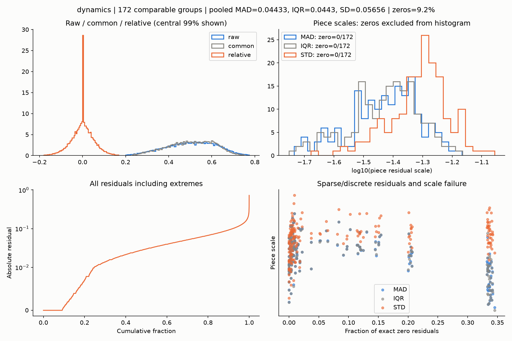
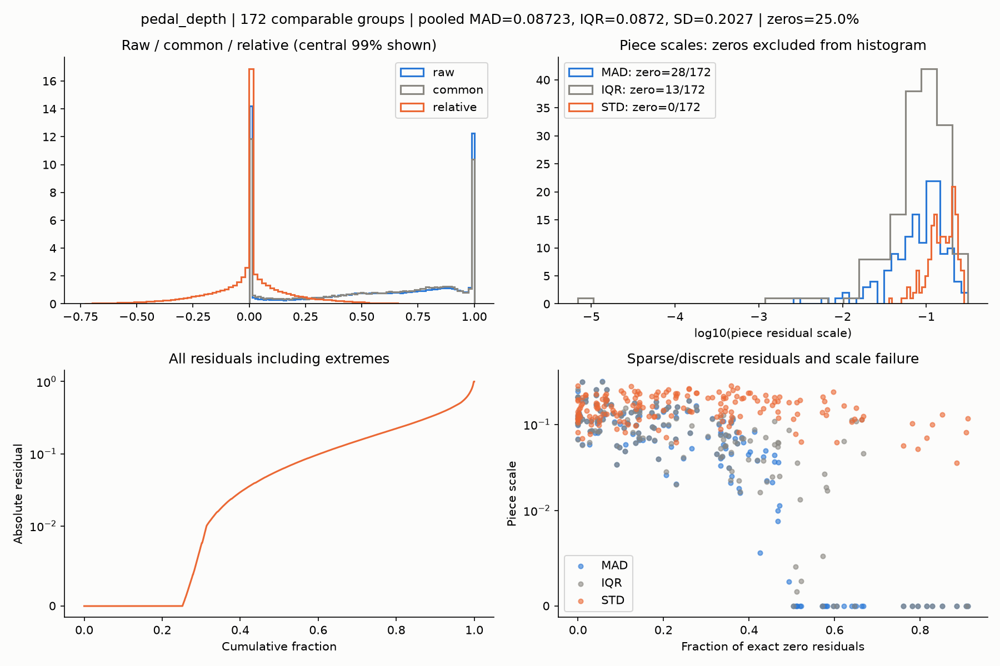
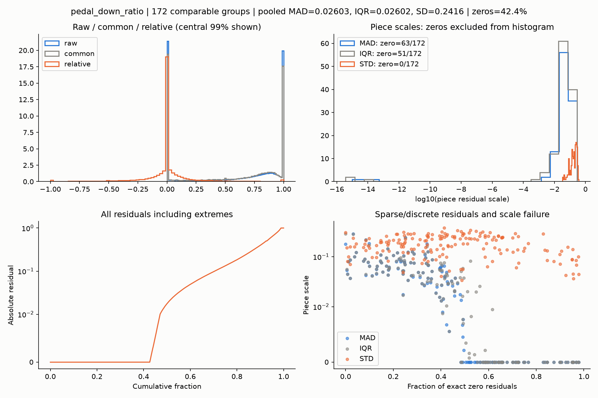
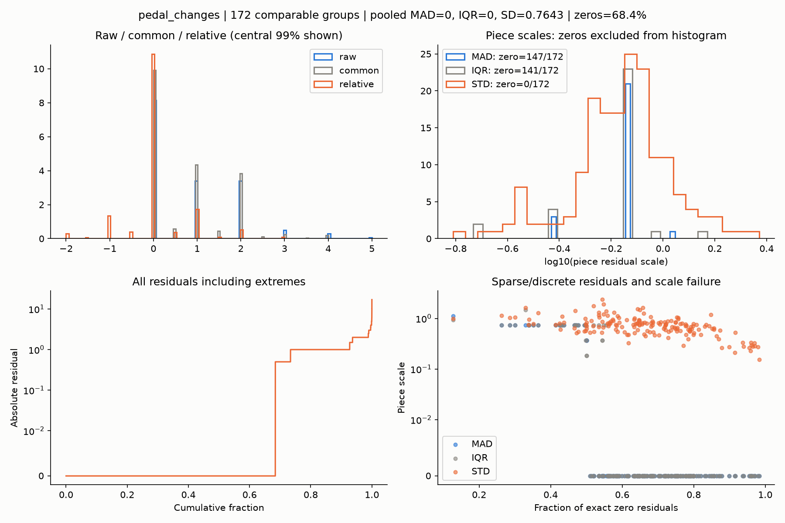
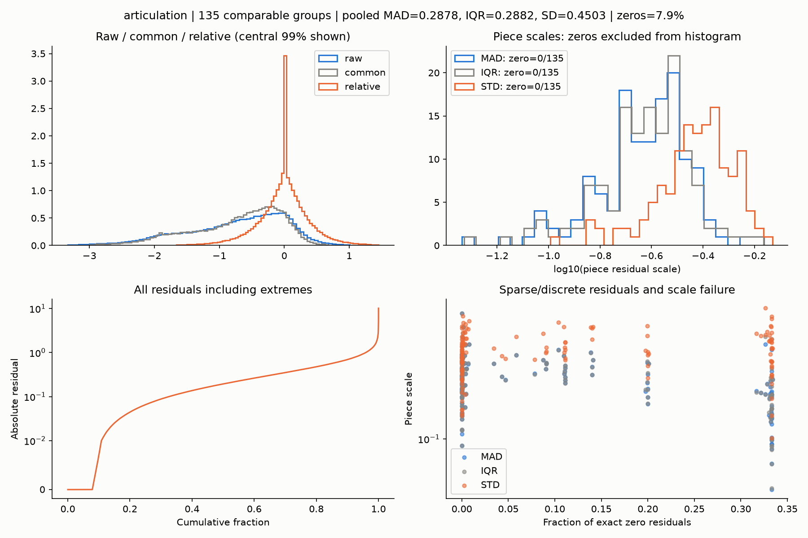
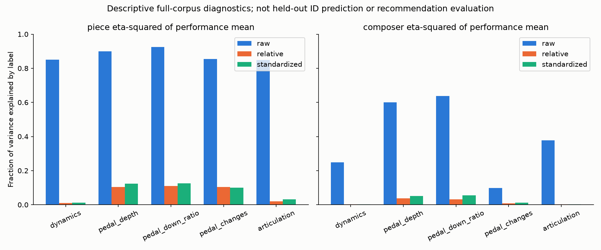
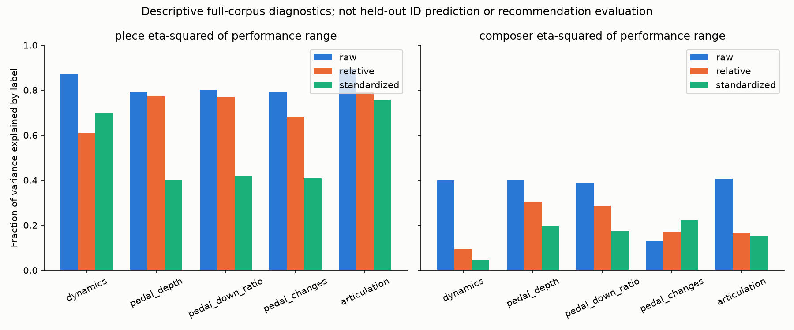
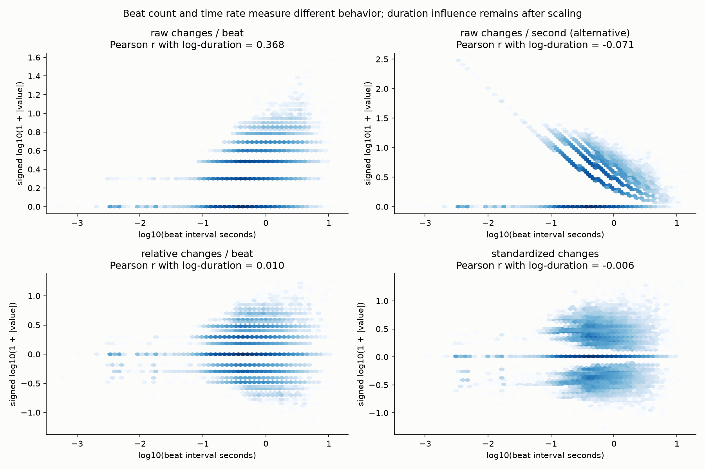

# 작품 공통 패턴 제거 후 feature별 scale 선택

2026-10-03에 공식 ASAP/nASAP의 실제 beat feature를 분석했다. Dynamics와 Articulation은
작품별 MAD, Pedaling의 depth/down_ratio/changes는 각각 작품별 표준편차를 기본값으로
선택하고 적용했다. 아래 선택은 분포와 수치 안정성을 근거로 한 입력 정책이며, 추천 성능의
최적해로 검증한 결과는 아니다. Tempo·Rubato는 기존 상대 feature와 상태를 그대로 유지했다.

## 데이터와 비교 조건

- [ASAP](https://github.com/fosfrancesco/asap-dataset): `afc815c75c42e83a79c03feb6da8a35e77d4c6b8`.
- [nASAP](https://github.com/CPJKU/asap-dataset): `4097b45757bed854818cf87e77b92323ebf90615`.
- 로컬 경로: 저장소 바깥 `Classicfy/datasets/ASAP`, `Classicfy/datasets/nASAP`.
  ASAP은 metadata/annotations/MIDI, nASAP은 metadata/match만 sparse checkout했다.
- 정렬 연주 1,036개에서 기존 extractor로 원시 feature를 추출했다. nASAP robust 표시가
  True인 연주는 833개이며 Articulation 기본 분석에는 이 연주들만 넣었다.
- D/P: 연주 2개 이상인 172개 그룹, 968개 연주. 단독 68개 그룹은 분리하지 않았다.
  Articulation: robust 연주 2개 이상인 135개 그룹, 780개 연주. robust 단독 53개 그룹 제외.
- 반복 구조가 다르면 별도 piece key를 쓴다. score beat 위치·길이·종류도 검증했다.
  이번 데이터에서 같은 piece key 내 추가 grid 변형은 없었다.
- `minimum_support=2`. mask=False/비유한 값은 중앙값과 scale에서 제외하며 페달 없음의
  0은 유효하다. 원래 D/P에 없는 bR/suspicious mask를 새로 도입하지 않았다.
- 중앙값에는 대상 연주도 포함했다. 작품 공통값은 데이터 내 중앙 패턴이지 음악적 정답이 아니다.

[collection.json](collection.json)은 dataset revision·입력/추출 코드 hash·필터 조건을,
[skipped_groups.csv](skipped_groups.csv)는 단독 그룹을 기록한다. 반복 구조 구분과 robust
필터로 기존 raw 분석 보고서의 모집단과 달라질 수 있으므로 수치를 직접 섞어서 비교하지 않는다.

## 수식과 출력

```text
common[i] = median(valid raw[p, i])
relative[p, i] = raw[p, i] - common[i]
R = 해당 작품·해당 feature의 모든 유효 relative beat
MAD = 1.4826 * median(abs(R - median(R)))
IQR = (percentile(R, 75) - percentile(R, 25)) / 1.3489795003921634
SD = std(R, ddof=0)
standardized[p, i] = relative[p, i] / 선택한 scale
```

Residual을 다시 center하지 않는다. 원본 단위를 유지한 relative와 모델 입력용 standardized를
함께 제공한다. clipping/log1p/winsorization을 적용하지 않았다. MAD 선택 시 0 또는
`<=1e-12` scale은 IQR→SD로 fallback한다. 모든 spread가 퇴화하면 unit scale=1로 값을
보존하고, 유효 residual이 없으면 scale=NaN 및 전체 mask=False다. 작은 epsilon으로 나누지 않는다.

`NormalizedFeature`는 `SeparatedFeature`의 raw/common/relative, 각 mask, common_support,
score grid, 키, 최소 지원 기준을 보존하고 standardized와 ResidualScale을 추가한다.
Scale에는 요청 방식·실제 방식·유효 beat 수·MAD/IQR/SD가 모두 남는다. 입력을 수정하지 않는다.

## Figure에서 읽은 근거와 적용 방식

진단 그림의 좌상단은 raw/common/relative 분포, 우상단은 작품별 scale, 좌하단은 극단값을
포함한 residual 절댓값 누적분포, 우하단은 zero 비율과 scale의 관계다. 히스토그램의 중앙
99% 표시 제한은 **그림에만** 적용한다. 값은 제거하지 않았다. 분포는 연주·beat 가중이며
common은 각 연주의 좌표로 반복된다. 작품별 scale 분포는 그룹당 한 점이다.

| Feature | residual 0 비율 | MAD=0 그룹 | IQR=0 그룹 | 선택 | 선택 scale 중앙값 |
|---|---:|---:|---:|---|---:|
| Dynamics | 9.16% | 0/172 | 0/172 | MAD | 0.03830 |
| Pedal depth | 25.04% | 28/172 | 13/172 | SD | 0.15759 |
| Pedal down_ratio | 42.35% | 63/172 | 51/172 | SD | 0.18044 |
| Pedal changes | 68.41% | 147/172 | 141/172 | SD | 0.73128 |
| Articulation | 7.89% | 0/135 | 0/135 | MAD | 0.24878 |

### Dynamics

MAD와 IQR이 거의 겹치고 모든 작품 그룹에서 양수다. SD는 tail 때문에 더 커지는 경향이다.
따라서 velocity residual의 중심 편차를 안정적으로 비교하도록 MAD를 선택했다. 선택 정책의
|standardized| 99%는 4.22, 최대 17.20이다.



[표준화 및 후보 tail 비교](02_normalized_dynamics.png), [대표 작품 곡선](03_curves_dynamics.png).

### Pedal depth

경계값과 exact zero가 많은 분포다. MAD→IQR→SD fallback만으로는 **양수지만 너무 작은**
robust scale의 문제가 해결되지 않는다. 이 정책의 최대 |z|는 77,318이며 선택한 SD에서는
9.20이다. Depth의 값 범위가 [0,1]이고 on/off 편차도 유지할 정보이므로 중심부의 좁은 폭으로
나누는 대신 작품 내 전체 spread를 나타내는 SD를 쓴다.



[표준화 및 후보 tail 비교](02_normalized_pedal_depth.png), [대표 작품 곡선](03_curves_pedal_depth.png).

### Pedal down_ratio

0/1 경계값과 zero residual이 더 많다. MAD/IQR로 나눌 때 일부 작품의 scale은 반올림 잡음
수준이거나 매우 작다. MAD fallback 정책의 |z| 99%는 264.96, 최대 1,336.60으로,
SD의 3.75와 16.74보다 크게 확대된다. 이 지표도 bounded ratio의 전체 spread인 SD를 쓴다.



[표준화 및 후보 tail 비교](02_normalized_pedal_down_ratio.png), [대표 작품 곡선](03_curves_pedal_down_ratio.png).

### Pedal changes

정수 counts와 중앙값 차이로 생긴 0.5 단위 residual이 대부분이고, 전체 pooled MAD와 IQR도
0이다. 작품 대부분이 결국 SD fallback을 쓰게 되므로 처음부터 SD를 명시했다. 선택한
|z| 99%는 3.52, 최대 21.66이다. Counts는 bounded feature가 아니므로 SD가 이상치에
영향받는 한계를 따로 남겼다. 임의 clipping으로 이 문제를 숨기지 않았다.



[표준화 및 후보 tail 비교](02_normalized_pedal_changes.png), [대표 작품 곡선](03_curves_pedal_changes.png).

### Articulation

이미 log2인 feature에 다시 로그를 취하지 않는다. MAD/IQR은 모든 그룹에서 안정적이고
거의 같다. 극단적인 건반 유지 시간과 정렬 이상이 SD를 키울 수 있어 MAD를 선택했다.
선택한 |z| 99%는 5.67, 최대 33.75이다. 큰 값을 유효한 해석으로 단정하지는 않는다.



[표준화 및 후보 tail 비교](02_normalized_articulation.png), [대표 작품 곡선](03_curves_articulation.png).

[piece_scale_candidates.csv](piece_scale_candidates.csv), [global_scale_candidates.csv](global_scale_candidates.csv),
[policy_comparison.csv](policy_comparison.csv)에 후보 수치를 저장했다. `piece_mad`는 fallback을
포함한 실제 정책이다. `global_mad/std`는 corpus 전체 fit 비교값이며 학습용 확정 scale이 아니다.

## 적용 결과와 작품 정보

표준화된 유효 beat는 Dynamics 510,656개(96.44%), Pedaling 각각 529,501개(100%),
Articulation 367,716개(96.36%)다. 비율 분모는 해당 채널에서 비교 가능한 연주들의 전체 beat다.
표준화 전 relative와 mask 및 유효 beat 수가 동일하다.

같은 작품의 모든 연주 쌍을 공통 유효 beat에서 비교했다. `relative_a-relative_b=raw_a-raw_b`의
최대 오차는 `1.78e-15`, `standardized_a-standardized_b=(raw_a-raw_b)/scale`의 최대 오차는
`7.11e-15`다. 원래 차이가 있는 연주 쌍이 0으로 붕괴하지 않았다. 수치 보존은 음악적 구별력이나
추천 효용을 검증한 결과와는 구분해야 한다. 상세는 [pair_preservation.csv](pair_preservation.csv).

연주별 평균값의 라벨 설명력 η²를 동일 모집단·동일 유효 beat에서 비교했다.

| Feature | 작품 raw → relative → standardized | 작곡가 raw → relative → standardized |
|---|---|---|
| Dynamics | 0.850 → 0.010 → 0.013 | 0.249 → 0.002 → 0.002 |
| Pedal depth | 0.899 → 0.104 → 0.124 | 0.600 → 0.037 → 0.052 |
| Pedal down_ratio | 0.924 → 0.111 → 0.125 | 0.638 → 0.033 → 0.055 |
| Pedal changes | 0.855 → 0.103 → 0.100 | 0.099 → 0.009 → 0.012 |
| Articulation | 0.848 → 0.020 → 0.031 | 0.378 → 0.003 → 0.003 |



**변화 범위(연주별 5–95%)에는 작품 정보가 남는다.** standardized의 작품 η²는 Dynamics
0.699, depth 0.403, down_ratio 0.418, changes 0.409, Articulation 0.757이다. Dynamics는
relative의 0.611보다 표준화 후 0.699로 증가했다. 중앙값 제거와 scale 선택이 모든 요약값의
작품 정보를 줄인다는 주장은 하지 않는다. 특히 MAD로 중심부를 맞춰도 tail 구조와 악보 밀도는
다를 수 있으므로 range를 embedding에 곧바로 넣기 전 추가 비교가 필요하다.



η²는 전체 corpus의 기술통계이며 classifier 정확도가 아니다. [identity_variance.csv](identity_variance.csv)는
mean/range × raw/relative/standardized × 작품/작곡가와 라벨 shuffle 100회의 평균을 기록한다.
Target을 포함해 common을 계산하므로 그룹의 평균 편차가 구조적으로 작아진다. Shuffle보다
낮은 mean η²를 독립 일반화 증거로 해석하면 안 된다. 학습/평가 분리 후 작품·작곡가 ID 예측,
interpretation 축을 추가한 추천 성능 및 사용자 평가, MTD를 대체하는 contribution 검증은
이번 정규화 분석의 수행 범위가 아니다.

## Beat 길이와 원본 극단값 점검



Raw counts와 log10(beat 초)의 Pearson 상관은 0.368이다. 상대 counts는 0.010, 표준화된
counts는 -0.006으로 줄었다. 이 pooled 상관만으로 시간 의존성이 완전히 제거됐다고 할 수 없다.
초당 전환율은 tempo에 반비례하는 다른 feature이며 아주 짧은 beat에서 최대 301.58/s까지
확대된다. 기존 counts의 의미와 원본 관계를 보존해 이번에는 초당 횟수로 교체하지 않았다.
세부 값은 [pedal_duration_comparison.csv](pedal_duration_comparison.csv)에 있다.

채널별 최대 |standardized| 위치를 실제 MIDI/match에서 다시 추출해 raw와 일치함을 확인했다.
[extreme_beats.csv](extreme_beats.csv)는 채널별 상위 20개 위치, [extreme_source_checks.json](extreme_source_checks.json)은
대표 5개 위치의 시각·음 velocity·CC64 이벤트와 Articulation 음 길이를 저장한다.

- Dynamics 최대: Beethoven 2-1 / Kochetkova01, beat 244. onset 음 하나의 velocity=20.
- Depth 최대: Scriabin op.8/11 / Shi08M, beat 0. raw=0이고 다른 연주의 중앙 패턴과 크게 다름.
- Down ratio 최대: Chopin Berceuse / ZhangE09M, beat 85. CC64가 64 아래에 오래 유지돼 raw=0.02497.
- Changes 최대: Liszt Mephisto Waltz / ChernovA04M, beat 2460. 10.38초 구간의 전환 12회이며
  경계는 `bR → db`다. 기존 D/P mask에는 유효하므로 보존했다. 특별 구간을 제외하는 정책은
  Tempo의 상태를 D/P에 임의 전파하는 것과 구분해서 별도 실험해야 한다.
- Articulation 최대: Beethoven 27-1 / Ko05M, beat 642. 악보 4 beat 음의 key-held 시간이
  약 1.04ms여서 raw=-10.67이다. robust 표시도 이 같은 개별 음 문제를 보장하지 않는다.
  원본 재추출 일치는 계산 추적 확인이며 정렬이 음악적으로 정확하다는 판정은 아니다.

## 재현과 결과 파일

저장소 루트에서 실행한다. `requirements.txt`에 matplotlib과 의존성 버전을 추가했다.
다운로드 데이터는 커밋하지 않는다. 공식 dataset의 위 revision에서 필요한 파일을 확보한 후:

```bash
.venv/bin/python -m pip install -r requirements.txt
.venv/bin/python classicfy-ai/scripts/validate_feature_normalization.py \
  --out classicfy-ai/analysis/feature_normalization --diagnose-only
.venv/bin/python classicfy-ai/scripts/validate_feature_normalization.py \
  --out classicfy-ai/analysis/feature_normalization
cd classicfy-ai
PYTHONPATH=src ../.venv/bin/python -m unittest discover -s tests -v
```

기본 dataset/cache 경로는 script 위치를 기준으로 `Classicfy/datasets`를 찾으므로 실행
디렉터리에 의존하지 않는다. 다른 경로는 `--asap-root`, `--nasap-root`, `--cache`,
`--normalized-cache`로 지정한다. `--include-non-robust`는 Articulation 모집단을 변경하므로
비교할 때 `--out`과 `--normalized-cache`도 별도로 지정한다.

- `feature_normalization_raw.npz`: 전체 정렬 연주의 원본 arrays/masks/grid·metadata 캐시.
- `feature_normalization_standardized.npz`: 비교 가능한 채널·연주별 raw/common/relative/
  standardized의 values/mask, common_support, score grid 및 fitted scale. 약 64MB 규모의
  생성 데이터이므로 `Classicfy/datasets`에 보관한다. 경로와 hash는 [normalization.json](normalization.json)에 기록.
- NPZ는 `np.load(path, allow_pickle=False)`로 읽는다. `manifest` JSON의 `records[i]`와
  `i/raw_values`, `i/common_values`, `i/relative_values`, `i/standardized_values`, `i/common_support`
  같은 array 키를 대응시키면 모든 값을 추적할 수 있다.
- [performance_summary.csv](performance_summary.csv): 같은 유효 beat에서 계산한 네 단계의 평균·범위 및 유효수.
- [piece_scales.csv](piece_scales.csv): 요청/실제 방식, 분모, 지원 beat 수, MAD/IQR/SD.
- [distributions.csv](distributions.csv): 네 단계의 전체 분위수·분산; 그림 범위 밖의 값도 포함.
- PNG 18개: 채널별 진단 5개·적용 비교 5개·대표 곡선 5개, mean/range 설명력 2개, duration 비교 1개.

실제 ASAP/nASAP 통합 테스트를 포함해 **123개 테스트 모두 통과, skip 0개**. 기존 Tempo·Rubato
회귀 테스트도 통과했다. 기존 MIDI의 non-zero track 메타 이벤트에 대한 pretty_midi 경고가
실제 데이터 테스트 1개에서 발생했으나 테스트는 통과했다.

작품당 연주 수가 적으면 공통값과 scale의 추정이 불안정하다. 작품별 scale은 절대 크기를
없애는 대신 작품 내 상대적인 편차를 비교하게 한다. Global scale은 절대 크기 차이를 보존하지만
작품 residual 분산 차이가 남는다. 추론 시 연주가 하나뿐이면 임의의 상대값 0을 만들지 말고
동일 grid의 학습 reference를 확보하거나 결측으로 처리한다. 독립 평가에서는 reference와
scale을 학습 집합에서 fit해 고정해야 한다.
