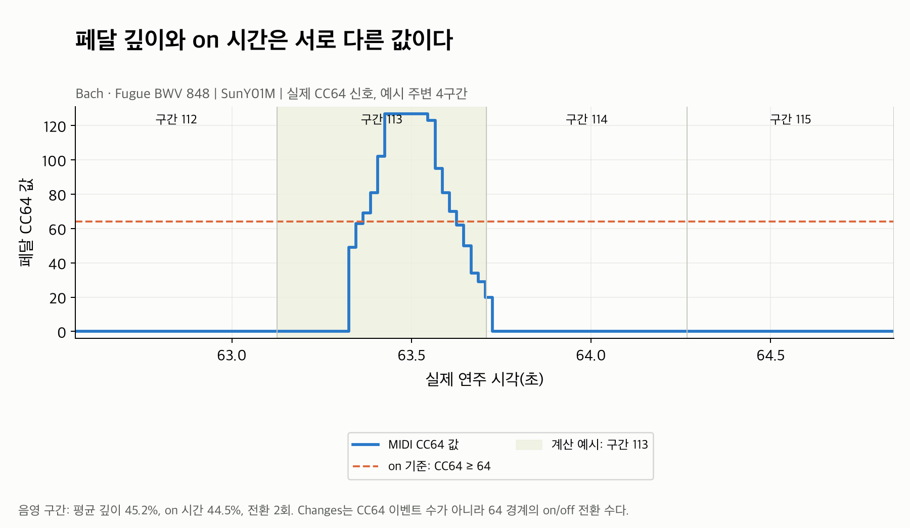

# Pedaling: 깊이·사용 시간·갈아 밟는 횟수의 연주 차이

[Tempo](../tempo/README.md)·[Rubato](../rubato/README.md)와 같은 **Bach 푸가 BWV 848의
실제 정렬 연주 9개**를 분석했다. 세 하위 feature를 폴더로 나누고 파일마다 그래프 하나씩
두었다. 원본 신호 예시 1개와 하위 feature별 그림 4개로 **PNG 총 13개**다.

## 먼저 무엇을 볼까?

| 순서 | 자료 | 질문 |
|---|---|---|
| 1 | [실제 CC64 신호](01_cc64_signal_example.png) | 페달 이벤트에서 어떤 값을 추출하나? |
| 2 | [depth 안내](depth/README.md) | 얼마나 깊게 밟았나? |
| 3 | [down_ratio 안내](down_ratio/README.md) | 구간의 얼마 동안 on 상태였나? |
| 4 | [changes 안내](changes/README.md) | 구간 안에서 on/off를 몇 번 바꿨나? |

각 하위 폴더는 **01 원본+공통 → 02 상대값 → 03 표준화 → 04 전체 연주 평균** 순서다.
먼저 연주 전체의 차이를 보고 싶으면 각 폴더의 04 막대 그림부터 보면 된다.

## 실제 신호 하나로 세 지표 이해하기



파랑은 MIDI에 기록된 CC64 값(0~127), 주황 점선은 현재 코드의 on 기준 **64**다.
이벤트 사이에는 마지막 값이 유지된다. 첫 이벤트 이전의 값은 0으로 계산한다.
음영 표시한 SunY01M의 **113번 구간**은 다음과 같다.

| 지표 | 계산하는 내용 | 실제 예시 값 |
|---|---|---:|
| depth | `CC64 / 127`의 구간 내 시간 가중 평균 | 45.2% |
| down_ratio | `CC64 ≥ 64`였던 시간 / 구간 길이 | 44.5% |
| changes | 64 경계의 on/off 전환 횟수 | 2회 |

신호 값이 여러 번 바뀌어도 64 경계를 위로 한 번, 아래로 한 번 넘었으므로 changes는 2다.
Depth가 40%라는 것은 CC64 기록값의 시간 평균이 최대값의 40%라는 뜻이다.
실제 페달 이동 거리나 음향 효과가 정확히 40%라는 뜻으로 읽지 않는다.

신호 예시는 평균 깊이 순위의 중간 연주에서 **중앙에 가장 가까운, 일부 시간만 on이고
전환이 있는 구간**을 선택했다. 변화가 가장 큰 구간을 고르지 않았다. 나머지 곡선은
전체 216구간 중 가운데 **93~124번, 32구간**을 고정해 확대했다.

## 전체 연주에서 관찰한 차이

모든 값은 **유효 beat마다 계산한 값을 동일 가중으로 평균**했다. Down_ratio의 평균을
곡 전체 재생시간 중 on 시간 비율로 해석하면 안 된다. Beat의 길이가 다르기 때문이다.

| 연주 | 평균 깊이 | 평균 on 시간 비율 | 평균 전환 횟수/beat |
|---|---:|---:|---:|
| Denisova06M | 0.3% | 0.4% | 0.009 |
| Lee01M | 16.6% | 5.6% | 0.171 |
| LeeSH01M | 9.5% | 10.1% | 0.495 |
| Lin04M | 1.7% | 2.3% | 0.102 |
| Lou01M | 13.7% | 2.9% | 0.130 |
| MiyashitaM01M | 30.9% | 2.3% | 0.079 |
| Mizumoto03M | 1.5% | 1.4% | 0.065 |
| SunY01M | 9.5% | 6.5% | 0.269 |
| Zhou01M | 0.6% | 0.7% | 0.037 |

이 작품에서는 기록된 페달 사용 양상이 연주마다 다르다. 특히 MiyashitaM은 평균 깊이가
30.9%지만 on 시간은 2.3%다. 64 미만의 얕은 값을 오래 유지해도 depth에는 들어가고
down_ratio에는 들어가지 않으므로 **깊이·시간·횟수를 하나의 지표로 합쳐 읽지 않는다.**
악기와 기록 장치의 CC64 보정 차이까지 이 분석에서 검증하지 않았으므로, 수치 차이를
모두 연주자의 의도나 청각적 차이라고 단정하지 않는다.

세 곡선에 나오는 연주는 전체 평균 depth 순위 25·50·75%에서 고른
Mizumoto03M(파랑), SunY01M(회색), Lou01M(주황)이다. 세 하위 feature에서 같은 연주와
구간을 사용한다. “얕은 편·중간·깊은 편”은 depth 기준이며 on 시간이나 횟수의 순위가 아니다.
공통 패턴은 표시한 세 명만이 아니라 **9개 모두**의 같은 위치 중앙값이다.

## 공통 제거와 표준화

```text
common[i] = 동일 위치의 유효 raw 값 중앙값
relative[p, i] = raw[p, i] - common[i]
R = 해당 작품·해당 하위 feature의 모든 유효 relative 값
scale = std(R, ddof=0)
standardized[p, i] = relative[p, i] / scale
```

공통값은 데이터에 포함된 연주들의 중앙 패턴이다. 음악적 정답이 아니며, 대상 연주 자신도
집계에 포함한다. Relative를 다시 중앙값 0으로 맞추지 않는다. Scale은 세 지표별로 따로
계산하며, 연주마다 따로 나누지 않는다. 기존 SD 기본 정책을 그대로 적용했다.

| 지표 | 공통값이 0인 구간 | residual이 0인 비율 | MAD | IQR scale | 적용 SD |
|---|---:|---:|---:|---:|---:|
| depth | 194/216 | 65.1% | 0 | 0.109658 | 0.156432 |
| down_ratio | 210/216 | 90.6% | 0 | 0 | 0.128809 |
| changes | 210/216 | 91.7% | 0 | 0 | 0.522939 |

0이 많아 세 지표 모두 MAD가 0이다. 이번 작품은 SD가 양수여서 SD로 안정적으로 나눌 수
있다. 더 넓은 데이터에서 선택한 근거는 [전체 정규화 보고서](../feature_normalization/README.md)에 있다.
SD는 이상치의 영향을 받으며, 이 선택을 추천 성능의 최적해로 검증하지는 않았다.

**이 작품의 down_ratio·changes 공통값은 대부분 0이다.** 과반수 연주가 해당 위치에서
on 시간을 사용하지 않거나 전환하지 않기 때문이다. 그래서 원본과 상대 곡선이 같은 모양인
구간이 많다. 정규화 오류로 볼 이유는 없고, 모든 작품에서 크게 변할 것으로 기대하지 않는다.
같은 위치의 중앙값을 제거해도 연주 간 차이는 남는다. 세 채널 각각 36쌍을 확인했다.

Depth·down_ratio의 relative는 **퍼센트포인트(%p)**다. 예를 들어 원본 40%, 공통 30%면
편차는 +10%p다. “공통보다 10% 더 사용”이라는 배율 표현과 다르다. Changes는 회/beat,
standardized는 단위 없는 SD 기준 편차다. +1은 공통보다 해당 지표의 scale 하나만큼 높다.

Clipping·평활화·보간은 하지 않았다. 표준화는 곡선의 모양을 유지하며 숫자의 범위를 바꾼다.
세 그림의 세로축 단위와 눈금이 달라지므로 눈으로 보이는 진폭만 직접 비교하지 않는다.
모든 residual의 spread가 0이면 scale=1로 보존하는 기존 정책을 사용한다.

## 마스크·시간 길이와 해석의 한계

- 원본 Pedaling mask는 양수 beat 간격 여부다. 이 예시에서는 채널당 1,944개 값이 모두 유효하다.
  Tempo의 bR/suspicious 상태를 새 Pedaling 제외 조건으로 넣지 않았다. 상태는 CSV에 참고 정보로 저장한다.
- `minimum_support=2`. 지원 미달 common/relative는 NaN + mask=False다. 원본값과 mask는 보존한다.
- 이벤트가 없는 연주의 0은 유효값이다. 이번 9개는 모두 CC64 이벤트가 있고,
  없는 경우의 동작은 기존 테스트에서 검증했다. CC64 0이나 이벤트 부재가 실제 음향의 부재를 보증하지는 않는다.
- Changes는 **현재 score beat 구간당 횟수**다. 긴 구간에는 여러 전환이 들어갈 수 있고
  score beat 정의가 다르면 작품 간 직접 비교가 어렵다. `changes / performance_interval_seconds`로
  바꾸면 초당 전환율이 되어 전체 빠르기에도 영향을 받는다. 원본 counts를 유지하고 작품별 공통 제거·SD를 적용했다.
  자세한 비교는 [기존 beat 길이 분석](../feature_normalization/README.md#beat-길이와-원본-극단값-점검)에 있다.
- 상대값의 음수는 페달을 음수로 밟았다는 뜻이 아니라 공통보다 덜 사용했다는 뜻이다.
  값이 크다고 좋은 연주라는 뜻은 아니다. 평균값만으로는 어느 위치에서 사용하는지 알 수 없어 곡선을 함께 본다.

## 검증과 재현

원본 CC64를 구간별로 직접 적분하고 threshold crossing을 별도로 세어 기존 추출값과 비교했다.
최대 오차는 depth `1.50e-14`, down_ratio `1.28e-15`, changes 0이다.
중앙값·residual·SD·standardized를 독립 재계산했고 원본·mask·support가 유지됨을 확인했다.
공통 제거 전후의 연주 간 차이는 최대 `1.11e-16`, scale로 나눈 차이는 최대 `8.88e-16` 오차로 보존됐다.
관련 단위·실제 ASAP/nASAP 통합 테스트 **47개가 모두 통과**했다.

| 결과 파일 | 내용 |
|---|---|
| [performance_summary.csv](performance_summary.csv) | 9연주 × 3지표의 raw/common/relative/standardized 요약 |
| [beat_features.csv](beat_features.csv) | 전체 5,832개 채널별 beat 값, 각 mask/support·시간 길이 |
| [scales.csv](scales.csv) | 세 지표의 SD·MAD·IQR·0 비율 |
| [pairwise_distances.csv](pairwise_distances.csv) | 36쌍 × 3지표의 차이 보존·차이가 있는 beat 비율 |
| [cc64_events.csv](cc64_events.csv) | 실제 원본 CC64 이벤트 3,669개 |
| [stats.json](stats.json) | 선택 조건, source revision·코드/MIDI hash, 검증 결과 |

페달은 0이 많아 쌍별 거리도 중앙값만 사용하면 0이 되기 쉽다. 여기서는 평균 절대 차이를
함께 저장했다. 쌍별 평균 절대 차이의 중앙값은 depth 14.16%p, down_ratio 5.79%p,
changes 0.199회/beat다. 루바토의 중앙값 거리와는 통계·단위가 다르므로 수치를 직접 비교하지 않는다.

저장소 루트에서 실행한다. 기본 dataset 경로는 저장소 밖 `Classicfy/datasets/ASAP`,
`Classicfy/datasets/nASAP`이고 출력은 실행 위치와 관계없이 이 폴더다.

```bash
.venv/bin/python classicfy-ai/scripts/validate_pedaling.py
```

다른 작품은 이 README의 예시와 섞이지 않도록 별도 `--out`을 사용한다.

```bash
.venv/bin/python classicfy-ai/scripts/validate_pedaling.py \
  --work Chopin/Etudes_op_10/8 \
  --out classicfy-ai/analysis/pedaling/chopin_op10_8
```

전체 곡선은 `--curve-beats 216`으로 표시할 수 있다. 새 분석은 기존 추출 코드와 scale 정책을
바꾸지 않았다. [기존 Dynamics·Pedaling 전체 분석](../dynamics_pedaling/README.md)은 그대로 보존했다.

[전체 분석 목록](../README.md) · [Feature 공개 인터페이스](../../src/features/README.md)
