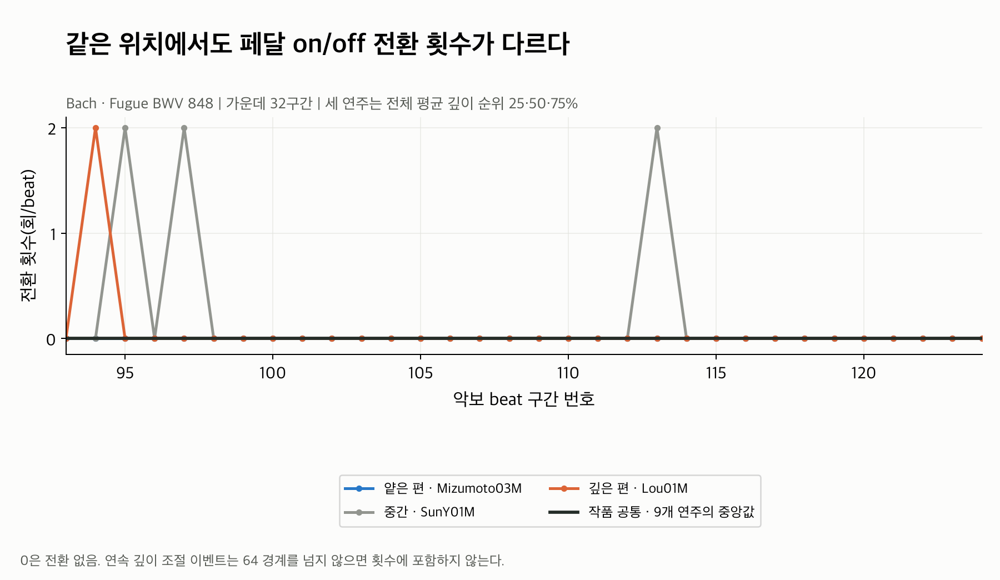

# Changes: on/off를 몇 번 바꿨나?

각 beat 구간에 발생한 **CC64 64 경계의 on/off 전환 횟수**다.
0은 전환 없음, 1은 on 또는 off로 한 번 바뀜, 2는 두 번 바뀜이다.
On과 off를 각각 센 값이므로 2를 언제나 “완전한 페달 교체 두 번”으로 읽으면 안 된다.

| 그림 | 읽는 방법 |
|---|---|
| [01 원본과 공통](01_raw_and_common.png) | 같은 악보 위치에서 전환이 어느 연주에 나타나는지 본다. 점 하나가 beat 구간 하나다. |
| [02 상대값](02_relative.png) | 공통보다 전환이 많으면 양수, 적으면 음수다. 단위는 회/beat다. |
| [03 표준화](03_standardized.png) | 상대 횟수를 changes 전용 SD로 나눈 값이다. |
| [04 전체 연주 평균](04_all_performances.png) | 전체 구간의 평균 on/off 전환 횟수를 비교한다. |

SunY01M(회색)과 Lou01M(주황)은 일부 위치에서 2회 전환하고,
Mizumoto03M(파랑)은 이 확대 구간에서 모두 0이다. 곡선 사이를 잇는 선은 읽기 위한
연결선이며, beat 내부에서 횟수가 연속적으로 변한다는 뜻은 아니다.

[원본 CC64 예시](../01_cc64_signal_example.png)의 Sun 113번 구간에는 많은 값 변경이
있지만 on 경계를 위로 한 번, 아래로 한 번 넘어서 changes는 **2회**다.
100→127처럼 이미 on인 상태에서 깊이만 바뀌는 이벤트는 전환 횟수에 넣지 않는다.

이번 확대 구간에서 공통 changes는 모두 0이라 01과 02가 같은 모양이다.
전체 216구간 중 공통값이 0인 구간도 210개다. 대부분의 연주가 같은 위치에서
전환하지 않아, 소수 연주에만 있는 전환이 개인 편차로 남는다.

Sun 113번 구간은 raw 2회, common 0회, relative **+2회/beat**다.
SD 0.522939로 나누면 standardized는 **+3.82**다.
다른 작품에서 중앙값이 소수일 수 있으므로 common·relative를 정수로 반올림하지 않는다.

전체 평균 횟수는 **0.009~0.495회/beat**, 상대 평균은 **-0.019~0.468회/beat**다.
LeeSH는 구간당 평균 약 0.495회로 가장 높고 Denisova는 약 0.009회다.
이는 “특정 구간에 집중하는가, 더 자주 전환하는가”의 기록상 차이를 나타낸다.

Residual의 91.7%가 0이라 MAD와 IQR scale이 모두 0이다.
기존 기본 정책인 **changes 전용 SD 0.522939**를 사용했다.
전체 beat의 최대 |standardized|는 7.65이며 clipping하지 않았다.

**Beat가 길면 그 안에 여러 전환이 들어갈 수 있다.** 다른 작품의 count를 그대로
비교하면 score beat 정의와 길이의 영향을 받는다. 초당 횟수로 나누면 전체 빠르기의 영향이
추가된다. 이번 분석은 원본 counts를 유지하며 작품별 공통 제거와 SD 표준화를 적용했다.
이는 모든 beat 길이 영향을 제거했다는 뜻은 아니다.

연주와 구간 선택, 계산식, mask와 검증 결과는 [Pedaling 분석 안내](../README.md)에 있다.
