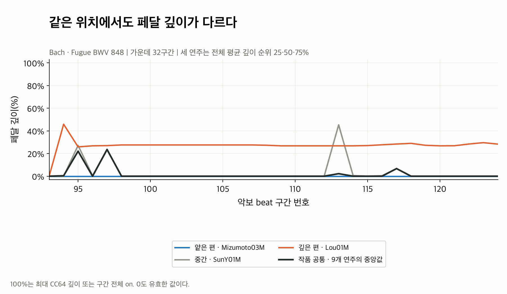

# Depth: 얼마나 깊게 밟았나?

CC64 값을 127로 나눈 뒤, 각 beat 구간 안에서 **시간 가중 평균**한다.
100%는 CC64가 구간 내내 127인 상태, 0%는 내내 0인 상태다.
실제 페달 이동 거리나 음향 효과의 비율로 해석하지 않는다.

| 그림 | 읽는 방법 |
|---|---|
| [01 원본과 공통](01_raw_and_common.png) | 선이 높을수록 그 구간의 평균 CC64가 높다. 검정은 9개 연주의 중앙값이다. |
| [02 상대값](02_relative.png) | 0보다 위면 공통보다 깊게, 아래면 덜 깊게 밟았다. 단위는 %p다. |
| [03 표준화](03_standardized.png) | 상대값을 작품 내 depth residual의 SD로 나눈 값이다. +1은 약 +15.64%p다. |
| [04 전체 연주 평균](04_all_performances.png) | 각 연주의 전체 유효 beat 평균을 비교한다. |

가운데 32구간에서 Lou01M(주황)은 상당 구간에 약 27% 깊이를 유지하고,
Mizumoto03M(파랑)은 대부분 0이다. SunY01M(회색)은 일부 구간에서만 크게 올라간다.
같은 작품이라도 **지속적으로 얕게 사용하는 방식과 특정 구간에서 사용하는 방식**이
기록된 신호에서 다르게 나타난다.

Lou의 주황 선이 계속 올라와 있는 구간에도 [on 시간 곡선](../down_ratio/01_raw_and_common.png)은
대부분 0이다. CC64가 64 미만인 얕은 사용은 depth에는 남고 down_ratio에는 들어가지 않기 때문이다.

02에서 Mizumoto의 95번 구간은 raw 0%, common 22.04%라 **-22.04%p**다.
03에서는 이를 SD 0.156432로 나눠 **-1.41**로 표현한다.
같은 연주의 차이를 단위만 바꿔 보여주며, 음수는 공통보다 덜 깊다는 뜻이다.

전체 9개 연주의 평균 깊이는 **0.32~30.87%**, 상대값의 평균은 **-1.62~28.93%p**다.
이번 작품의 공통 패턴은 216구간 중 194개가 0이라 모든 구간에서 원본이 크게 바뀌지는 않는다.
그래도 공통값이 있는 위치에서는 위 예시처럼 차이가 제거되고, 개인 편차가 남는다.

유효 residual의 65.1%가 0이며 MAD도 0이다. 기존 기본 정책인 **depth 전용 SD**로
표준화했다. 모든 연주·구간을 포함한 SD가 0.156432이고, 다른 페달 지표의 scale과 섞지 않는다.
전체 beat의 최대 |standardized|는 5.47이며 clipping하지 않았다.

연주와 구간 선택, 계산식, mask와 검증 결과는 [Pedaling 분석 안내](../README.md)에 있다.
