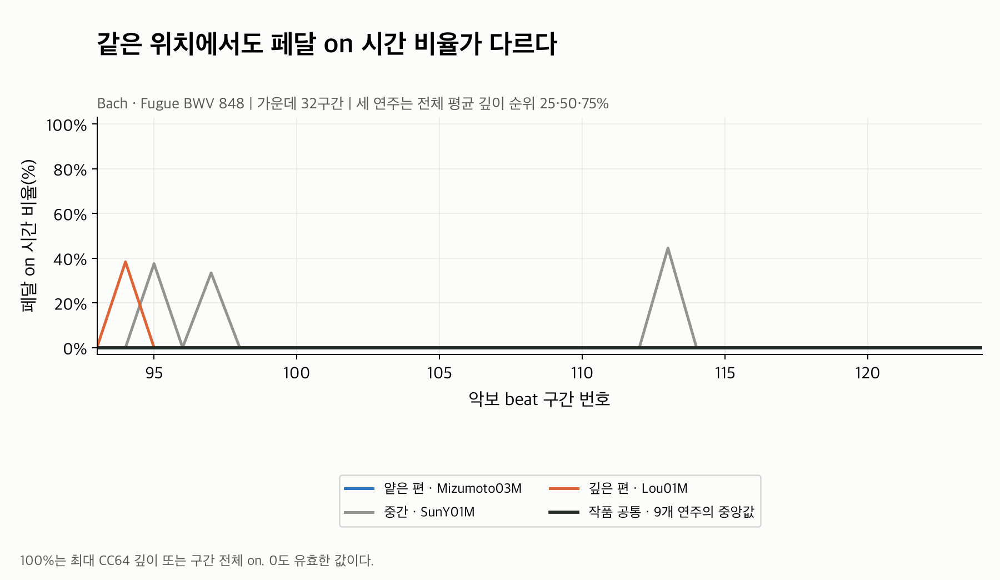

# Down ratio: 얼마 동안 on 상태였나?

각 beat 구간에서 **CC64가 64 이상인 시간의 비율**이다.
100%는 구간 내내 on, 50%는 구간 길이의 절반 동안 on, 0%는 on 시간이 없다는 뜻이다.
64 미만의 얕은 값을 유지해도 이 지표는 0일 수 있다.

| 그림 | 읽는 방법 |
|---|---|
| [01 원본과 공통](01_raw_and_common.png) | 선이 높을수록 해당 구간에서 on으로 유지한 시간이 길다. |
| [02 상대값](02_relative.png) | 공통보다 오래 on이면 양수, 짧으면 음수다. 단위는 %p다. |
| [03 표준화](03_standardized.png) | 상대값을 on 비율 전용 SD로 나눈다. +1은 약 +12.88%p다. |
| [04 전체 연주 평균](04_all_performances.png) | 전체 유효 beat의 on 비율 평균을 비교한다. |

같은 세 연주를 비교해도 depth 곡선과 모양이 다르다. SunY01M(회색)은 95·97·113번
주변에서 잠깐 올라가고 나머지는 대부분 0이다. Lou01M(주황)은
[깊이 곡선](../depth/01_raw_and_common.png)에서 이어지던 얕은 값 대부분이 이 그림에서는 0이 된다.

**원본과 상대 그림이 여기서는 거의 같다.** 확대 구간의 공통 on 비율이 모두 0이기 때문이다.
전체 216구간에서도 210개가 공통값 0이다. 공통값은 9개 연주의 중앙값이므로,
몇몇 연주만 on이면 중앙 패턴으로 남지 않는다. 같은 위치에서 과반수의 on 시간이 있는
경우에만 공통값이 양수가 될 수 있다.

Sun의 113번 구간은 원본 44.50%, 공통 0%, 상대 **+44.50%p**다.
SD 0.128809로 나누면 standardized는 **+3.46**이다.
0으로 붕괴하지 않고 다른 연주와 다른 페달 사용 위치가 그대로 남는다.

전체 평균 on 비율은 **0.44~10.13%**, 상대값의 평균은 **-0.05~9.64%p**다.
Depth 평균이 가장 높은 MiyashitaM(30.9%)의 on 비율은 2.3%이고,
LeeSH는 깊이 9.5%인데 on 비율은 10.1%다. **깊이 순위와 on 시간 순위는 다르다.**

이 평균은 beat마다 계산한 비율을 동일 가중으로 평균한 것이다.
곡 전체 재생시간 중 on 시간 비율과는 다르다. 전체 시간 가중 요약이 필요하면 별도로 계산해야 한다.

Residual의 90.6%가 0이라 MAD와 IQR scale이 모두 0이다.
기존 기본 정책인 **on 비율 전용 SD 0.128809**를 사용했다.
전체 beat의 최대 |standardized|는 7.31이며 clipping하지 않았다.

연주와 구간 선택, 계산식, mask와 검증 결과는 [Pedaling 분석 안내](../README.md)에 있다.
