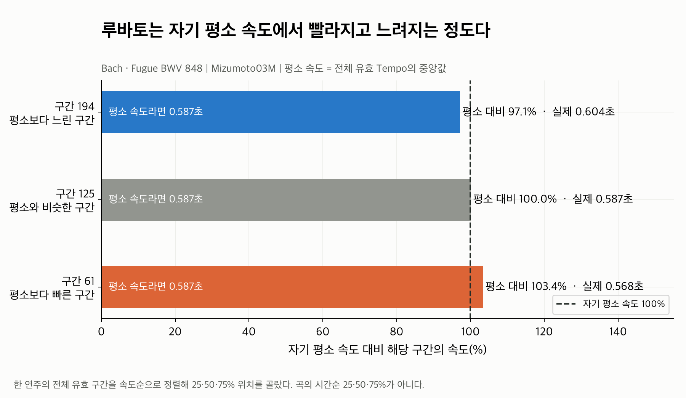
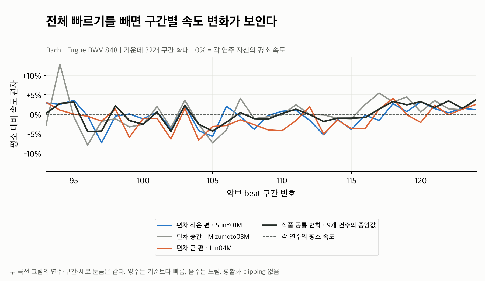
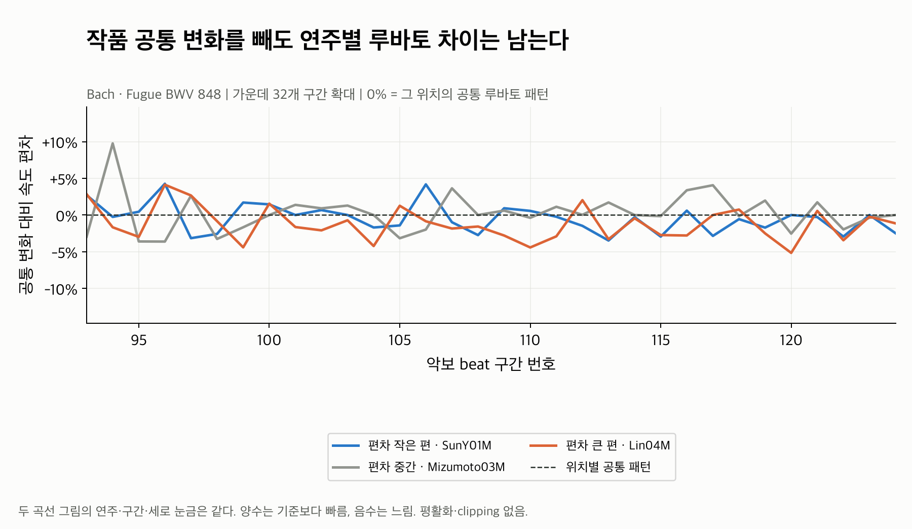
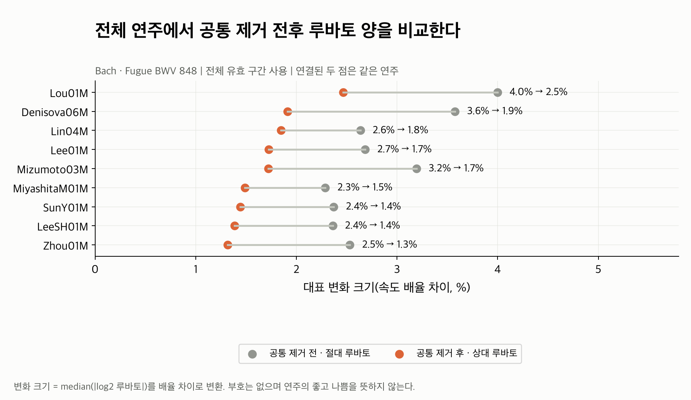
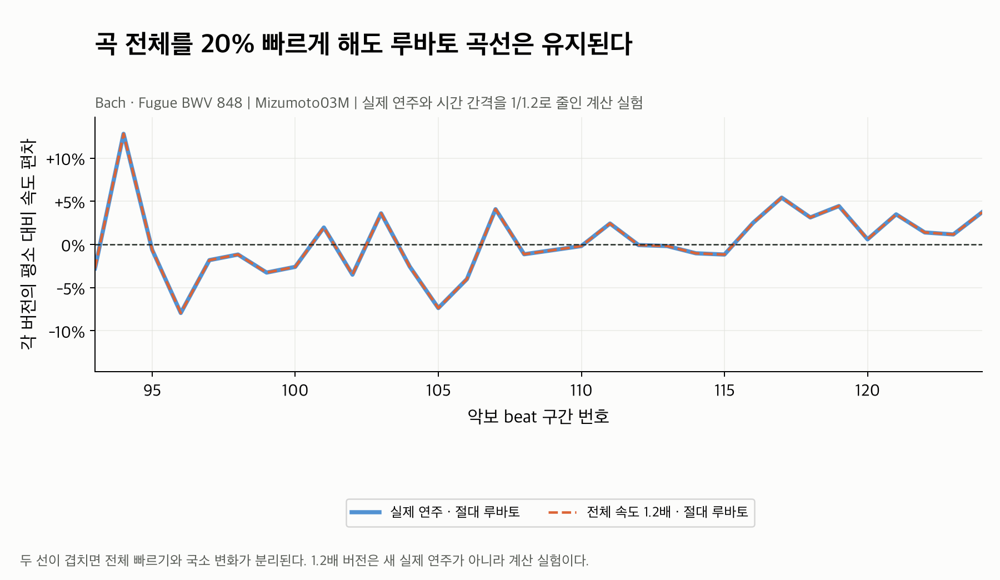
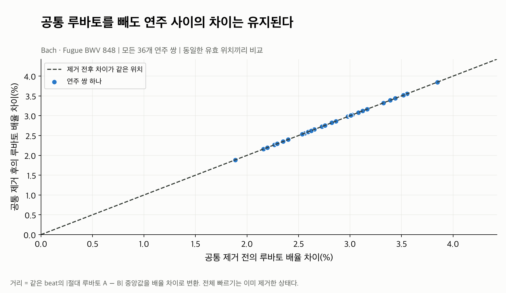

# Rubato: 전체 빠르기를 빼도 국소적인 연주 차이가 남는가?

[Tempo 예시](../tempo/README.md)와 같은 **Bach 푸가 BWV 848의 실제 정렬 연주 9개**를
사용했다. 파일마다 그래프 하나씩 두었고, 속도 편차를 퍼센트로 표시했다.
**01 → 02 → 03 → 04** 순서로 읽으면 루바토의 의미와 연주별 차이를 이해할 수 있다.
05와 06은 전체 빠르기 분리·연주 간 차이 보존 확인용이다.

Tempo에서 보았던 “이 연주는 전체적으로 더 빠르다”를 제거한 뒤,
**“자기 평소 속도보다 어느 위치에서 더 빠르게, 더 느리게 연주하는가”**를 보는 분석이다.
현재 feature의 `absolute`는 자기 평소 속도 기준, `relative`는 작품 공통 변화 기준이다.
`absolute`라는 이름이 절대 BPM을 뜻하지는 않는다.

## 그림 목록

| 파일 | 이 그림이 답하는 질문 |
|---|---|
| [01_rubato_from_own_baseline.png](01_rubato_from_own_baseline.png) | 자기 평소 속도에서 벗어났다는 것은 실제 시간으로 어떤 뜻인가? |
| [02_absolute_rubato_curves.png](02_absolute_rubato_curves.png) | 전체 빠르기를 빼면 어떤 구간별 변화가 보이나? |
| [03_relative_rubato_curves.png](03_relative_rubato_curves.png) | 작품 공통 변화를 빼도 개인별 루바토 차이가 남나? |
| [04_all_performance_rubato_amounts.png](04_all_performance_rubato_amounts.png) | 전체 9개 연주에서 공통 제거 전후의 변화량은 어느 정도인가? |
| [05_global_speed_invariance.png](05_global_speed_invariance.png) | 곡 전체를 빠르게 하면 루바토도 커지는가? |
| [06_pairwise_difference_preserved.png](06_pairwise_difference_preserved.png) | 공통 제거 과정에서 연주 사이의 차이가 사라지지는 않았나? |

## 01. 평소보다 빠르거나 느리다는 뜻



Mizumoto03M이 자기 평소 속도로 연주한다면 이 악보 구간들에 약 **0.587초**가 걸린다.
실제 구간 세 개를 비교하면 다음과 같다.

| 악보 구간 | 실제 소요 시간 | 자기 평소 대비 속도 | 읽는 방법 |
|---|---:|---:|---|
| 194 | 0.604초 | 97.1% | 더 오래 걸려 평소보다 약 2.9% 느림 |
| 125 | 0.587초 | 100.0% | 평소와 거의 같은 속도 |
| 61 | 0.568초 | 103.4% | 더 짧게 걸려 평소보다 약 3.4% 빠름 |

막대의 기준선 **100%는 악보 MIDI나 다른 연주의 속도가 아니라 이 연주 자신의 평소 속도**다.
02에서는 같은 값을 100% 기준에서 뺀 편차로 표시한다. 예를 들어 103.4%는 +3.4%다.

이 세 구간은 한 연주의 전체 유효 구간을 속도순으로 정렬해 25·50·75% 순위에서 골랐다.
차이가 가장 큰 구간이나 곡의 시간순 25·50·75%를 고른 것이 아니다. 이 작품의 악보 구간은
모두 0.5초라 평소 속도 기준 시간도 같으며, 다른 작품에서는 구간마다 악보 길이를 반영한다.

## 02. 자기 평소 속도를 제거한 곡선



가로축은 악보 beat 구간 번호다. 세로축은 **각 연주의 자기 평소 속도 대비 편차**다.
0%면 평소 속도, +5%면 평소보다 5% 빠름, -5%면 평소보다 5% 느림이다.

- 파랑: 전체 상대 루바토 양이 작은 편인 SunY01M.
- 회색: 상대 루바토 양이 중간인 Mizumoto03M.
- 주황: 상대 루바토 양이 큰 편인 Lin04M.
- 검정 실선: **9개 모두**로 계산한 위치별 공통 루바토 중앙 패턴.
- 검정 점선: 각 연주의 자기 평소 속도.

세 연주는 전체 상대 루바토 양 순위의 **25·50·75%**에서 골랐다. Tempo 그림의
“느린 편·중간·빠른 편”과는 다른 기준이다. 전체 곡에서 편차가 작은 연주도 특정 위치에서는
다른 연주보다 크게 변할 수 있다.

여러 선이 함께 내려가거나 올라가는 곳은 작품 공통 변화가 있는 위치다. 회색 선의 94번
구간처럼 다른 선과 달라지는 곳은 개인 차이가 있는 위치다. 검정 선은 현재 데이터셋의
중앙 패턴이며 **음악적 정답이나 연주자가 따라야 할 속도가 아니다.**

곡선은 전체 216구간 중 가운데 **93~124번, 32구간**을 확대했다. Tempo 예시와 같은 구간이다.
변화가 큰 위치를 찾는 대신 가운데를 고정했다. 평활화·보간·값 clipping은 하지 않았다.
나머지 구간과 마지막 구간도 [beat_features.csv](beat_features.csv)에 모두 보존했다.

## 03. 작품 공통 변화까지 제거한 곡선



02와 **같은 연주·같은 구간·같은 세로 눈금**이다. 기준만 자기 평소 속도에서
그 위치의 공통 루바토 패턴으로 바뀐다.

- 0%: 전체 빠르기를 제거한 국소 속도 변화가 공통 패턴과 같음.
- +5%: 그 위치의 공통 변화보다 정규화된 국소 속도가 5% 빠름.
- -5%: 그 위치의 공통 변화보다 정규화된 국소 속도가 5% 느림.

02에서 함께 움직이던 변화 일부가 줄지만, 세 선이 모두 0으로 붕괴하지 않는다.
따라서 **공통 제거 후에도 어느 위치에서 상대적으로 더 빠르거나 느리게 연주하는지**를
읽을 수 있다. 점 하나의 양수·음수는 앞 구간 대비 가속·감속 방향을 뜻하지 않는다.

예를 들어 Mizumoto03M의 94번 구간은 자기 평소보다 **12.8%** 빠르다. 그 위치의 공통 변화는
**+2.8%**이며, 이를 제거한 개인 편차는 **+9.8%**다. 퍼센트 자체를 빼는 방식은 아니다.

```text
개인 속도 배율 = 자기 평소 대비 속도 배율 / 공통 변화 배율
1.128076 / 1.027800 ≈ 1.097564 → +9.8%
```

0에 가깝다고 좋은 연주, 멀다고 나쁜 연주라는 뜻은 아니다. 중앙 패턴에 대한 상대적 위치다.
공통 제거 후의 상대 루바토는 각 연주에서 다시 중앙값 0으로 맞추지 않는다.

## 04. 전체 연주의 루바토 양 비교



한 줄이 한 연주이며, 회색 점은 공통 제거 전의 절대 루바토 양, 주황 점은 제거 후의
상대 루바토 양이다. 곡선에 나오지 않은 나머지 연주도 모두 포함한다.

| 연주 | 공통 제거 전 | 공통 제거 후 |
|---|---:|---:|
| Lou01M | 4.00% | 2.46% |
| Denisova06M | 3.58% | 1.91% |
| Lin04M | 2.64% | 1.85% |
| Lee01M | 2.68% | 1.73% |
| Mizumoto03M | 3.19% | 1.72% |
| MiyashitaM01M | 2.29% | 1.49% |
| SunY01M | 2.37% | 1.44% |
| LeeSH01M | 2.36% | 1.38% |
| Zhou01M | 2.53% | 1.32% |

이 작품에서는 공통 제거 후 9개 연주 모두 변화량이 줄지만 **1.32~2.46%**로 남는다.
연주별 변화량의 중앙값은 제거 전 **2.64%**, 제거 후 **1.72%**다.
공통 움직임을 덜어내면서 연주마다 남는 편차의 크기가 다름을 확인할 수 있다.
모든 작품과 모든 연주에서 반드시 변화량이 줄어든다는 보장은 없다.

여기서 “양”은 전체 유효 위치의 `median(abs(log2 루바토))`를 `100 × (2^값 - 1)`로
변환한 **부호 없는 속도 배율 차이**다. 곡선의 최고점·평균값이나 연주 간 거리가 아니다.
예를 들어 평소의 1.05배와 1/1.05배 속도는 모두 변화 크기 5%로 취급한다.
느린 쪽의 signed 편차는 약 -4.76%이므로, 이 값은 `median(abs(그림의 퍼센트))`와 다르다.
큰 값은 중앙 패턴에서 벗어난 국소 변화가 더 크다는 뜻이며 해석의 우수함을 판단하지 않는다.

## 05. 전체 빠르기와 루바토가 분리되는지 확인



파랑 실선은 실제 Mizumoto03M의 절대 루바토다. 주황 점선은 모든 연주의 시간 간격을
`1/1.2`로 줄여 전체 속도를 20% 높인 뒤 다시 추출한 결과 중 같은 연주다.
이 버전은 새 실제 연주가 아니라 **전체 빠르기만 바꾼 계산 실험**이다.

두 선이 겹친다. 전체 빠르기를 높여도 같은 위치에서 자기 평소 속도 대비 빨라지고
느려지는 패턴은 유지된다. 루바토가 단순히 빠른 연주를 높은 값으로 표현하지 않음을 확인한다.
9개 전체의 absolute/common/relative와 mask/support도 비교했으며, 최대 값 차이는
약 `8.12e-14` log2 단위로 부동소수점 오차 수준이다.

## 06. 공통 제거가 연주 간 차이를 보존하는지 확인



한 점은 두 연주의 쌍이다. 9개 연주의 모든 **36개 쌍**을 비교했다. 가로축은 공통 제거 전,
세로축은 제거 후의 루바토 배율 차이다. 모든 점이 대각선 위에 있으므로 차이가 보존됐다.

같은 위치에서 같은 공통값을 빼므로 다음 관계가 성립한다.

```text
(absolute_A - common) - (absolute_B - common) = absolute_A - absolute_B
```

거리는 두 연주가 함께 유효한 위치의 `median(abs(absolute_A - absolute_B))`를
배율 차이로 변환했다. 36쌍의 거리 중앙값은 **2.84%**, 범위는 **1.89~3.85%**다.
공통 제거 전후 beat별 차이의 최대 오차는 `5.55e-17` log2 단위다.

이 그림의 제거 전 값도 **전체 빠르기는 이미 제거한 절대 루바토**다.
원본 Tempo에서 절대 루바토로 바꿀 때는 연주별 전체 빠르기 차이를 의도적으로 제거하므로,
그 과정까지 모든 Tempo 거리를 보존한다는 뜻은 아니다.

## 계산과 검증 범위

```text
tempo[p, i] = log2(score_interval[i] / performance_interval[p, i])
baseline[p] = 연주 p의 유효 tempo 값 중앙값
absolute[p, i] = tempo[p, i] - baseline[p]
common[i] = 같은 위치의 유효 absolute 값 중앙값
relative[p, i] = absolute[p, i] - common[i]

01 표시값 = 100 × 2^absolute
02 표시값 = 100 × (2^absolute - 1)
03 표시값 = 100 × (2^relative - 1)
04 변화량 = 100 × (2^median(abs(유효 루바토)) - 1)
```

퍼센트는 기존 log2 값의 **그림용 단위 변환**이다. 추가 scale 표준화나 clipping을 적용하지
않았고 기존 추출 코드와 원본 feature를 바꾸지 않았다. 공통값에는 자기 자신도 포함한 9개가
모두 들어간다. 반복 구조가 다른 no_repeat/extra_repeat 대응 연주는 이 그룹에 포함하지 않는다.

유효 beat **1,944개**의 raw Tempo, 연주별 baseline, absolute/common/relative를 독립 재계산해
일치 여부를 확인했다. Baseline과 absolute에서 역산한 원본 시간 간격의 최대 오차는
`2.22e-16`초다. 이 작품은 연주당 216구간이며 모두 regular/유효, 위치별 support는 9다.
기존의 bR·suspicious·invalid 구간 제외 정책과 상태·이유를 CSV에 보존한다.
지원수가 2 미만이면 common/relative는 NaN + mask=False다.

현재 Rubato는 **beat 수준의 국소 속도 변화**를 뜻한다. 악보에 적힌 accelerando/ritardando,
구조적인 템포 변화, 연주자가 의도한 미세한 timing을 완전히 분리하는 의미는 아니다.
그 공통 부분을 데이터의 중앙 패턴으로 덜어내는 분석이다. Beat 사이의 더 작은 timing이나
음악적 의도, annotation 자체의 정확성, 사용자 취향과 추천 성능은 이 그림만으로 검증하지 않는다.
04처럼 변화량이 비슷해도 어느 위치에서 어떻게 변하는지는 다를 수 있어 03의 곡선도 함께 본다.

## 데이터와 재현

- 작품: `Bach/Fugue/bwv_848`, 실제 정렬 연주 9개.
- ASAP revision: `afc815c75c42e83a79c03feb6da8a35e77d4c6b8`.
- [performance_summary.csv](performance_summary.csv): 연주별 baseline, 변화량, 유효수·상태별 수.
- [beat_features.csv](beat_features.csv): 전체 시간 간격, Tempo/absolute/common/relative, mask/support.
- [pairwise_distances.csv](pairwise_distances.csv): 모든 36개 연주 쌍의 전후 거리.
- [stats.json](stats.json): 선택 규칙, 그림 구간, 데이터·코드 hash, 재계산과 속도 배율 변경 검증 결과.

저장소 루트에서 실행한다. Dataset 기본 경로는 저장소 밖 `Classicfy/datasets/ASAP`,
`Classicfy/datasets/nASAP`이고, 기본 출력 경로는 실행 위치와 관계없이 이 폴더다.

```bash
.venv/bin/python classicfy-ai/scripts/validate_rubato.py
```

전체 곡선을 보려면 `--curve-beats 216`을 지정한다. 다른 작품을 선택할 때는 이 README의
Bach 예시와 섞이지 않도록 별도 `--out`을 지정한다.

```bash
.venv/bin/python classicfy-ai/scripts/validate_rubato.py \
  --work Chopin/Etudes_op_10/8 \
  --out classicfy-ai/analysis/rubato/chopin_op10_8
```

관련 Tempo·Rubato·대표 feature 회귀 및 실제 ASAP pipeline 테스트 **24개가 모두 통과**했다.
기존 10작품 자료는 내용 변경 없이 [archive/](archive/README.md)에 보존했다. 기존 그림은
여러 패널에 공통 곡선과 편차 범위를 묶어 작은 개별 차이를 읽기 어려워 실제 연주선을 따로 그렸다.

[전체 분석 목록](../README.md) · [Feature 공개 인터페이스](../../src/features/README.md)
