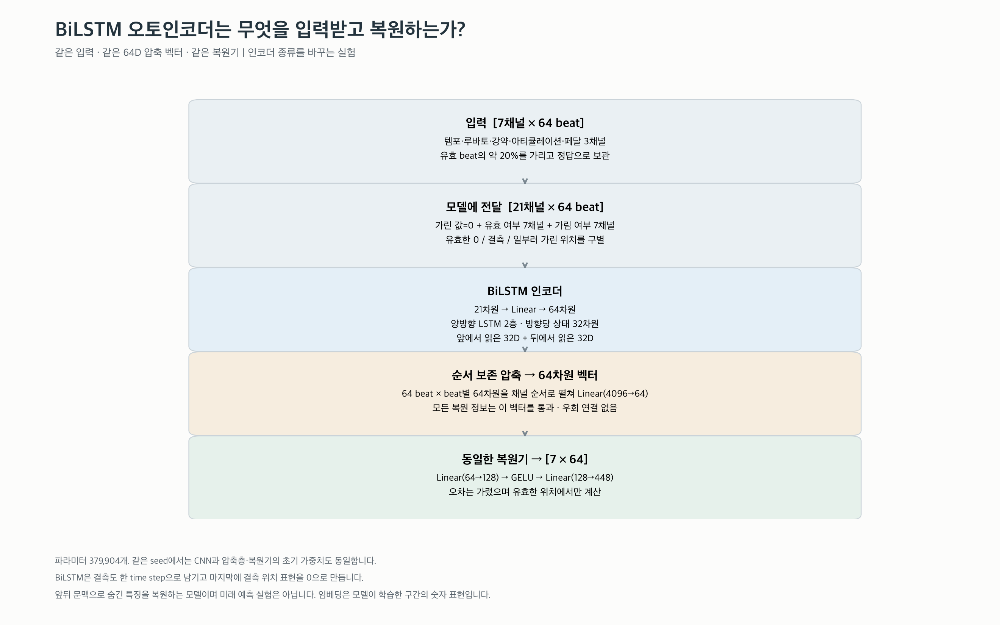
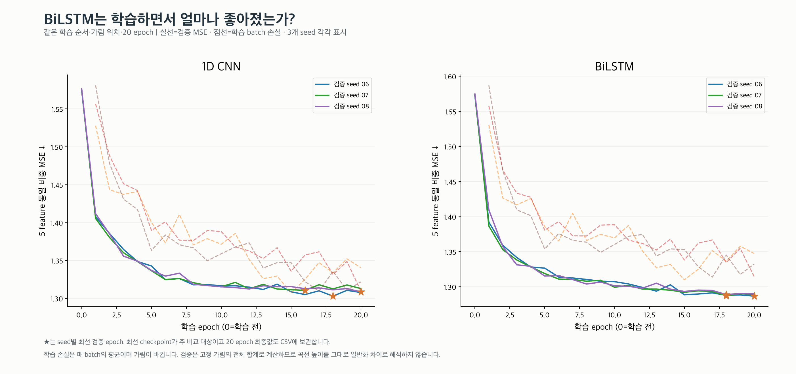
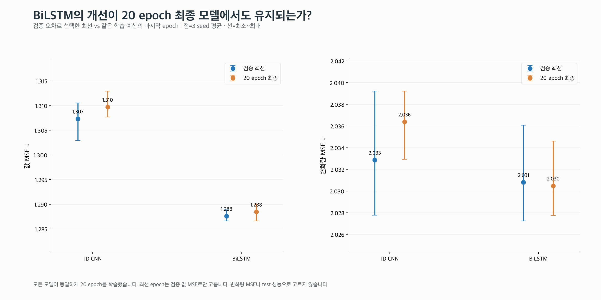
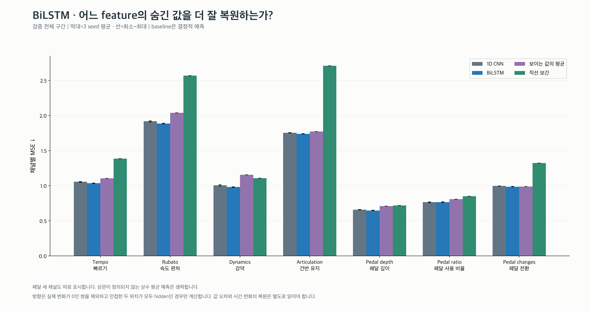
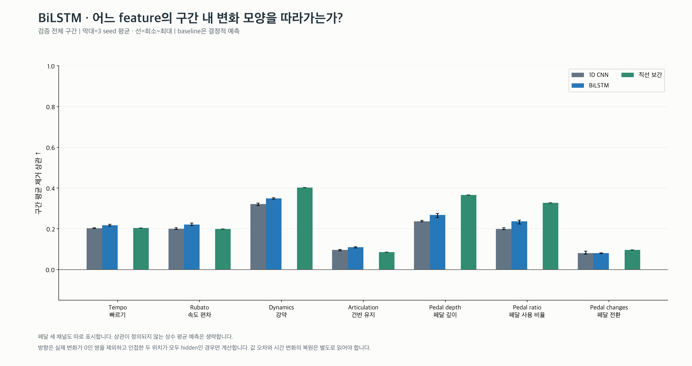
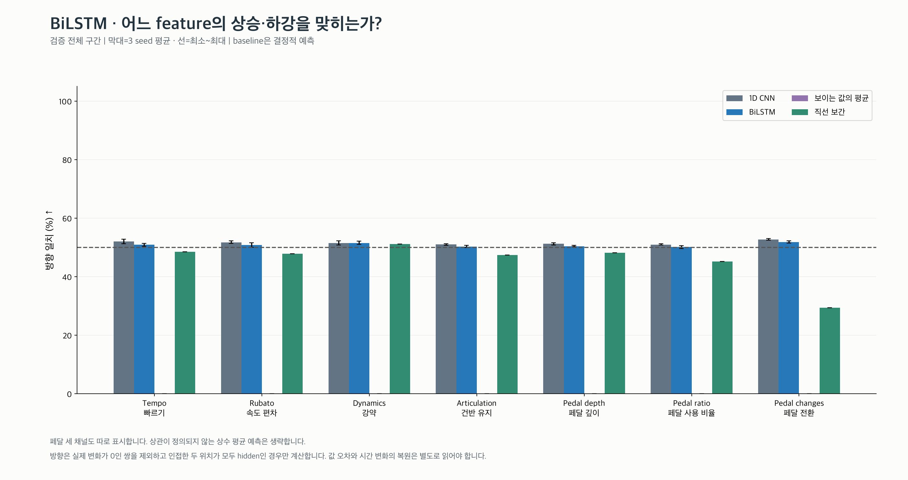
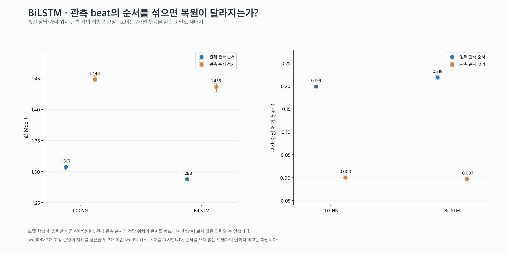
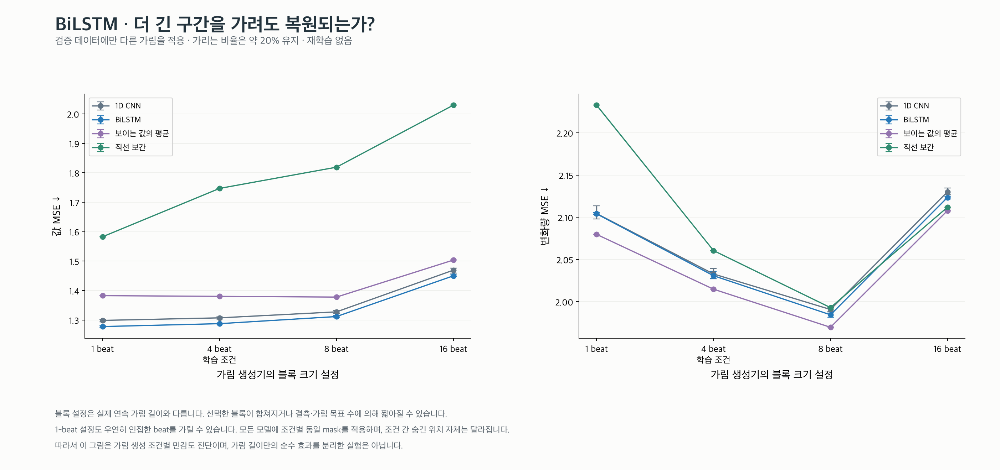
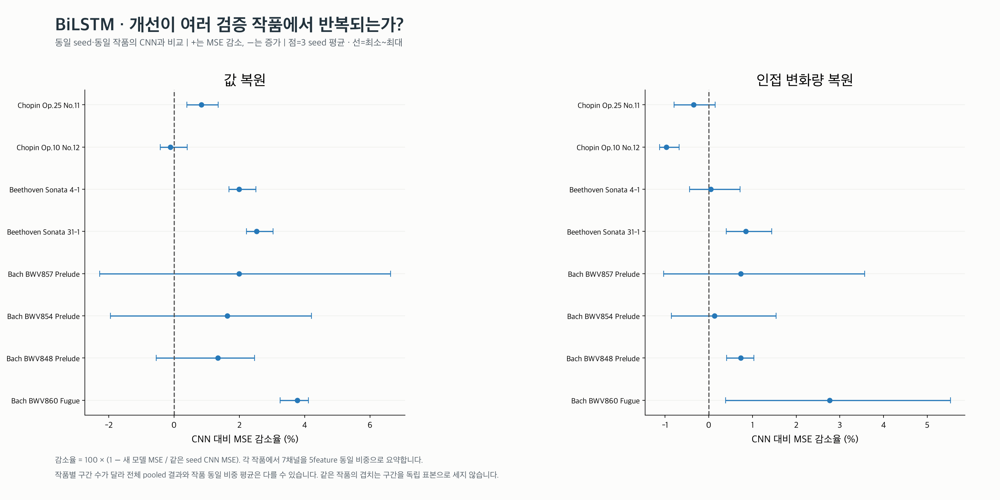
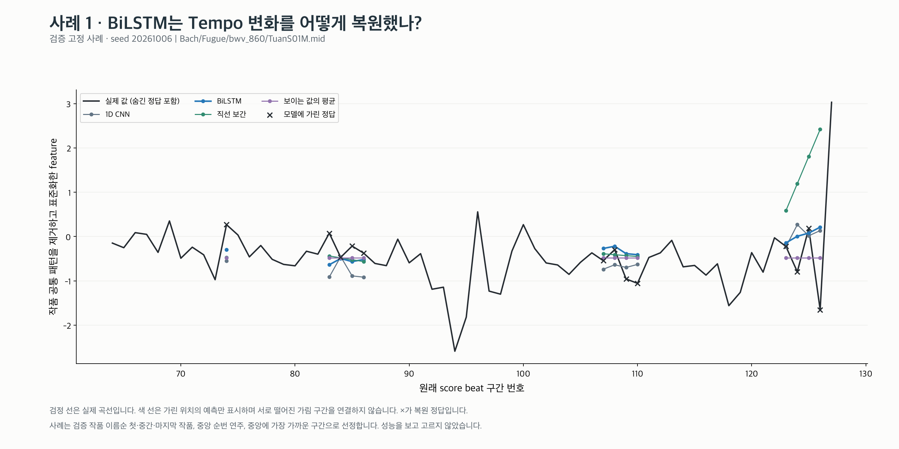

# BiLSTM 구현과 실험 결과

**검증 값 MSE 1.2876, CNN 1.3073. 평균 MSE의 비율로 보면 1.51% 감소입니다.**
인접 변화량 MSE는 2.0308 (CNN 대비 0.10% 감소), 모양 상관 0.219,
예측/실제 변화 폭 24.6%, 방향 일치 50.8%입니다.
음수 감소율은 악화를 뜻합니다. 모델 종류 전체의 성능을 단정하지 않습니다.

구조의 숫자는 이번 구현 설정입니다. 64D 벡터와 복원기는 CNN과 동일합니다.
전체 지표 정의·입력·동일 조건·한계는 [공통 실험 설명](../README.md)에 있습니다.

BiLSTM은 LSTM 두 개로 같은 구간을 앞→뒤와 뒤→앞으로 읽습니다. 각 LSTM의 hidden state는
지금까지 읽은 정보를 요약하는 벡터이고, cell state는 게이트로 정보를 유지·지우며 전달하는 내부 기억입니다.
이번 구현은 각 방향 32차원의 출력을 합쳐 beat마다 64차원으로 만듭니다. 첫 층의 출력 전체를 둘째 층이 다시 읽습니다.
한 방향의 마지막 state만 쓰지 않고 모든 beat의 출력을 순서대로 펼쳐 압축하므로 위치별 정보를 유지합니다.
뒤에서 읽는 방향도 **관측된 입력과 mask만** 읽습니다. 숨긴 정답을 읽는 것이 아닙니다.
오른쪽 padding과 중간 결측을 삭제하지 않아서 원래 beat 간 간격이 유지됩니다. 다만 결측 step도 상태 전달에 영향을 줄 수 있습니다.

## 학습이 실제로 수행됐는가?

세 seed 모두 실제 학습·저장·재로드를 수행했습니다. seed별 선택 epoch: **20261006: 20, 20261007: 18, 20261008: 18**.
가린 정답 누출 방지, 결측·padding 처리, 인코더 gradient, 저장 후 동일 출력 테스트를 통과했습니다.

## 값 오차와 시간 변화는 각각 어떻게 달라졌는가?

값 MSE 감소는 평균적인 수준을 잘 맞춘 결과일 수도 있습니다. 모양·방향·변화 폭을 함께 읽어야 합니다.
변화 폭 비율은 100%가 크기의 일치일 뿐, 모양이 같다는 뜻이 아닙니다.

## 시간 순서와 가림 조건을 바꾸면?

순서 섞기는 추론 중 관측 값과 원래 위치의 관계를 깨는 진단입니다. 학습 분포 밖의 입력일 수 있습니다.
블록 크기 설정은 실제 gap 길이와 다르며, 조건별 숨긴 위치도 달라집니다. 이 두 실험을 인과적 증명으로 해석하지 않습니다.

원래 순서의 값 MSE는 **1.2876**, 세 순열을 seed 안에서 평균한 순서 섞기 MSE는 **1.4363**입니다.
가림 생성 설정별 3 seed 평균은 다음과 같습니다.

| 블록 설정 (beat) | 값 MSE ↓ | 변화량 MSE ↓ |
|---|---:|---:|
| 1 | 1.2778 | 2.1041 |
| 4 (학습 조건) | 1.2876 | 2.0308 |
| 8 | 1.3117 | 1.9845 |
| 16 | 1.4501 | 2.1235 |

## 일부 작품에만 맞는 결과인가?

검증 8작품 중 **4작품**에서 세 seed 모두 CNN보다 값 MSE가 작았습니다.
전체 pooled 결과와 작품 동일 비중 평균은 구간 수 차이로 달라질 수 있습니다.

## 고정된 실제 복원 사례

검정=실제, ×=숨긴 정답, 색 선=가린 위치의 예측입니다. 서로 다른 gap을 이어 그리지 않습니다.
작품 이름순 첫·중간·마지막 작품의 중앙 연주·중앙 구간으로 고정했으며 성능을 보고 선택하지 않았습니다.

| 사례 | Tempo | Rubato | Dynamics | Articulation | Pedal depth | Pedal ratio | Pedal changes |
|---|---|---|---|---|---|---|---|
| 1 | [figure](examples/01_tempo.png) | [figure](examples/01_rubato.png) | [figure](examples/01_dynamics.png) | [figure](examples/01_articulation.png) | [figure](examples/01_pedal_depth.png) | [figure](examples/01_pedal_down_ratio.png) | [figure](examples/01_pedal_changes.png) |
| 2 | [figure](examples/02_tempo.png) | [figure](examples/02_rubato.png) | [figure](examples/02_dynamics.png) | [figure](examples/02_articulation.png) | [figure](examples/02_pedal_depth.png) | [figure](examples/02_pedal_down_ratio.png) | [figure](examples/02_pedal_changes.png) |
| 3 | [figure](examples/03_tempo.png) | [figure](examples/03_rubato.png) | [figure](examples/03_dynamics.png) | [figure](examples/03_articulation.png) | [figure](examples/03_pedal_depth.png) | [figure](examples/03_pedal_down_ratio.png) | [figure](examples/03_pedal_changes.png) |

나머지 20개 사례 figure도 위 표에서 확인할 수 있습니다.
