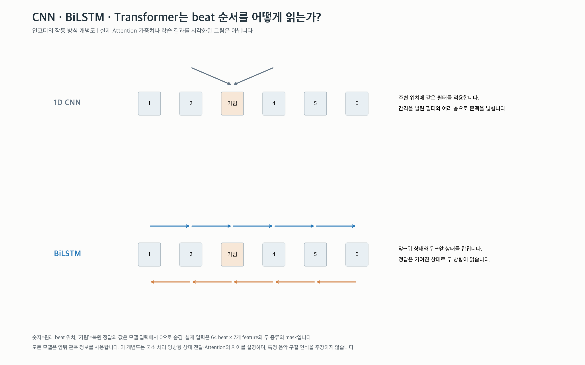
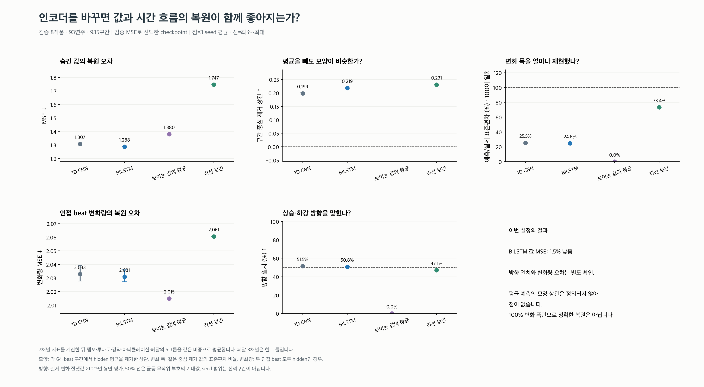
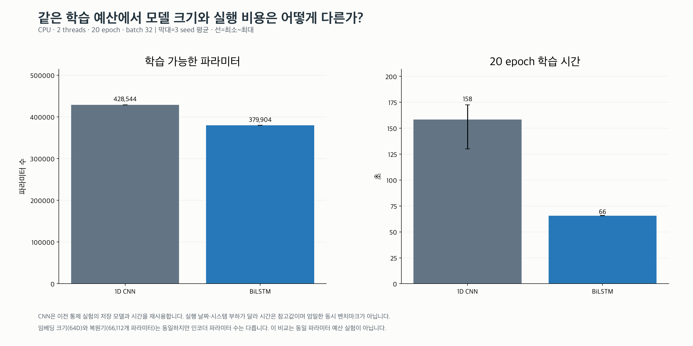

# BiLSTM 먼저 완료한 검증 비교 (Transformer 학습 전)

- **BiLSTM**: 같은 seed의 CNN 대비 검증 값 MSE 평균 **1.51% 감소** (세 seed의 감소율 범위 +1.25~+1.78%; 음수=악화). 모양 상관 **0.219**, 변화 폭 **24.6%**, 방향 일치 **50.8%**.

이 결과는 아래 고정 설정에서의 비교입니다. 모델 계열 전체의 우열을 뜻하지 않습니다.
이 보고서는 Transformer 실행 전 BiLSTM 학습과 검증 결과를 담은 중간 기록입니다.

## 먼저 볼 그림





위 그림에서 값 MSE 감소와 시간 변화 복원을 따로 확인하세요. 평균에 가까운 값을 잘 맞혀도
급격한 변화·방향·변화 폭이 잘 복원된다고 단정할 수 없습니다.

BiLSTM은 값 오차와 모양 상관(0.199→0.219)이 개선됐지만, 변화 폭은 24.6%에 머물고 방향 일치는 CNN 51.5%보다 낮은 50.8%입니다. 값 복원의 소폭 개선을 beat별 움직임 복원 성공으로 확대해 해석하지 않습니다.

- [BiLSTM 구현·실험 설명](bilstm/README.md)

## 실제 검증 결과

3개 seed 평균입니다. 표준편차 비율의 목표는 100%이며 높을수록 무조건 좋은 지표가 아닙니다.

| 모델 | 값 MSE ↓ | 모양 상관 ↑ | 예측/실제 변화 폭 | 변화량 MSE ↓ | 방향 일치 ↑ |
|---|---:|---:|---:|---:|---:|
| 1D CNN | 1.3073 | 0.199 | 25.5% | 2.0329 | 51.5% |
| BiLSTM | 1.2876 | 0.219 | 24.6% | 2.0308 | 50.8% |
| 보이는 값의 평균 | 1.3803 | 정의 안 됨 | 0.0% | 2.0148 | 0.0% |
| 직선 보간 | 1.7469 | 0.231 | 73.4% | 2.0606 | 47.1% |

## 무엇을 구현했는가?

기존 beat별 7채널 feature, 64-beat 구간, 64차원 임베딩, Linear 복원기를 유지하고 인코더만 바꿨습니다.
학습 정답은 입력에서 가린 feature 값입니다. 연주 취향 라벨이나 유사도 라벨은 사용하지 않았습니다.
앞뒤 문맥을 사용하는 masked autoencoder이며 미래를 예측하는 모델은 아닙니다.

- **BiLSTM**: 양방향 LSTM 2층. 방향마다 hidden 32개를 연결해 각 beat를 64차원으로 표현합니다.
- **Transformer**: 폭 64, Attention 4 heads, 2층, FFN 폭 128, pre-LayerNorm, GELU.
  원래 beat 번호를 구분하도록 고정 sin/cos 위치 벡터를 더합니다. causal mask는 사용하지 않습니다.
- **공통 압축층**: 각 위치의 표현을 순서대로 펼쳐 4096→64 Linear로 압축합니다.
- **공통 복원기**: 64→128→448 Linear, 중간 GELU. 임베딩을 우회하는 연결은 없습니다.

PyTorch 공식 [LSTM 문서](https://docs.pytorch.org/docs/stable/generated/torch.nn.LSTM.html)와
[TransformerEncoderLayer 문서](https://docs.pytorch.org/docs/stable/generated/torch.nn.TransformerEncoderLayer.html)를 기준으로 구현했습니다.

## 비교 조건과 데이터

원래 CNN의 동일 데이터·분할을 사용합니다. train 39작품·395연주·5803구간,
validation 8작품·93연주·935구간, test 8작품·82연주·1670구간입니다.
작품 단위 split이며 64-beat 구간, stride 32입니다. 결측 beat를 삭제하거나 이웃으로 붙이지 않습니다.
이번 실험은 ASAP/nASAP의 기존 cohort이며 추가 ATEPP 데이터를 섞지 않았습니다.

입력은 가린 값을 0으로 만든 7채널 + 유효 여부 7채널 + 가림 여부 7채널입니다.
약 20%의 유효 beat를 블록 설정 4로 가립니다. 실제 블록 길이는 결측·겹침·마지막 선택에 따라 다릅니다.
가린 정답과 결측의 값을 바꿔도 출력이 변하지 않는 테스트를 수행했습니다.
BiLSTM은 결측을 한 step으로 남깁니다. Transformer는 결측을 Attention key에서 제외합니다.
LSTM의 hidden state(내부 상태)와 hidden target(가린 정답)은 서로 다른 의미입니다.

세 학습 seed는 20261006/07/08입니다. 모든 모델은 AdamW, lr 0.001, batch 32,
dropout 0.1, gradient clipping 1, 20 epoch를 사용합니다. 학습 batch 순서와 가림의 SHA-256이
같은 seed의 CNN과 정확히 일치하는지 확인합니다. 검증 가림은 모든 모델·seed에서 고정합니다.
같은 seed에서 압축층·복원기의 초기 가중치도 동일합니다.
검증 값 MSE가 최소인 checkpoint로 비교하고 마지막 20 epoch 결과도 별도로 제공합니다.

작품 공통 패턴 제거·scale은 기존 방식입니다. 검증/test도 해당 작품의 전체 reference 연주를
포함해 정규화합니다. reference 없이 단독 새 MIDI를 처리하는 상황과는 다릅니다.

## 지표를 읽는 법

1. **값 MSE**: 가렸으며 유효한 위치에서 (예측−실제)² 평균. 낮을수록 좋습니다.
2. **모양 상관**: 각 64-beat 구간에서 hidden 값의 평균을 실제·예측 각각에서 제거한 후 Pearson 상관.
   떨어진 여러 hidden 블록이 한 구간에 있으면 함께 중심을 제거합니다. 각 연속 블록별 상관과 다릅니다.
   구간의 평균적인 높이만 맞추는 효과를 줄입니다. 상수 평균 예측은 정의되지 않아 생략합니다.
3. **변화 폭 비율**: 같은 중심 제거 값의 예측 표준편차 / 실제 표준편차 ×100.
   100%는 크기가 같은 것이며, 같은 모양·방향이라는 뜻은 아닙니다.
4. **변화량 MSE**: 인접한 두 beat가 모두 hidden이고 유효할 때 Δ예측과 Δ실제의 MSE.
   관측 정답을 그대로 붙여 경계 변화가 좋아 보이는 효과를 제외합니다.
5. **방향 일치**: 같은 hidden 인접 쌍 중 |Δ실제|>10⁻⁶인 쌍에서 상승·하강 부호가 같은 비율.
   실제 변화 0은 제외하고 예측 변화 0은 정답 부호와 다르면 실패입니다. 50%는 균등 무작위 부호의 기대값입니다.

전체 요약은 채널별 지표를 구한 뒤 Tempo/Rubato/Dynamics/Articulation/Pedaling 5그룹을 같은 비중으로
평균합니다. 페달 세 채널은 평균해서 한 그룹으로 둡니다. 작품별 결과는 별도 CSV·그림으로 제공합니다.
**seed 최소~최대는 신뢰구간이 아닙니다.** 같은 연주의 겹치는 구간을 독립 샘플로 간주하지 않습니다.

## 실험 순서와 figure 구성

각 모델 폴더에는 구조 → 학습 → best/final → 채널별 값/모양/방향 → 관측 순서 섞기 → 가림 블록 조건 → 작품별 비교가 있습니다.
검증 사례는 작품 이름순 첫·중간·마지막 작품의 중앙 순번 연주, 중앙 구간으로 고정했습니다.
각 사례의 7채널을 모두 표시하며, 좋은 사례만 고르지 않았습니다.

순서 섞기는 학습 후 입력 변형 진단입니다. 세 고정 순열을 seed 안에서 평균한 후 seed 간 범위를 표시합니다.
순서 없는 모델을 따로 학습한 비교가 아니므로 시간 순서 사용의 인과적 증명은 아닙니다.
가림 블록 실험은 설정 1/4/8/16에서 같은 약 20%를 가립니다. 조건별 정답 위치도 달라지므로
길이만의 효과를 분리하지 않습니다. 검증 데이터에만 이 진단을 적용합니다.

## 모델 크기와 실행 비용



압축 벡터와 복원기는 동일하지만 인코더 파라미터 수는 다릅니다. 파라미터 수를 맞춘 실험은 아닙니다.
CNN은 이전 저장 모델을 재사용합니다. 실행 날짜·부하가 달라 학습 시간은 참고값입니다.

## 범위와 한계

한 작품 split, 3개 seed, 20 epoch, 하나의 optimizer 설정입니다. 각 모델에 최적인 설정을 탐색한 것은 아닙니다.
음악적으로 관련된 작품군 전체가 완전히 분리됐다고 보장하지 않습니다.
복원 개선만으로 추천 품질·사람이 느끼는 연주 해석 유사성을 입증하지 않습니다.
전곡 검색 벡터는 구간 임베딩 평균과 표준편차를 연결한 128D이며 구간 간의 전곡 배치 순서를 잃습니다.
여기서 ‘변화 폭’ 등은 그림에 적힌 통계량이며 새로운 음악 이론 개념이나 성향 정답을 정의한 것이 아닙니다.

## 산출물과 재현

- `summary.csv`: 모델·seed·split·진단 조건별 요약
- `channel_metrics.csv`: 7채널 지표와 평가 target/인접 쌍 수
- `work_metrics.csv`: 작품별 결과
- `history.csv`, `training_runs.json`: 학습 곡선·선택 epoch·규모·시간·schedule hash
- `example_beats.csv`: 모든 고정 사례의 실제·예측 수치
- `protocol.json`: 입력 hash·소스 hash·설정·분할 규모·한계
- figure는 PNG와 SVG를 모두 제공합니다. 체크포인트·임베딩 NPZ는 저장소 밖 datasets에 둡니다.

저장소 루트에서 실행합니다. 완료된 실행은 protocol과 checkpoint hash가 일치할 때만 재사용합니다.

```bash
XDG_CACHE_HOME=/tmp/classicfy-cache MPLCONFIGDIR=/tmp/classicfy-mpl \
classicfy-ai/.venv/bin/python classicfy-ai/scripts/compare_sequence_autoencoders.py --stage all
```

기존 캐시는 ATEPP 전용 수집 파일이 추가되기 전에 생성됐습니다. 원래 reference commit의 feature·preprocessing
파일 **전체가 현재 파일과 byte 단위로 일치**하는지 먼저 검사하고, 원래 수집기 파일 목록으로 원래 소스 hash와
데이터 revision을 검증했습니다. 캐시나 provenance를 임의 수정하지 않았습니다.
