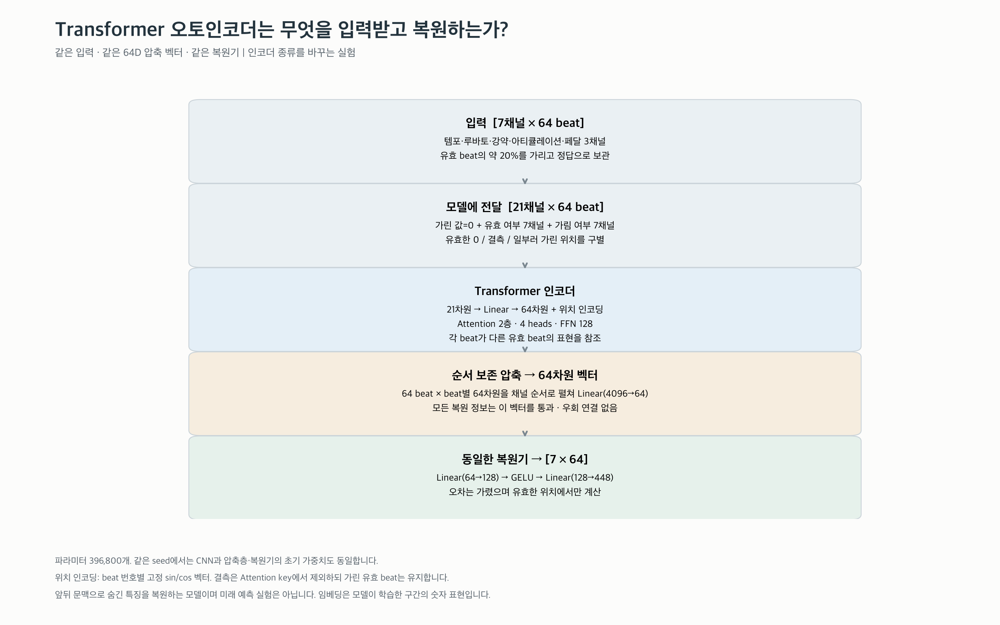
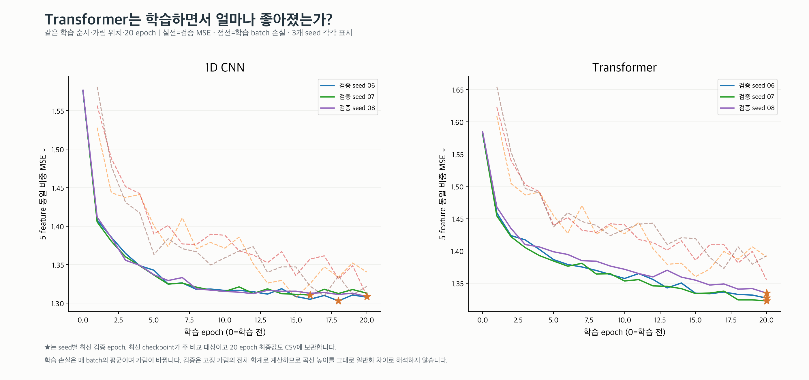
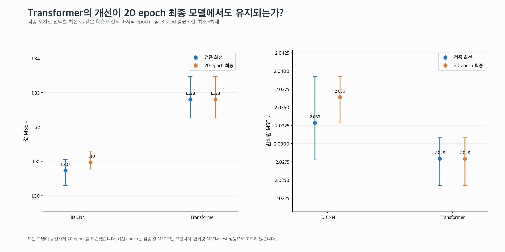
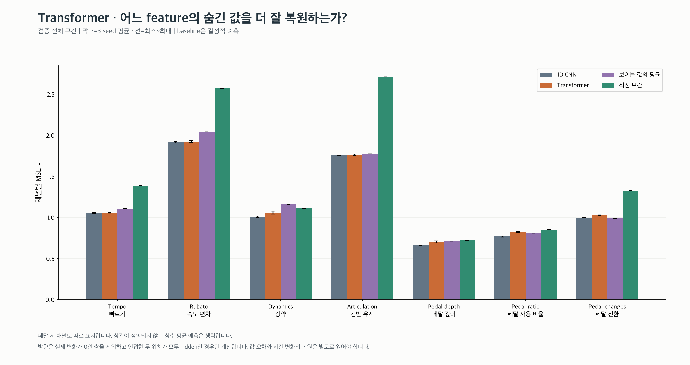
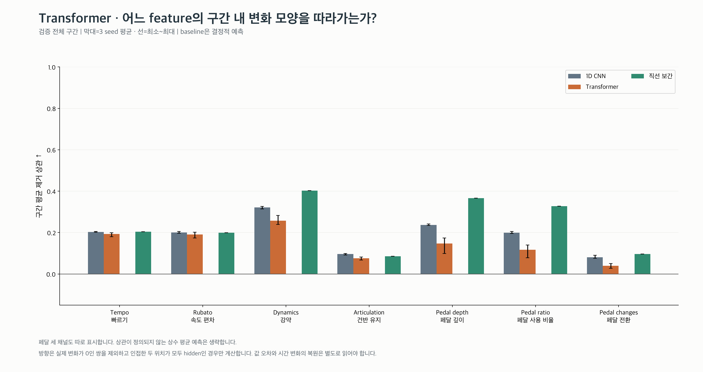
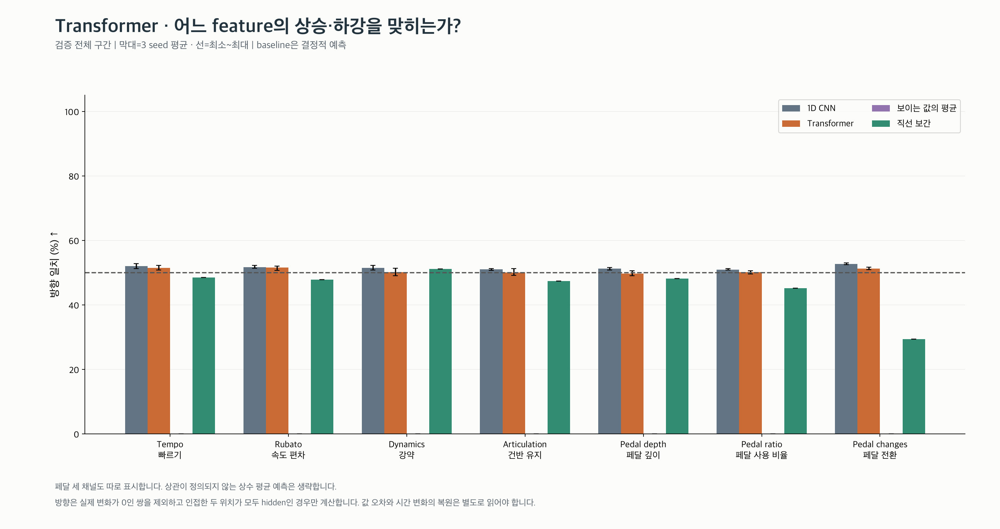
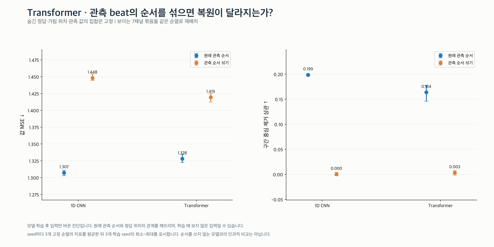
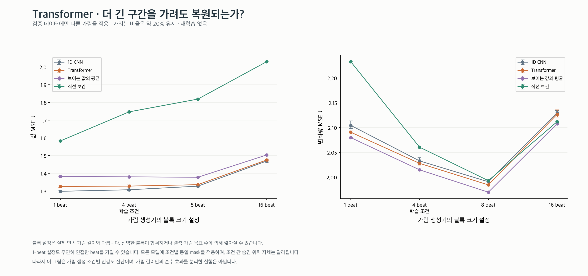
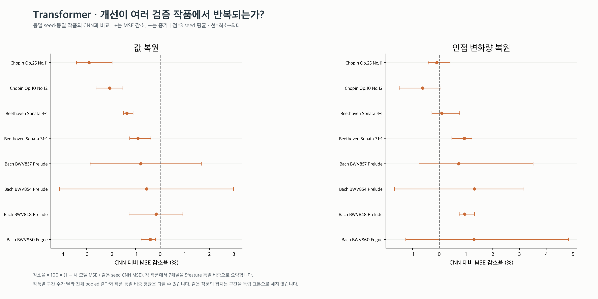
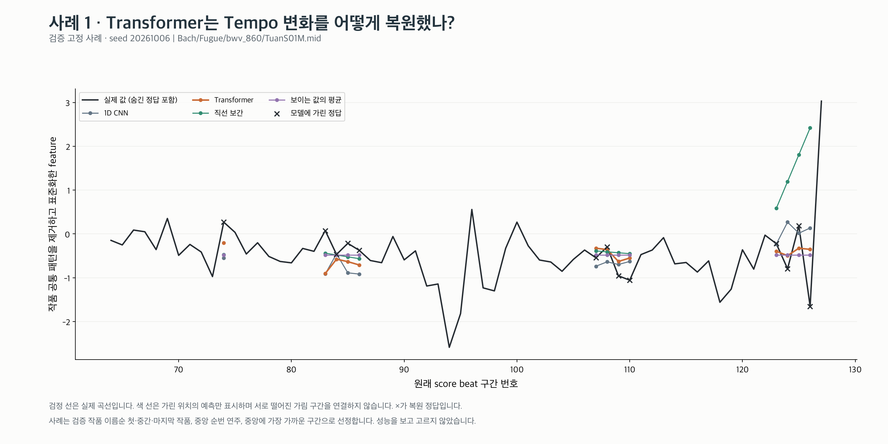

# Transformer 구현과 실험 결과

**검증 값 MSE 1.3281, CNN 1.3073. 평균 MSE의 비율로 보면 1.59% 증가입니다.**
인접 변화량 MSE는 2.0279 (CNN 대비 0.24% 감소), 모양 상관 0.164,
예측/실제 변화 폭 20.0%, 방향 일치 50.7%입니다.
음수 감소율은 악화를 뜻합니다. 모델 종류 전체의 성능을 단정하지 않습니다.

구조의 숫자는 이번 구현 설정입니다. 64D 벡터와 복원기는 CNN과 동일합니다.
전체 지표 정의·입력·동일 조건·한계는 [공통 실험 설명](../README.md)에 있습니다.

Transformer의 self-attention은 각 beat의 표현에서 query(Q), key(K), value(V)를 만들고,
Q와 다른 beat의 K가 얼마나 맞는지로 가중치를 구해 V를 가중합하는 연산입니다. 이 연산을 4개 head가 나누어 수행합니다.
head는 입력 표현의 다른 부분을 학습하는 경로이며, 특정 head가 템포나 페달 같은 음악 개념을 담당한다고 지정하지 않았습니다.
FFN은 각 위치에 적용하는 64→128→64 신경망이고, LayerNorm은 각 위치의 표현을 정규화합니다.
pre-LayerNorm은 Attention/FFN 전에 정규화하는 배치입니다. encoder layer 2개를 순서대로 통과합니다.
위치 인코딩은 beat 번호별 sin/cos 숫자 벡터입니다. Attention만으로는 입력 순서를 직접 구별하지 못하므로 위치 정보를 더합니다.
결측 위치는 key에서 제외하고 유효한 hidden beat는 남깁니다. 그 위치의 실제 값은 0으로 가려져 있으며 mask를 통해 가림 사실만 알 수 있습니다.
마지막에 64위치 전체를 순서대로 펼쳐 압축합니다. causal mask를 쓰지 않아 앞뒤 관측 문맥을 모두 볼 수 있습니다.

## 학습이 실제로 수행됐는가?

세 seed 모두 실제 학습·저장·재로드를 수행했습니다. seed별 선택 epoch: **20261006: 20, 20261007: 20, 20261008: 20**.
가린 정답 누출 방지, 결측·padding 처리, 인코더 gradient, 저장 후 동일 출력 테스트를 통과했습니다.

## 값 오차와 시간 변화는 각각 어떻게 달라졌는가?

값 MSE 감소는 평균적인 수준을 잘 맞춘 결과일 수도 있습니다. 모양·방향·변화 폭을 함께 읽어야 합니다.
변화 폭 비율은 100%가 크기의 일치일 뿐, 모양이 같다는 뜻이 아닙니다.

## 시간 순서와 가림 조건을 바꾸면?

순서 섞기는 추론 중 관측 값과 원래 위치의 관계를 깨는 진단입니다. 학습 분포 밖의 입력일 수 있습니다.
블록 크기 설정은 실제 gap 길이와 다르며, 조건별 숨긴 위치도 달라집니다. 이 두 실험을 인과적 증명으로 해석하지 않습니다.

원래 순서의 값 MSE는 **1.3281**, 세 순열을 seed 안에서 평균한 순서 섞기 MSE는 **1.4194**입니다.
가림 생성 설정별 3 seed 평균은 다음과 같습니다.

| 블록 설정 (beat) | 값 MSE ↓ | 변화량 MSE ↓ |
|---|---:|---:|
| 1 | 1.3261 | 2.0907 |
| 4 (학습 조건) | 1.3281 | 2.0279 |
| 8 | 1.3360 | 1.9845 |
| 16 | 1.4751 | 2.1269 |

## 일부 작품에만 맞는 결과인가?

검증 8작품 중 **0작품**에서 세 seed 모두 CNN보다 값 MSE가 작았습니다.
전체 pooled 결과와 작품 동일 비중 평균은 구간 수 차이로 달라질 수 있습니다.

## 고정된 실제 복원 사례

검정=실제, ×=숨긴 정답, 색 선=가린 위치의 예측입니다. 서로 다른 gap을 이어 그리지 않습니다.
작품 이름순 첫·중간·마지막 작품의 중앙 연주·중앙 구간으로 고정했으며 성능을 보고 선택하지 않았습니다.

| 사례 | Tempo | Rubato | Dynamics | Articulation | Pedal depth | Pedal ratio | Pedal changes |
|---|---|---|---|---|---|---|---|
| 1 | [figure](examples/01_tempo.png) | [figure](examples/01_rubato.png) | [figure](examples/01_dynamics.png) | [figure](examples/01_articulation.png) | [figure](examples/01_pedal_depth.png) | [figure](examples/01_pedal_down_ratio.png) | [figure](examples/01_pedal_changes.png) |
| 2 | [figure](examples/02_tempo.png) | [figure](examples/02_rubato.png) | [figure](examples/02_dynamics.png) | [figure](examples/02_articulation.png) | [figure](examples/02_pedal_depth.png) | [figure](examples/02_pedal_down_ratio.png) | [figure](examples/02_pedal_changes.png) |
| 3 | [figure](examples/03_tempo.png) | [figure](examples/03_rubato.png) | [figure](examples/03_dynamics.png) | [figure](examples/03_articulation.png) | [figure](examples/03_pedal_depth.png) | [figure](examples/03_pedal_down_ratio.png) | [figure](examples/03_pedal_changes.png) |

나머지 20개 사례 figure도 위 표에서 확인할 수 있습니다.
