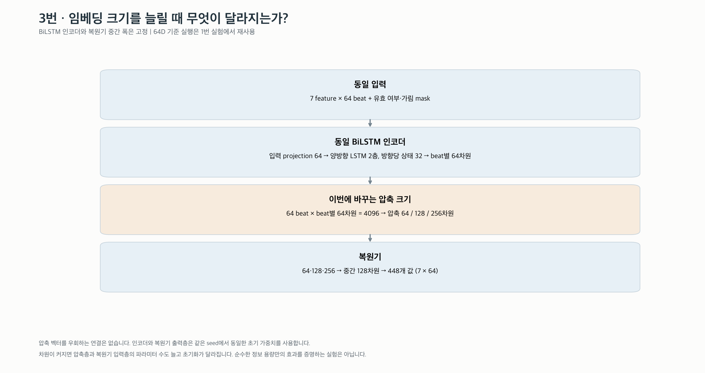
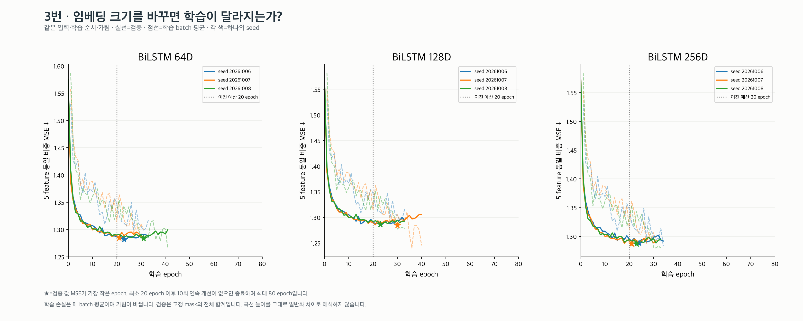
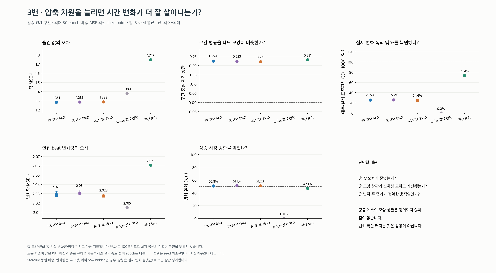
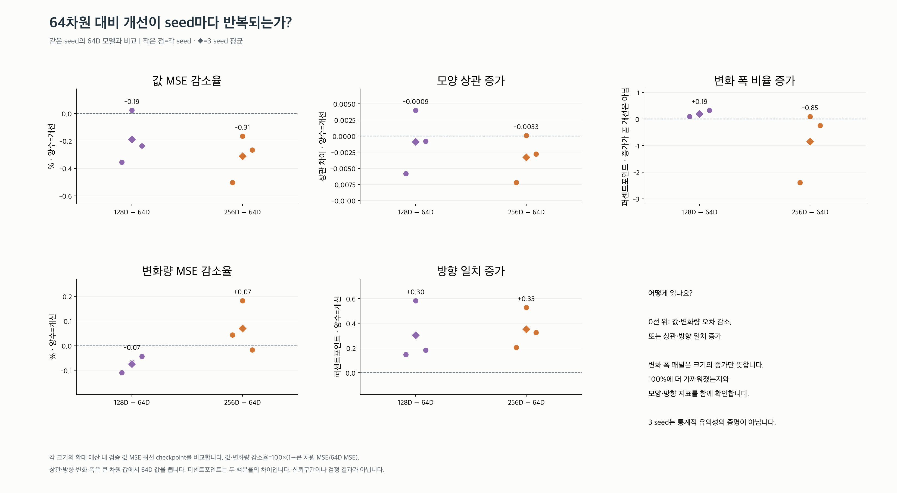
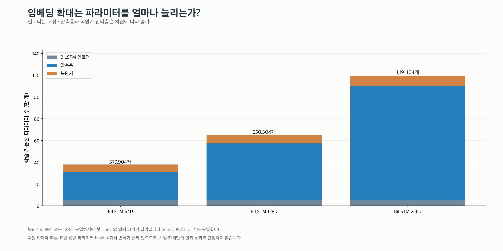
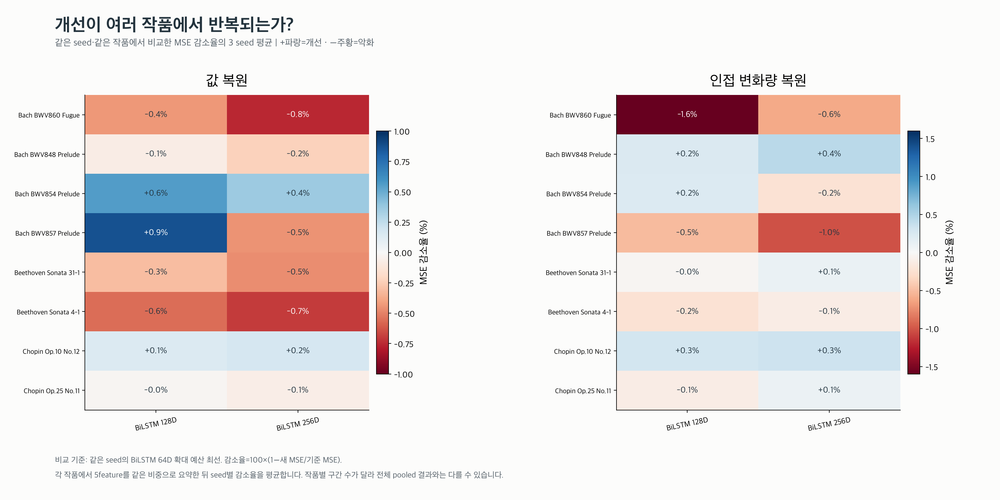
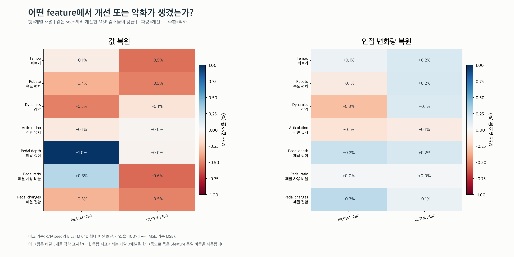
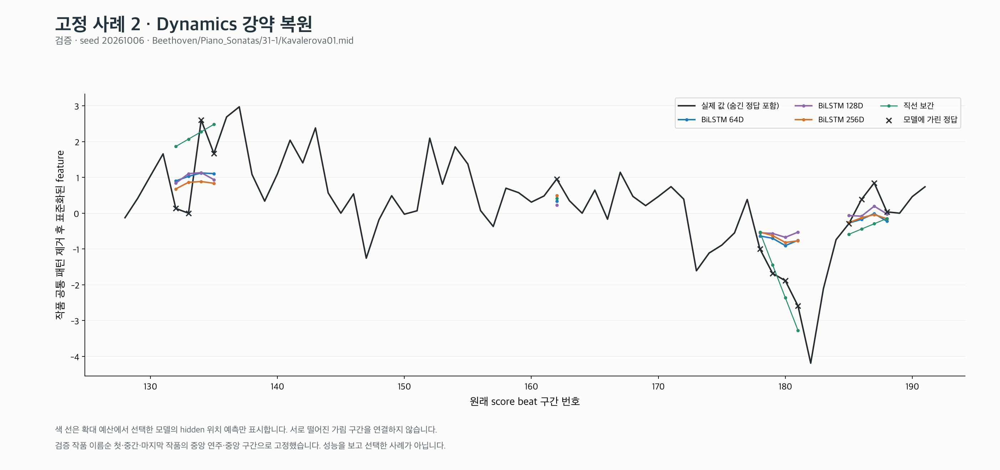

# 3번: BiLSTM 임베딩 64·128·256차원 비교

이번 검증 split에서 seed 평균 **값 MSE가 가장 낮은 크기는 BiLSTM 64D**, 
**변화량 MSE가 가장 낮은 크기는 BiLSTM 256D**입니다. 각 크기의 가중치 선택은 값 MSE를 기준으로 했습니다.
이 순위가 새로운 작품에서 재현되는지는 확인하지 않았습니다.

- **BiLSTM 128D vs 64D**: 값 MSE 감소율 평균 -0.19% (seed 범위 -0.36~+0.02%, 개선 1/3). 모양 상관 차이 -0.001, 방향 일치 차이 +0.30퍼센트포인트.
- **BiLSTM 256D vs 64D**: 값 MSE 감소율 평균 -0.31% (seed 범위 -0.50~-0.17%, 개선 0/3). 모양 상관 차이 -0.003, 방향 일치 차이 +0.35퍼센트포인트.

인접 변화량 MSE가 보이는 값 평균 기준선보다 높은 크기는 **3/3**입니다.
값 오차가 가장 낮은 크기와 세밀한 시간 변화까지 잘 복원하는 모델은 같은 의미가 아닙니다.

BiLSTM 폭과 층 수, 입력, 학습률, mask와 split을 유지했습니다. 인코더 가중치는 고정한 채 쓰는 것이 아니라,
**같은 초기 인코더에서 시작해 각 크기의 압축층·복원기와 함께 학습**합니다. 64D는 1번 실행을 재사용합니다.

| 모델 | 값 MSE ↓ | 모양 상관 ↑ | 변화 폭 비율 | 변화량 MSE ↓ | 방향 일치 ↑ |
|---|---:|---:|---:|---:|---:|
| BiLSTM 64D | 1.2836 | 0.224 | 25.5% | 2.0292 | 50.8% |
| BiLSTM 128D | 1.2860 | 0.223 | 25.7% | 2.0307 | 51.1% |
| BiLSTM 256D | 1.2876 | 0.221 | 24.6% | 2.0278 | 51.2% |

차원 확대는 압축층과 복원기 입력층의 파라미터·초기화를 함께 바꿉니다. 복원기의 중간 폭과 출력층 구조는 동일합니다.
변화 폭이 100%에 가까워지는 것만으로 정확한 복원이라고 판단하지 않습니다.

## 고정 사례

- 사례 1: [tempo](examples/01_tempo.png) · [rubato](examples/01_rubato.png) · [dynamics](examples/01_dynamics.png) · [articulation](examples/01_articulation.png) · [pedal_depth](examples/01_pedal_depth.png) · [pedal_down_ratio](examples/01_pedal_down_ratio.png) · [pedal_changes](examples/01_pedal_changes.png)
- 사례 2: [tempo](examples/02_tempo.png) · [rubato](examples/02_rubato.png) · [dynamics](examples/02_dynamics.png) · [articulation](examples/02_articulation.png) · [pedal_depth](examples/02_pedal_depth.png) · [pedal_down_ratio](examples/02_pedal_down_ratio.png) · [pedal_changes](examples/02_pedal_changes.png)
- 사례 3: [tempo](examples/03_tempo.png) · [rubato](examples/03_rubato.png) · [dynamics](examples/03_dynamics.png) · [articulation](examples/03_articulation.png) · [pedal_depth](examples/03_pedal_depth.png) · [pedal_down_ratio](examples/03_pedal_down_ratio.png) · [pedal_changes](examples/03_pedal_changes.png)

[공통 지표·종료 규칙·한계](../README.md)
