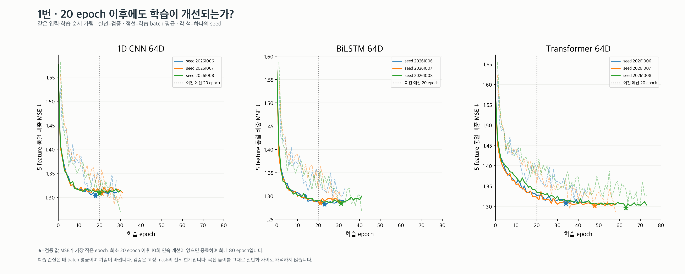
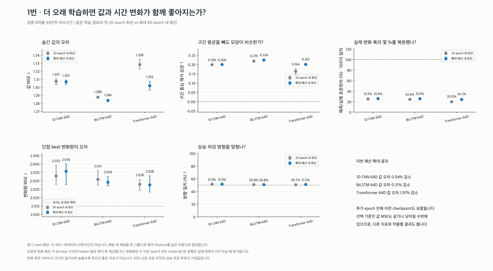
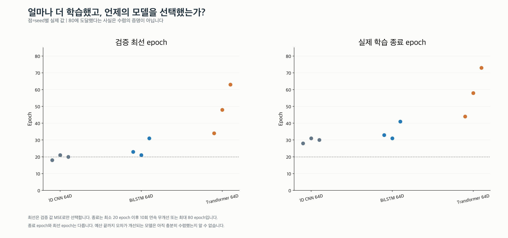
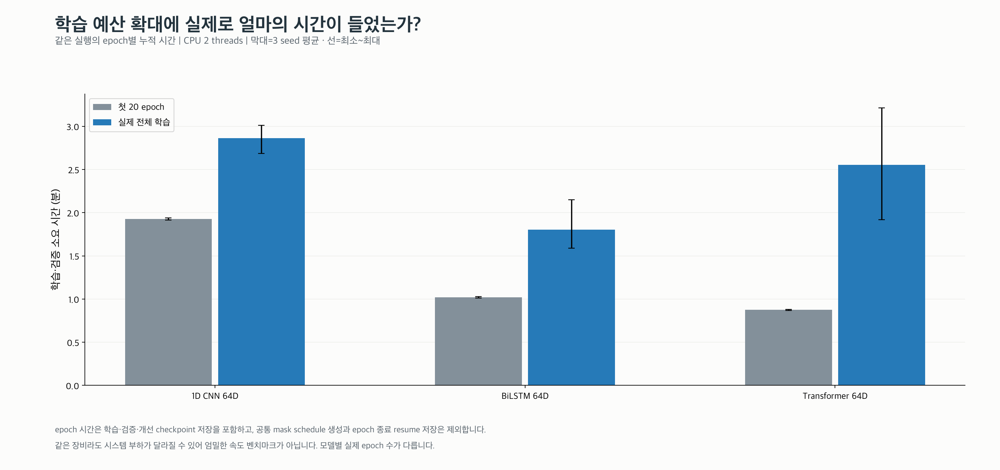
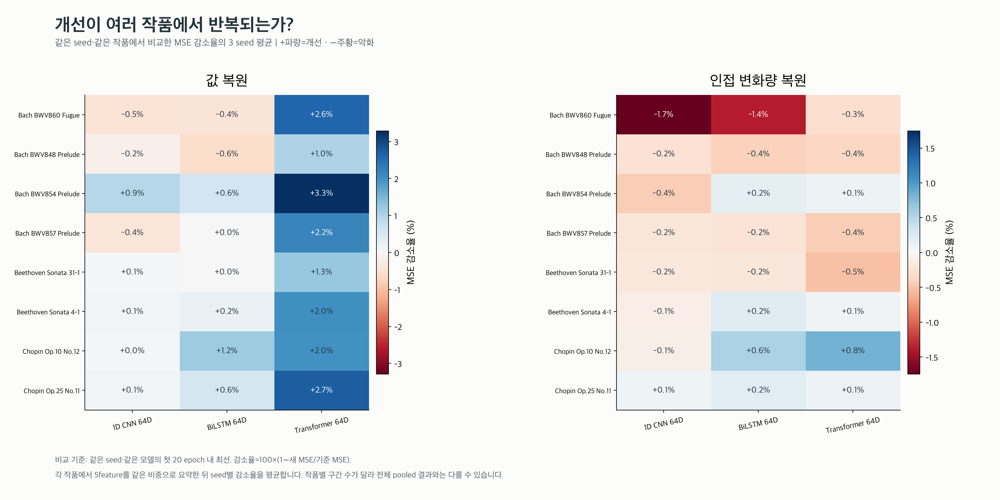
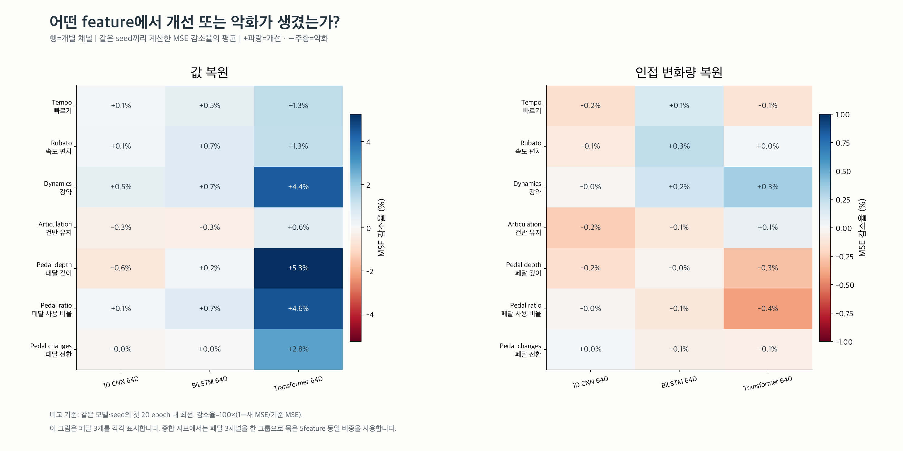
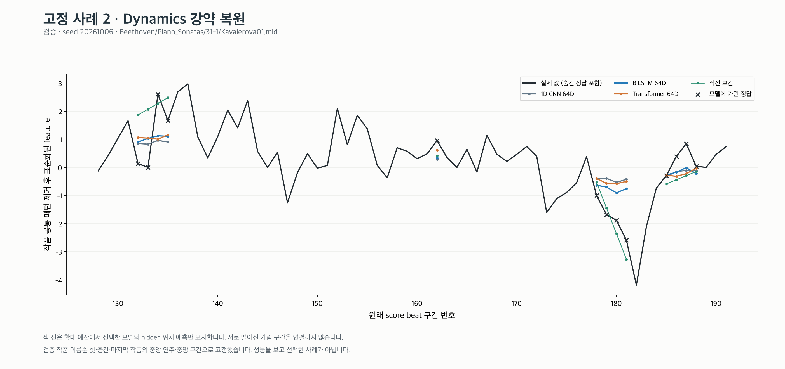

# 1번: 학습 예산 확대 결과

첫 20 epoch와 최대 80 epoch를 **같은 학습 경로 안에서** 비교했습니다.
입력·작품 분할·optimizer·학습률·가림·seed는 유지하고 최대 학습 예산만 늘렸습니다.

| 모델 | 첫 20 epoch 내 값 MSE | 확대 예산 내 값 MSE | 감소율 평균 | seed별 감소율 범위 |
|---|---:|---:|---:|---:|
| 1D CNN 64D | 1.30732 | 1.30682 | 0.04% | 0.00~0.12% |
| BiLSTM 64D | 1.28759 | 1.28358 | 0.31% | 0.18~0.40% |
| Transformer 64D | 1.32808 | 1.30185 | 1.97% | 1.47~2.87% |

MSE는 3 seed 평균이며, 감소율은 각 seed 안에서 먼저 계산한 후 평균합니다.

- **1D CNN 64D**: 값 오차가 감소한 seed 1/3. 모양 상관 0.199→0.200, 변화량 MSE 2.0329→2.0356, 방향 일치 51.5%→51.5%.
- **BiLSTM 64D**: 값 오차가 감소한 seed 3/3. 모양 상관 0.219→0.224, 변화량 MSE 2.0308→2.0292, 방향 일치 50.8%→50.8%.
- **Transformer 64D**: 값 오차가 감소한 seed 3/3. 모양 상관 0.164→0.201, 변화량 MSE 2.0279→2.0275, 방향 일치 50.7%→51.2%.

확대 예산에서도 seed 평균 값 MSE가 가장 낮은 모델은 **BiLSTM 64D**입니다.

- 확대 예산의 **BiLSTM 64D vs CNN**: 값 MSE 감소율 평균 +1.78% (seed 범위 +1.60~+1.90%, 개선 3/3).
- 확대 예산의 **Transformer 64D vs CNN**: 값 MSE 감소율 평균 +0.38% (seed 범위 -0.35~+0.93%, 개선 2/3).

인접 변화량 MSE가 보이는 값 평균 기준선보다 높은 모델은 **3/3**입니다.
추가 학습이 값 오차를 줄인 사실과 beat별 움직임을 충분히 복원했는지는 구분해야 합니다.

## 확대 예산 내 최선 모델의 검증 결과

| 모델 | 값 MSE ↓ | 모양 상관 ↑ | 변화 폭 비율 | 변화량 MSE ↓ | 방향 일치 ↑ |
|---|---:|---:|---:|---:|---:|
| 1D CNN 64D | 1.3068 | 0.200 | 25.9% | 2.0356 | 51.5% |
| BiLSTM 64D | 1.2836 | 0.224 | 25.5% | 2.0292 | 50.8% |
| Transformer 64D | 1.3019 | 0.201 | 24.2% | 2.0275 | 51.2% |

같은 hidden 위치에서 평가한, 보이는 값만 사용하는 학습 없는 기준선입니다.

| 모델 | 값 MSE ↓ | 모양 상관 ↑ | 변화 폭 비율 | 변화량 MSE ↓ | 방향 일치 ↑ |
|---|---:|---:|---:|---:|---:|
| 보이는 값의 평균 | 1.3803 | 정의 안 됨 | 0.0% | 2.0148 | 0.0% |
| 직선 보간 | 1.7469 | 0.231 | 73.4% | 2.0606 | 47.1% |

값 MSE는 선택 기준이며, 확대 예산에는 이전 checkpoint도 포함됩니다. 따라서 최소값이 줄어드는
것만으로 충분한 개선이라고 판단하지 않습니다. 모양·변화량·방향과 작품별 결과를 함께 읽습니다.
80 epoch에 도달한 실행은 수렴했다고 단정하지 않습니다.

## 고정 사례

- 사례 1: [tempo](examples/01_tempo.png) · [rubato](examples/01_rubato.png) · [dynamics](examples/01_dynamics.png) · [articulation](examples/01_articulation.png) · [pedal_depth](examples/01_pedal_depth.png) · [pedal_down_ratio](examples/01_pedal_down_ratio.png) · [pedal_changes](examples/01_pedal_changes.png)
- 사례 2: [tempo](examples/02_tempo.png) · [rubato](examples/02_rubato.png) · [dynamics](examples/02_dynamics.png) · [articulation](examples/02_articulation.png) · [pedal_depth](examples/02_pedal_depth.png) · [pedal_down_ratio](examples/02_pedal_down_ratio.png) · [pedal_changes](examples/02_pedal_changes.png)
- 사례 3: [tempo](examples/03_tempo.png) · [rubato](examples/03_rubato.png) · [dynamics](examples/03_dynamics.png) · [articulation](examples/03_articulation.png) · [pedal_depth](examples/03_pedal_depth.png) · [pedal_down_ratio](examples/03_pedal_down_ratio.png) · [pedal_changes](examples/03_pedal_changes.png)

[실험 조건·지표·실행별 epoch·한계](../README.md)
