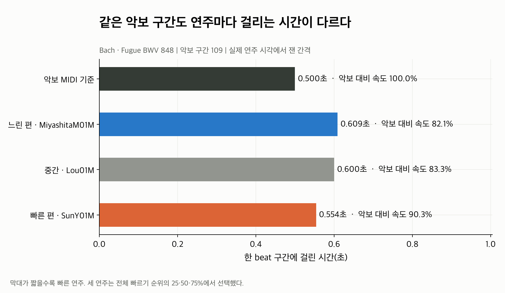
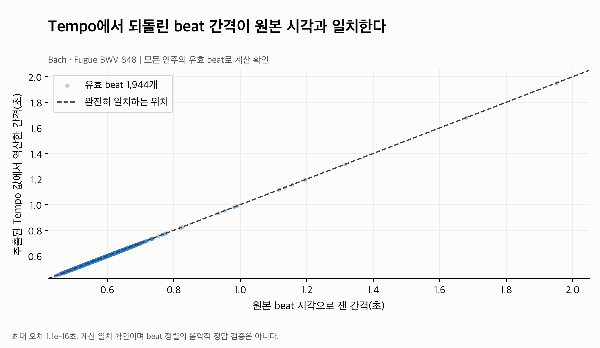
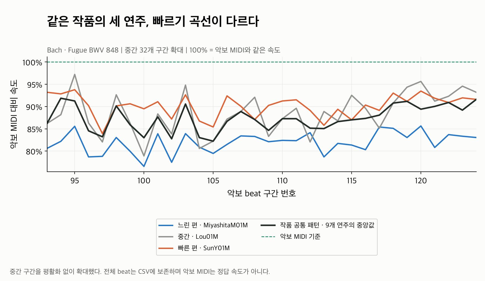
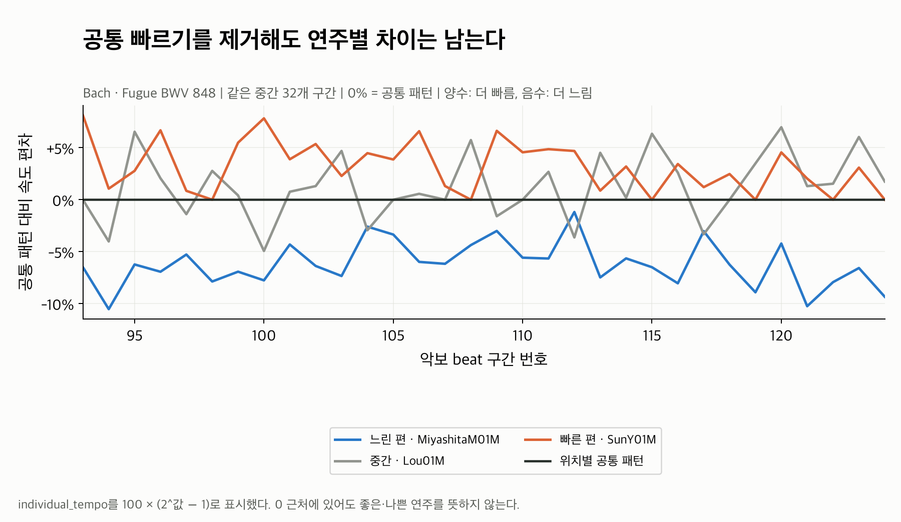
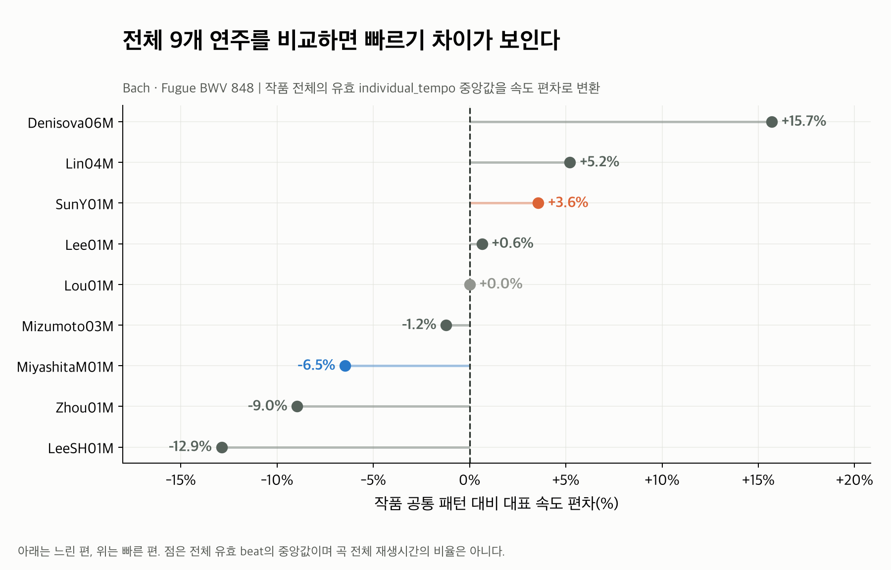
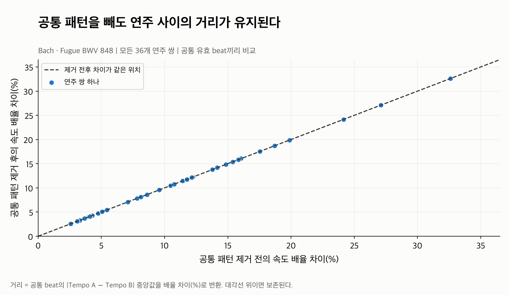

# Tempo: 같은 작품에서도 빠르기 차이가 드러나는가?

Bach 푸가 BWV 848의 실제 정렬 연주 **9개**를 사용해 다시 그렸다. 파일마다 그래프를
하나씩 두었고, 눈금을 초와 속도 비율(%)로 표시했다. **01 → 03 → 04 → 05** 순서로
읽으면 계산의 의미와 연주별 차이를 이해할 수 있다. 02와 06은 계산·차이 보존 확인용이다.

## 그림 목록

| 파일 | 이 그림이 답하는 질문 |
|---|---|
| [01_same_beat_duration.png](01_same_beat_duration.png) | 같은 악보 구간을 연주마다 얼마나 오래 연주했나? |
| [02_tempo_calculation_check.png](02_tempo_calculation_check.png) | 추출한 Tempo가 원본 beat 시간 간격을 정확히 표현하나? |
| [03_performance_tempo_curves.png](03_performance_tempo_curves.png) | 같은 악보 위치에서 세 연주의 빠르기가 어떻게 다른가? |
| [04_individual_tempo_curves.png](04_individual_tempo_curves.png) | 작품 공통 패턴을 빼도 개인별 빠르기 차이가 남는가? |
| [05_all_performance_differences.png](05_all_performance_differences.png) | 전체 9개 연주에서 대표 빠르기의 차이는 어느 정도인가? |
| [06_pairwise_difference_preserved.png](06_pairwise_difference_preserved.png) | 공통 제거 과정에서 연주 사이의 차이가 사라지지는 않았나? |

## 01. 한 구간의 실제 시간으로 이해하기



악보 구간 **109번**을 보자. 악보 MIDI에서는 0.500초인 구간을 세 연주는 각각 약
0.609초, 0.600초, 0.554초로 연주했다. **막대가 짧으면 그 구간을 더 빠르게 연주한 것**이다.
Tempo는 이 시간 간격의 차이를 숫자로 표현한다.

예를 들어 SunY01M의 이 구간 속도는 `0.500 / 0.554 ≈ 90.3%`다. 악보 MIDI보다 약
9.7% 느리지만 이 그림의 다른 두 연주보다는 빠르다. 악보 기준과 동료 연주 기준이 다른 이유다.
악보 MIDI는 계산 기준이며 음악적 정답 속도는 아니다.

세 연주는 **곡 전체 대표 빠르기 순위의 25·50·75%**에서 골랐다. 느린 편=MiyashitaM01M,
중간=Lou01M, 빠른 편=SunY01M이다. 가장 극단적인 두 연주를 골라 차이를 과장하지 않았다.
한 구간의 속도 순서는 곡 전체 순서와 다를 수 있다. 첫 예시 구간은 가운데에 가깝고 세 연주의
시간 순서가 일치하는 유효 구간으로 선택했으며, 최대 차이 구간을 탐색하지 않았다.

## 02. Tempo가 시간 간격을 잘 표현하는지 확인하기



가로축은 ASAP의 실제 beat 시각 두 개를 빼서 얻은 시간 간격이다. 세로축은 추출한 Tempo
값에서 역산한 시간 간격이다. 한 점은 한 연주의 한 beat 구간을 나타낸다.

**점이 대각선 위에 있으면 같은 시간을 가리킨다.** 9개 연주의 유효 값 1,944개가 모두
대각선 위에 있고 최대 역산 오차는 약 `1.11e-16`초, 즉 부동소수점 계산 오차 수준이다.
원본 시간 → Tempo → 시간으로 돌아오는 계산에 문제가 없음을 확인했다.

이 검증은 beat annotation으로부터 feature를 계산한 수치적 정확성을 보여준다. Annotation이
음악적 beat에 정확히 놓였는지까지 독립적으로 검증하거나 청취 평가한 결과는 아니다.

## 03. 같은 작품의 세 연주를 같은 위치에서 비교하기



가로축은 **악보 beat 구간 번호**이고, 세로축은 악보 MIDI 대비 속도다.
100%면 악보 MIDI와 같은 속도, 80%면 악보 MIDI의 0.8배 속도다.

- 파랑: 작품 전체 기준 느린 편인 MiyashitaM01M.
- 회색: 작품 전체 기준 중간인 Lou01M.
- 주황: 작품 전체 기준 빠른 편인 SunY01M.
- 검정: **9개 연주 모두**로 계산한 위치별 공통 중앙 패턴.
- 초록 점선: 악보 MIDI 속도 100%.

같은 악보 위치에서도 세 선의 높이가 다르다. 이 구간에서는 대체로 파랑이 낮고 주황이 높지만,
Lou01M이 잠깐 더 빨라지는 곳도 있다. 따라서 전체 빠르기뿐 아니라 **어느 위치에서 속도가
달라지는지**도 feature에 들어 있다.

가독성을 위해 전체 216개 중 가운데 **93~124번, 32개 구간**을 확대했다. 구간은 데이터의
가운데로 고정했고, 그림이 예쁘거나 차이가 큰 곳을 검색하지 않았다. 평활화·보간·clipping은
하지 않았다. 전체 beat와 마지막 구간도 [beat_features.csv](beat_features.csv)에 그대로 보존했다.

## 04. 공통 패턴을 제거한 뒤 개인 차이 보기



03과 **같은 연주, 같은 위치**다. 기준만 악보 MIDI에서 그 위치의 공통 연주 패턴으로 바뀐다.

- 0%: 그 위치의 공통 패턴과 같은 빠르기.
- +5%: 공통 패턴보다 약 5% 빠름.
- -5%: 공통 패턴보다 약 5% 느림.

파랑은 주로 아래, 주황은 주로 위에 남고, 회색은 기준을 오간다. 모두 같은 0선으로 붕괴하지
않으므로 공통 패턴을 제거한 후에도 개인별 편차를 읽을 수 있다. 0에 가깝다고 좋은 연주,
멀다고 나쁜 연주라는 뜻은 아니다. 표현의 상대적인 위치다.

## 05. 전체 9개 연주의 차이를 한눈에 보기



각 점은 한 연주의 **전체 유효 individual_tempo 값의 중앙값**을 속도 편차(%)로 바꾼 것이다.
앞선 곡선에 나오지 않은 나머지 연주도 모두 표시했다. 가운데 0선은 위치별 공통 패턴이다.

| 연주 | 공통 패턴 대비 대표 편차 |
|---|---:|
| Denisova06M | +15.7% |
| Lin04M | +5.2% |
| SunY01M | +3.6% |
| Lee01M | +0.6% |
| Lou01M | 0.0% |
| Mizumoto03M | -1.2% |
| MiyashitaM01M | -6.5% |
| Zhou01M | -9.0% |
| LeeSH01M | -12.9% |

이 예시에서는 대표 편차가 **-12.9%~+15.7%**다. 대표 배율의 최댓값/최솟값은 약 1.328로,
가장 빠른 대표 배율이 가장 느린 배율보다 약 32.8% 크다. 이 값은 총 재생시간의 비율이나
절대 BPM을 의미하지 않는다. Beat별 상대 속도를 요약한 결과다.

## 06. 공통 패턴 제거가 연주 차이를 훼손하지 않는지 확인하기



한 점은 두 연주의 쌍이다. 9개 연주의 모든 **36개 쌍**을 계산했다. 가로축은 공통 제거 전의
속도 배율 차이, 세로축은 제거 후의 차이다. 모든 점이 대각선 위에 있으므로 차이가 보존됐다.

같은 beat에서 공통값을 똑같이 빼기 때문에 다음 관계가 성립한다.

```text
(raw_A - common) - (raw_B - common) = raw_A - raw_B
```

쌍별 거리는 공통 유효 위치의 `median(abs(log2_tempo_A - log2_tempo_B))`를
`100 × (2^거리 - 1)`로 바꾼 값이다. 같은 beat에서 두 연주의 빠른 쪽/느린 쪽 속도 배율이
얼마나 다른지 요약한다. **36개 쌍의 차이 중앙값은 약 10.0%**이고 범위는 약 2.6~32.6%다.
공통 제거 전후 beat별 차이의 최대 오차는 `1.11e-16` log2 단위다.

05의 대표 배율 차이와 06의 beat별 쌍 거리에는 요약하는 순서가 달라 작은 차이가 있을 수 있다.
두 숫자를 동일한 통계로 해석하지 않는다.

## 계산과 데이터 조건

```text
raw[p, i] = log2(score_interval[i] / performance_interval[p, i])
common[i] = 같은 위치의 유효 raw 값 중앙값
individual[p, i] = raw[p, i] - common[i]

03 표시값 = 100 × 2^raw
04 표시값 = 100 × (2^individual - 1)
05 표시값 = 100 × (2^median(valid individual) - 1)
```

퍼센트는 기존 log2 값의 **그림용 단위 변환**이며 추가 정규화가 아니다. Tempo 추출기,
원래 값, 상태와 mask를 바꾸지 않았다. 공통값에는 9개 모두 들어가고 자기 자신도 포함된다.
no_repeat/extra_repeat로 대응된 다른 구조는 이 예시 그룹에 넣지 않는다.

이 작품은 연주당 216개 구간이며 1,944개 모두 regular/유효다. 공통값의 위치별 support는
9다. 기존 추출기는 bR을 건드리는 special, 극단적인 suspicious, 0폭 invalid 위치를 mask로
제외하고 상태와 이유를 보존한다. 이 예시에 그런 위치가 없다고 다른 작품에서도 없다는 뜻은 아니다.

원본 시간 간격과 raw, 위치별 common/support, individual, pair 차이를 각각 다시 계산해
일치 여부를 검사했다. “시간 정보를 올바르게 수치화하며 이 작품 안의 연주 차이를 표현한다”는
근거는 제공하지만 모든 작품의 음악적 해석 품질, 사용자 취향이나 추천 성능을 검증하지는 않았다.
같은 작품 내 비교가 목적이므로 이 그림을 작곡가 간 빠르기 비교로 사용하지 않는다.

## 데이터와 재현

- 작품: `Bach/Fugue/bwv_848`.
- ASAP revision: `afc815c75c42e83a79c03feb6da8a35e77d4c6b8`.
- [performance_summary.csv](performance_summary.csv): 연주별 대표값, 유효수, 상태별 수.
- [beat_features.csv](beat_features.csv): 전체 시간 간격, raw/common/individual, mask/support.
- [pairwise_distances.csv](pairwise_distances.csv): 모든 36개 연주 쌍의 전후 거리.
- [stats.json](stats.json): 선택 규칙, 그림 구간, 데이터·코드 hash와 재계산 검증 결과.

저장소 루트에서 실행한다. Dataset 기본 경로는 저장소 밖 `Classicfy/datasets/ASAP`,
`Classicfy/datasets/nASAP`이고, 기본 출력 경로는 실행 위치와 관계없이 이 폴더다.

```bash
.venv/bin/python classicfy-ai/scripts/validate_tempo.py
```

전체 곡선을 보고 싶으면 `--curve-beats 216`을 지정한다. `--work`로 다른 작품을 분석할 때는
이 README의 Bach 예시와 섞이지 않도록 별도 `--out`을 지정한다.

```bash
.venv/bin/python classicfy-ai/scripts/validate_tempo.py \
  --work Chopin/Etudes_op_10/8 \
  --out classicfy-ai/analysis/tempo/chopin_op10_8
```

관련 Tempo·Rubato·대표 feature 회귀 테스트 및 실제 ASAP pipeline 테스트 24개가 모두 통과했다.

## 기존 그림에 대한 판단

기존 10작품 곡선은 작품의 중앙 패턴을 비교하기 좋지만 개별 연주선이 없고, log2와 넓은 공통
눈금 때문에 작은 연주 차이를 읽기 어렵다. 기준 비교 그림은 boxplot/막대/거리 세 개를 한
파일에 담아 각각의 주장이 섞인다. 한 작품의 구체적 예시를 설명하는 데는 새 구성이 더 직접적이다.
기존 결과는 내용 변경 없이 [archive/](archive/README.md)에 보존했다.

[전체 분석 목록](../README.md) · [Feature 공개 인터페이스](../../src/features/README.md)
