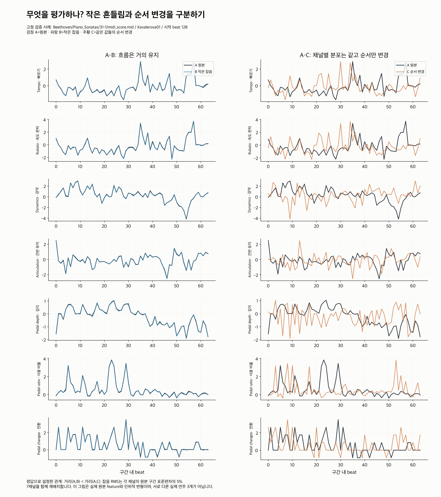
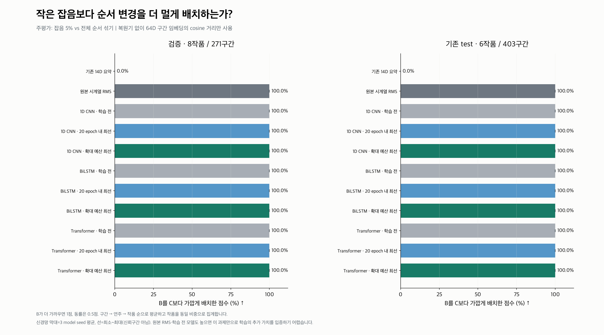
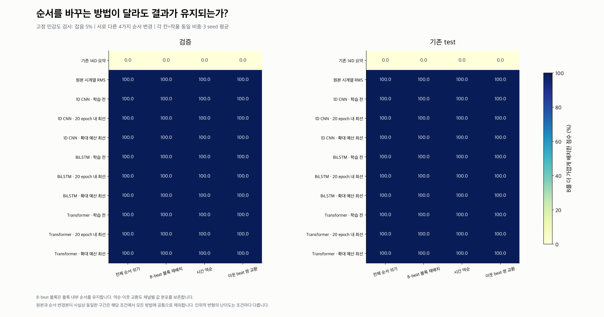
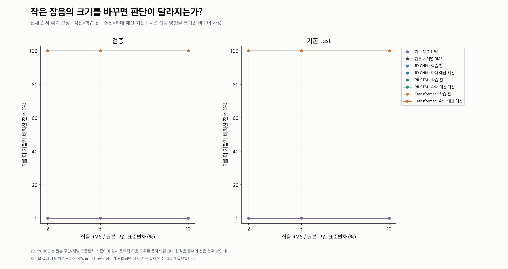
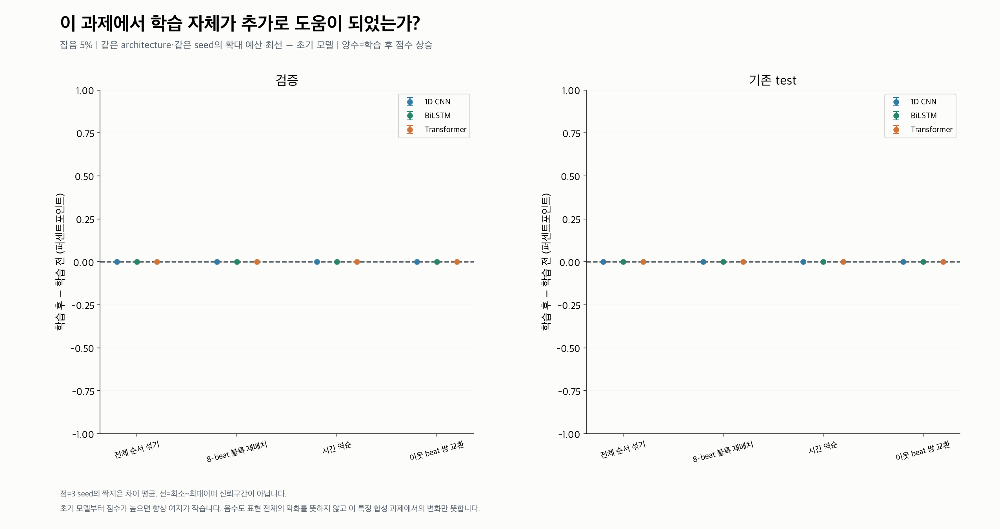

# 시간 순서 차이가 임베딩 거리에 반영되는가?

저장된 1D CNN·BiLSTM·Transformer의 **64D 구간 임베딩**을 복원기 없이 평가했다. 새 학습·모델 선택은 하지 않았다.

**이 실험은 작은 값 잡음보다 시간 순서 변경을 더 멀게 배치하는지 검사한다. 실제 연주 간 음악적 유사성·사용자 선호·전곡 검색 성능 평가는 아니다.**

## 평가 문제

A=실제 원본 feature 구간, B=작은 잡음을 더한 구간, C=같은 값의 순서를 바꾼 구간이다.
`거리(A,B) < 거리(A,C)`이면 1점, 동률은 0.5점, 반대면 0점이다. C는 채널별 전체 값 분포를 보존한다.



## 주평가 결과

주조건은 사전에 고정한 **잡음 5% vs 전체 순서 섞기**다. 점수는 구간→연주→작품 순으로 평균하며 작품에 같은 비중을 준다.

| 방법 | 검증 점수 | 기존 test 점수 |
|---|---:|---:|
| 기존 14D 요약 | 0.00% | 0.00% |
| 원본 시계열 RMS | 100.00% | 100.00% |
| 1D CNN · 학습 전 | 100.00% (100.00~100.00) | 100.00% (100.00~100.00) |
| 1D CNN · 20 epoch 내 최선 | 100.00% (100.00~100.00) | 100.00% (100.00~100.00) |
| 1D CNN · 확대 예산 최선 | 100.00% (100.00~100.00) | 100.00% (100.00~100.00) |
| BiLSTM · 학습 전 | 100.00% (100.00~100.00) | 100.00% (100.00~100.00) |
| BiLSTM · 20 epoch 내 최선 | 100.00% (100.00~100.00) | 100.00% (100.00~100.00) |
| BiLSTM · 확대 예산 최선 | 100.00% (100.00~100.00) | 100.00% (100.00~100.00) |
| Transformer · 학습 전 | 100.00% (100.00~100.00) | 100.00% (100.00~100.00) |
| Transformer · 20 epoch 내 최선 | 100.00% (100.00~100.00) | 100.00% (100.00~100.00) |
| Transformer · 확대 예산 최선 | 100.00% (100.00~100.00) | 100.00% (100.00~100.00) |

괄호는 세 model seed의 최소~최대이며 신뢰구간이 아니다. 50%를 모든 방법의 무작위 성능으로 해석하지 않는다. 동률만 발생하면 점수가 50%다.

**실제 결과: 세 모델의 학습 전·20 epoch·확대 예산 모델과 원본 시계열 RMS가 모두 100%였다. 네 순서 변경 × 세 잡음 크기의 12조건에서도 동일했다.**

이 검사는 순서 차이가 임베딩 거리에 남아 있음을 확인했지만, 학습 전 모델도 모두 풀 수 있을 만큼 쉬워 학습의 추가 가치를 구분하지 못했다. 학습 전후 차이는 모든 조건에서 0퍼센트포인트다. 시계열 학습이 요약 표현보다 유용한 연주 정보를 더 배웠다는 결론은 내릴 수 없다.



## 해석

- 요약 벡터는 A와 C가 같으므로 B를 더 가깝게 둘 수 없다. 이는 설계상 예상되는 결과이며 학습 모델의 우수성을 단독 입증하지 않는다.
- 원본 시계열 RMS와 학습 전 모델도 높은 점수를 얻는지 함께 본다. 큰 순서 변경과 작은 잡음의 구분은 학습 없이도 가능하다.
- 학습의 추가 기여는 같은 architecture·seed의 학습 전후 점수 차이로 확인한다. 높은 점수가 포화되면 학습 효과를 판별하기 어렵다.
- 학습 후 점수가 떨어져도 다른 표현 능력 전체가 악화됐다고 해석하지 않는다. 복원 학습이 이 변형 구분 능력을 얼마나 유지했는지에 대한 결과다.







## 데이터와 조건

| split | 원래 작품/연주/구간 | 선택 작품/연주/구간 |
|---|---:|---:|
| validation | 8/93/935 | 8/93/271 |
| test | 8/82/1670 | 6/67/403 |

64 beat·7채널이 모두 유효한 구간만 선택하고, 연주별로 시간순 greedy 선택해 구간 겹침을 제외했다. 결측 위치를 붙이거나 padding을 재배치하지 않았다.
학습 작품은 평가에 포함하지 않았다. 다만 validation과 기존 test는 이전 분석에서 이미 관찰한 작품이며 새로운 독립 holdout으로 주장하지 않는다.
작품별 reference cohort·공통 패턴 제거·scale은 기존 정책을 유지한다. reference 없는 단독 새 연주 평가는 아니다.

- 잡음 RMS: 원본 구간/채널 표준편차의 2%·5%·10%. 구간 내 평균을 제거하고 RMS를 맞춘 Gaussian 방향을 크기만 바꿔 사용한다. 상수 채널은 그대로 둔다.
- 순서 변경: 전체 순열, 8-beat 블록 재배치, 역순, 이웃 beat 쌍 교환. 7채널을 같은 순열로 움직이므로 동시 채널 관계와 값 분포는 유지한다.
- 초기·20 epoch 내 최선·확대 예산 최선: 기존 복원 validation MSE로 이미 선택한 checkpoint를 재사용한다.
- 신경망 거리: 64D cosine. 기존 14D 요약 거리: 5 feature 동일 비중 RMS. 원본 시계열: 5 feature 동일 비중·64 beat RMS. 서로 다른 표현의 거리 수치를 직접 비교하지 않는다.
- 구간마다 한 perturbation seed를 사용하며 모든 모델에 같은 변형을 제공한다. model seed 범위는 변형 seed에 대한 불확실성을 뜻하지 않는다.
- 원본과 순서 변경본의 feature-weighted RMS 차이가 1e-10 이하이면 해당 구간·조건을 모든 방법에서 제외한다.

## 한계와 다음 질문

이는 시간 순서에 대한 기초 민감도 검사다. 순서 변경본은 실제 연주가 아니며, 더 멀게 배치하는 것이 모든 음악적 상황에서 바람직하다는 뜻도 아니다.
특히 원본·초기 모델에서도 점수가 높다면 이 검사만으로 시계열 학습의 추가 가치를 입증하기 어렵다. 다음에는 실제 구간의 시간 특징을 고정 임베딩에서 읽어내는 검사와, 요약 성향이 유사한 실제 연주 간 비교가 필요하다.
완전 유효 구간만 사용한 선택 편향이 있다. test에서 빠진 작품: Beethoven/Piano_Sonatas/31-2/midi_score.mid, Chopin/Sonata_3/3rd/midi_score.mid.
64D 구간을 평가했으므로 구간 평균·표준편차로 만든 128D 전곡 벡터의 시간 정보 보존은 별도 문제다.

## 산출물과 재현

- [summary.csv](summary.csv): split·방법·seed·순서 변경·잡음 조건별 작품 동일 비중 점수
- [work_metrics.csv](work_metrics.csv): 작품별 점수·거리·지원 수
- [training_effects.csv](training_effects.csv): 확대 예산 학습 후−학습 전 차이(퍼센트포인트)
- [selected_windows.csv](selected_windows.csv), [example_beats.csv](example_beats.csv): 선택과 고정 사례
- [protocol.json](protocol.json), [audit.json](audit.json), [layout_audit.json](layout_audit.json), [figure_manifest.json](figure_manifest.json), [report_generation.json](report_generation.json): 설정·hash·수치·레이아웃·최종 보고서 생성 기록
- [independent_audit.json](independent_audit.json): 저장 입력·임베딩에서 모든 거리·점수·작품별 집계를 다시 계산한 독립 검증
- 대용량 입력·순열·임베딩·구간별 평가: 저장소 밖 `Classicfy/datasets/temporal_order_evaluation_run01`

저장소 루트에서 실행한다. 기존 출력이 있으면 덮어쓰지 않는다.

```bash
XDG_CACHE_HOME=/tmp/classicfy-cache MPLCONFIGDIR=/tmp/classicfy-mpl \
classicfy-ai/.venv/bin/python classicfy-ai/scripts/evaluate_temporal_order.py

# 저장 CSV에서 그림과 보고서만 다시 생성
classicfy-ai/.venv/bin/python classicfy-ai/scripts/evaluate_temporal_order.py --report-only

# 모든 저장 거리·점수·집계를 독립 재계산
classicfy-ai/.venv/bin/python classicfy-ai/scripts/audit_temporal_order.py
```

핵심 단위 검증 5개: 순열의 채널 묶음/분포 보존, 기존 요약 정의, 잡음 RMS·상수 채널, 동률·정의되지 않는 cosine, 결측·겹침 제외.
