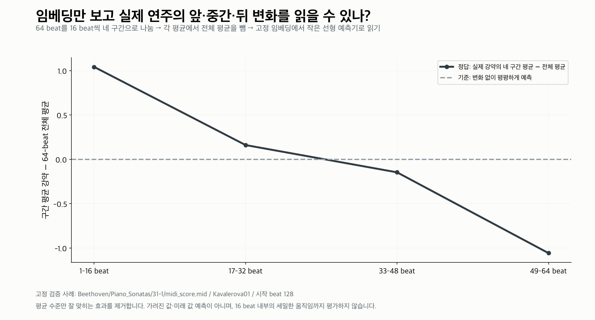
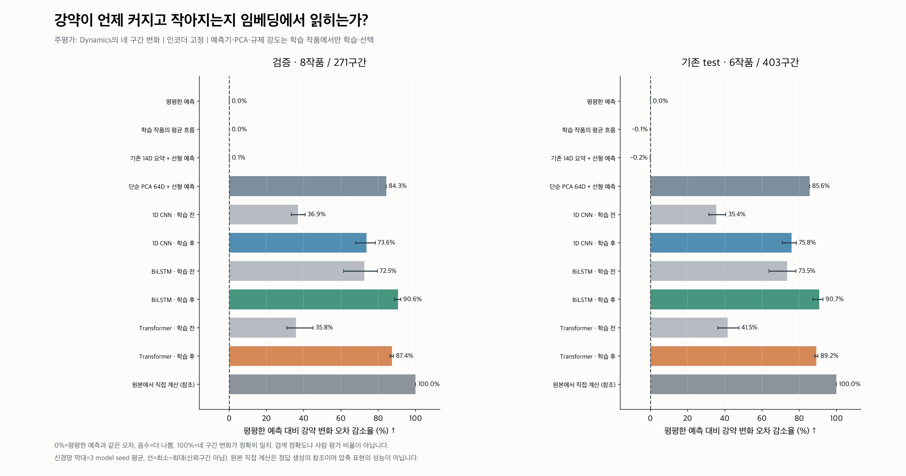
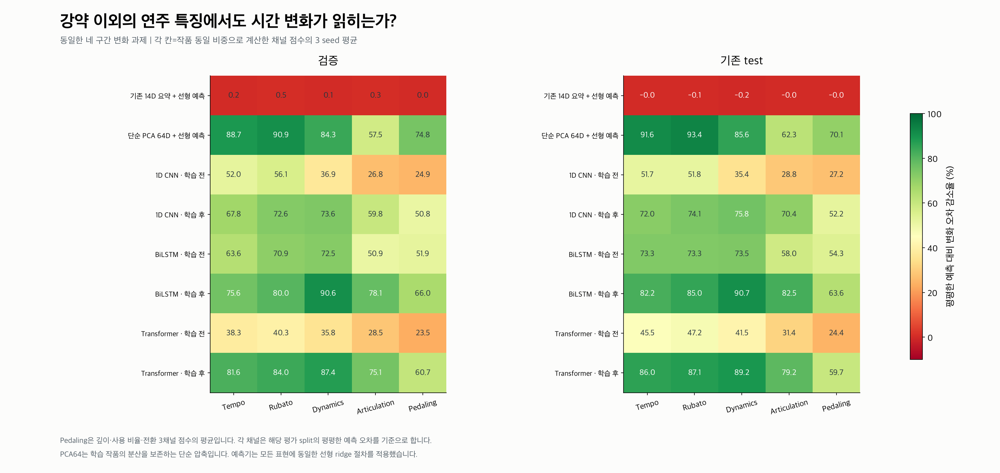
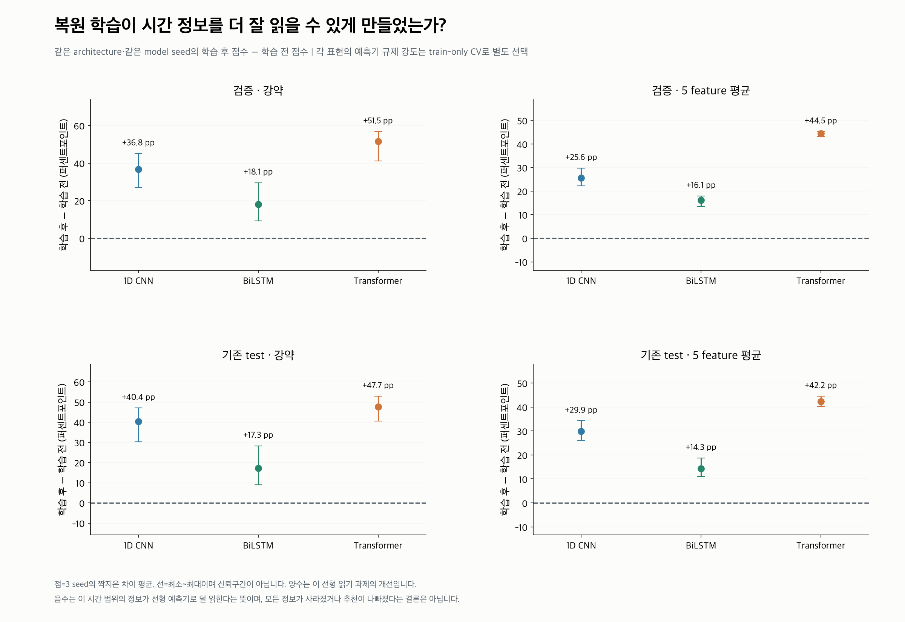
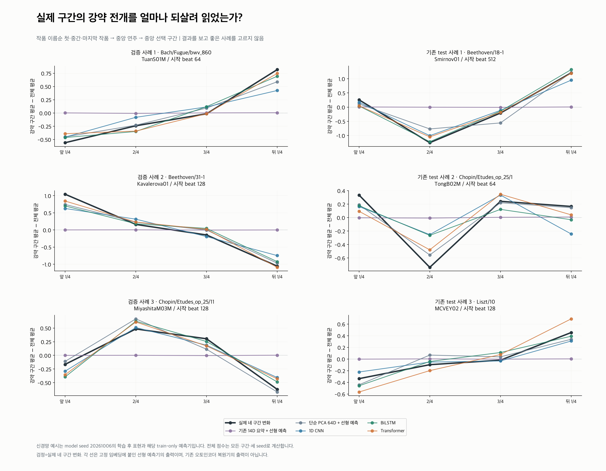

# 2단계: 고정 임베딩에서 실제 연주의 시간 변화 읽기

**질문: 복원 학습 후 표현은 기존 요약·학습 전 표현보다 실제 구간의 앞·중간·뒤 변화를 더 잘 읽게 하는가?**

저장된 1D CNN·BiLSTM·Transformer 인코더를 고정하고, 각 표현에 작은 선형 ridge 예측기만 학습했다. 인코더를 재학습하거나 checkpoint를 다시 선택하지 않았다.

## 평가 문제

64 beat를 16 beat씩 네 구간으로 나눈다. 채널별 네 평균에서 해당 64-beat 전체 평균을 빼고, 이 네 변화값을 임베딩만으로 예측한다. 전체 수준을 맞히는 효과를 제거한다.
주평가는 **Dynamics**이고, 같은 절차로 7채널 전체와 5 feature 동일 비중 평균도 확인한다. 실제 관측 feature를 사용하며 인위적인 순서 변경이나 가림은 없다.



## 결과

**점수 = 100 × (1 − 예측 MSE / 평평한 0 예측 MSE).** 0%는 평평하게 예측한 것과 같은 오차, 음수는 더 나쁨, 100%는 네 구간 변화가 정확히 일치함을 뜻한다. 사람 평가 비율이나 검색 정확도가 아니다.
각 MSE는 구간→연주→작품 순으로 평균해 작품을 동일 비중으로 둔다. 채널별 점수를 계산한 뒤 Pedaling 세 채널을 한 그룹으로 묶어 5 feature를 동일 비중으로 평균한다.

| 표현 | 검증 강약 | 기존 test 강약 | 검증 5 feature | 기존 test 5 feature |
|---|---:|---:|---:|---:|
| 평평한 예측 | 0.00% | 0.00% | 0.00% | 0.00% |
| 학습 작품의 평균 흐름 | 0.01% | -0.07% | 0.03% | -0.08% |
| 기존 14D 요약 + 선형 예측 | 0.15% | -0.18% | 0.24% | -0.07% |
| 단순 PCA 64D + 선형 예측 | 84.25% | 85.59% | 79.23% | 80.61% |
| 1D CNN · 학습 전 | 36.86% (33.28~40.75) | 35.40% (31.40~40.55) | 39.33% (37.08~41.76) | 38.99% (37.81~40.22) |
| 1D CNN · 학습 후 | 73.65% (67.87~78.40) | 75.78% (70.88~78.44) | 64.92% (61.87~68.89) | 68.91% (65.08~72.03) |
| BiLSTM · 학습 전 | 72.46% (61.41~79.40) | 73.45% (63.81~78.29) | 61.95% (60.68~63.23) | 66.48% (63.55~69.16) |
| BiLSTM · 학습 후 | 90.59% (88.71~92.06) | 90.73% (87.31~92.80) | 78.04% (75.37~80.14) | 80.82% (77.69~82.54) |
| Transformer · 학습 전 | 35.82% (30.86~45.07) | 41.52% (36.30~47.62) | 33.26% (30.61~35.00) | 37.99% (34.00~41.18) |
| Transformer · 학습 후 | 87.36% (86.29~88.11) | 89.18% (88.26~90.10) | 77.75% (75.57~79.44) | 80.23% (78.51~81.46) |
| 원본에서 직접 계산 (참조) | 100.00% | 100.00% | 100.00% | 100.00% |

괄호는 세 model seed의 최소~최대이며 신뢰구간이 아니다. 원본 직접 계산은 정답 생성의 참조값으로, 학습되거나 압축된 표현이 아니다.



## 학습 전후의 차이

| 모델 | 검증 강약 변화 | 기존 test 강약 변화 | 기존 test 5 feature 변화 |
|---|---:|---:|---:|
| 1D CNN | +36.79 pp (상승 3/3 seed) | +40.38 pp (상승 3/3 seed) | +29.92 pp (상승 3/3 seed) |
| BiLSTM | +18.13 pp (상승 3/3 seed) | +17.28 pp (상승 3/3 seed) | +14.34 pp (상승 3/3 seed) |
| Transformer | +51.53 pp (상승 3/3 seed) | +47.66 pp (상승 3/3 seed) | +42.24 pp (상승 3/3 seed) |

양수는 해당 시간 특징이 선형 예측기로 더 잘 읽힌다는 근거다. PCA64와도 비교해 단순한 분산 보존 압축 대비 추가 가치를 확인한다. 음수는 이 과제에서의 악화이며 모든 시간 정보가 사라졌다는 뜻은 아니다.

### 이번 결과의 판단

1. **기존 요약과는 차이가 있다.** 전체 수준을 제거한 네 구간 변화는 14D 요약에서 거의 읽히지 않지만, 학습된 세 시계열 표현에서는 읽힌다.
2. **복원 학습의 효과도 관찰된다.** 세 모델 모두 validation/test의 강약·5 feature 평균에서 같은 seed의 학습 전보다 개선됐다. 다만 학습 전 인코더에도 일부 시간 정보가 있었으므로 초기 표현을 무정보라고 볼 수 없다.
3. **복잡한 모델의 우위는 특징에 따라 다르다.** 강약은 학습된 BiLSTM·Transformer가 PCA64를 앞선다. 5 feature 평균에서는 PCA64와 비슷한 수준이며, Tempo·Rubato·Pedaling은 PCA64가 더 높다. 모든 특징에서 신경망이 가장 좋다는 결과는 아니다.
4. 따라서 **“이 모델들은 시간 변화를 전혀 담지 못한다”는 판단은 수정해야 한다.** 세밀한 가림 복원이 약했던 결과와, 관측된 16-beat 평균 변화가 표현에서 읽힌다는 결과는 함께 성립한다. 다음 확인 대상은 이 정보가 실제 임베딩 거리와 검색에서도 작동하는지다.





## 실제 고정 사례



사례는 각 split에서 작품 이름순 첫·중간·마지막 작품, 중앙 연주, 중앙 선택 구간으로 고정했다. 좋은 사례를 결과에서 탐색하지 않았다.

## 데이터와 누출 방지

| split | 원래 작품/연주/구간 | 선택 작품/연주/구간 |
|---|---:|---:|
| train | 39/395/5803 | 39/395/1639 |
| validation | 8/93/935 | 8/93/271 |
| test | 8/82/1670 | 6/67/403 |

- 완전 유효한 64-beat 구간만 선택하고 연주 내 구간 겹침을 제외했다. validation/test 입력은 앞선 순서 평가 입력과 byte 단위로 동일하다.
- 예측기 학습과 PCA는 train 작품만 사용한다. 입력 평균·표준편차도 train에서만 계산한다.
- 규제 강도 후보는 `0.0001, 0.001, 0.01, 0.1, 1, 10`. train 작품을 분리한 고정 5-fold CV로 선택한다. fold마다 정규화·PCA를 다시 train fold에서만 계산한다.
- CV 선택 지표는 채널 오차를 fold-training 정답 에너지로 나눈 뒤 5 feature 동일 비중으로 평균한다. validation/test로 규제 강도나 예측기를 선택하지 않는다.
- 모든 표현에 동일한 28출력 선형 ridge 절차를 적용한다. 기존 요약은 14D, 신경망과 PCA는 64D다. 인코더 출력은 L2 정규화하지 않으며 거리 검색 평가는 별도다.
- 원본 448D를 train-only 표준화한 뒤 weighted PCA로 64D 압축한다. PCA도 각 train CV fold에서 별도로 학습한다.
- 학습 전·후 표현별로 예측기를 별도로 학습한다. 신경망 seed는 20261006/07/08이며, 학습 후는 기존 확대 예산의 복원 validation 최선 checkpoint다.
- 기존 validation/test는 이미 관찰한 작품이므로 새로운 독립 holdout으로 주장하지 않는다. 작품별 reference cohort 정규화 정책도 유지한다.

## 해석 범위와 종료 조건

이 단계는 **관측된 16-beat 평균 변화가 고정 표현에서 선형적으로 읽히는가**를 평가한다. 가려진 beat의 예측 가능성, 16 beat 내부의 세밀한 변화, 음악적 유사성, 사용자 선호를 검증하지 않는다.
정답은 추출 feature에서 계산하므로 입력 정보 보존을 검증하며, feature 추출 규칙 자체의 타당성을 독립 검증하지 않는다.
학습 후가 요약·초기 표현을 앞서면 이 시간 범위에서의 표현 학습 효과를 지지한다. 차이가 작거나 악화돼도 이 단계의 완결된 결과로 기록한다. 결과에 맞춰 시간 범위·모델·정답을 추가 탐색하지 않는다.
3단계인 실제 임베딩 거리·검색 평가는 아직 수행하지 않았다. 선형 예측기로 정보가 읽히는 것과 cosine 거리 또는 전곡 평균/표준편차 표현이 이를 활용하는 것은 별개다.

## 산출물과 재현

- [summary.csv](summary.csv), [channel_metrics.csv](channel_metrics.csv), [work_metrics.csv](work_metrics.csv): 전체·채널·작품별 결과
- [training_effects.csv](training_effects.csv): 학습 전후 짝지은 점수 차이
- [cv.csv](cv.csv), [probe_parameters.csv](probe_parameters.csv): train-only 조정과 선택 규제 강도
- [selected_windows.csv](selected_windows.csv), [example_quarters.csv](example_quarters.csv): 선택과 고정 사례
- [protocol.json](protocol.json), [evaluation_audit.json](evaluation_audit.json), [independent_audit.json](independent_audit.json), [layout_audit.json](layout_audit.json), [figure_manifest.json](figure_manifest.json), [report_generation.json](report_generation.json): 설정·검증·최종 보고서 생성 기록
- 대용량 원본 입력·목표·임베딩·예측기·예측: 저장소 밖 `Classicfy/datasets/temporal_probe_run01`

저장소 루트에서 실행한다. 기존 결과는 덮어쓰지 않는다.

```bash
XDG_CACHE_HOME=/tmp/classicfy-cache MPLCONFIGDIR=/tmp/classicfy-mpl VECLIB_MAXIMUM_THREADS=2 \
classicfy-ai/.venv/bin/python classicfy-ai/scripts/evaluate_temporal_probe.py

classicfy-ai/.venv/bin/python classicfy-ai/scripts/evaluate_temporal_probe.py --report-only

classicfy-ai/.venv/bin/python classicfy-ai/scripts/audit_temporal_probe.py
```
