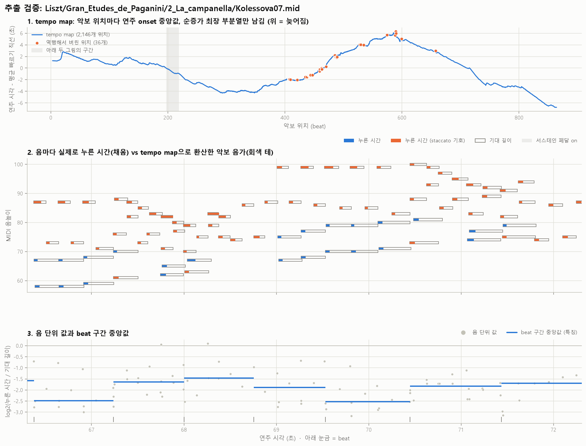
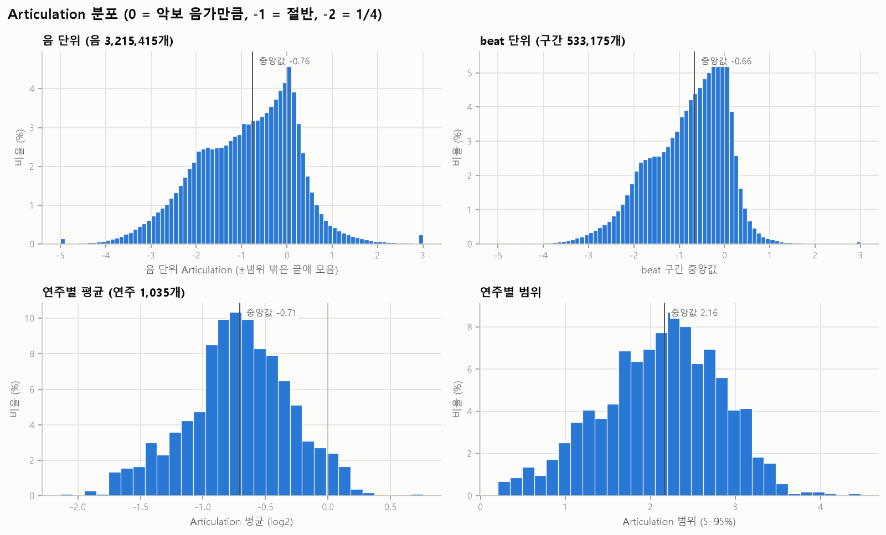
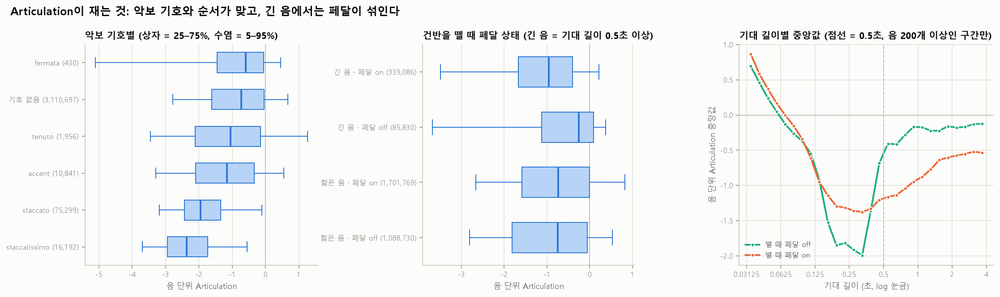
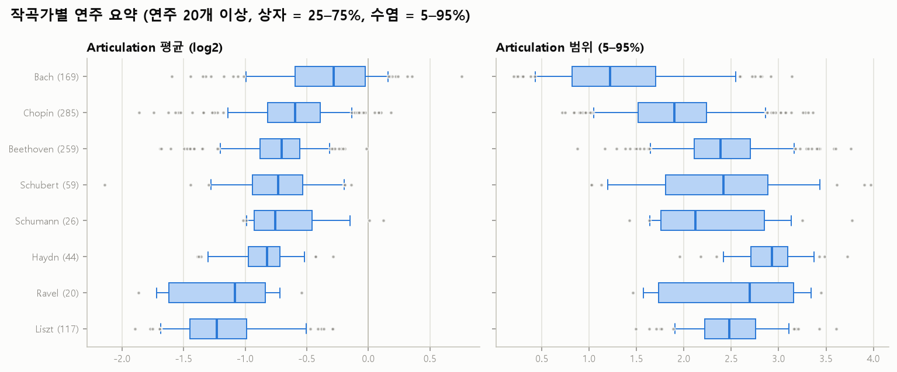
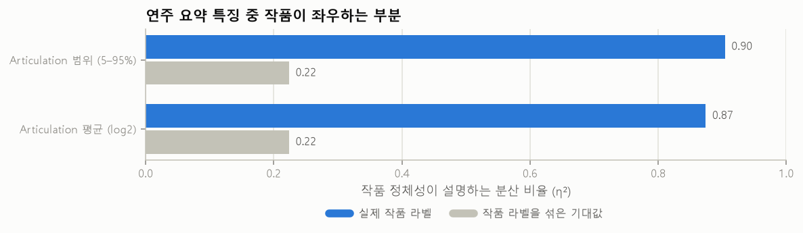
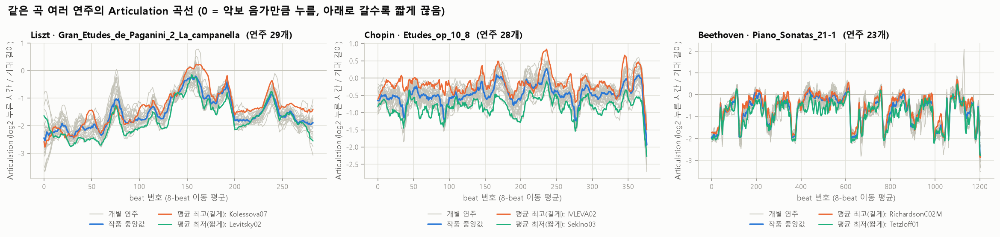
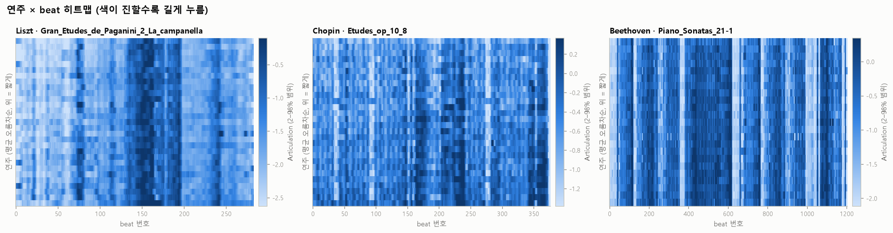
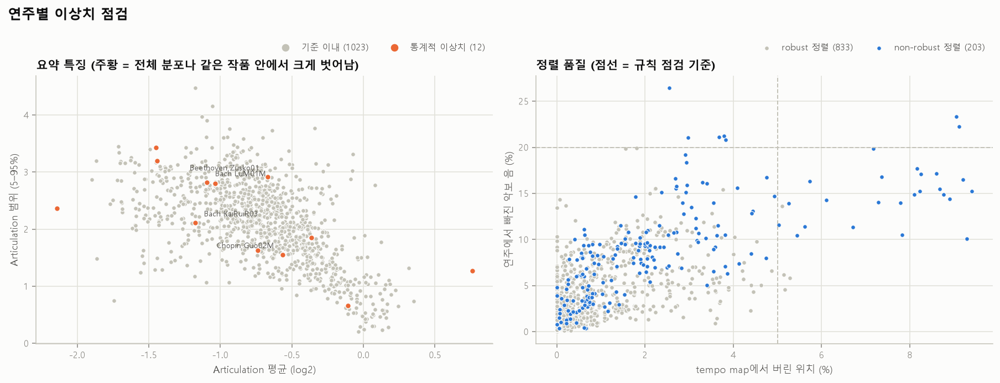

# Articulation 특징 검증 ((n)ASAP)

`features`의 Articulation 추출기를 (n)ASAP note 정렬이 있는 ASAP 연주 전체에 적용해 검증한 결과다. 특징 정의(tempo map, log2 비율, 제외 규칙, beat 구간 중앙값)는 `src/features/README.md` 4절에, match 파일 로더와 폴더 대응 규칙은 `src/preprocessing/README.md`에 있다.

- 대상: ASAP `aligned=True`이면서 match 파일이 있는 연주 **1,036개**, 작품 **234개**(ASAP 폴더 기준). 그중 robust 정렬 **833개**
- 정렬된 음 **3,239,711개**, 연주에서 빠진 악보 음 202,981개, 악보에 없는 연주 음 183,351개
- 수치의 원본은 `stats.json`, 연주별 값은 `performance_summary.csv`, 점검에 걸린 연주는 `outliers.csv`, 작품별 연주 간 비교는 `same_work_consistency.csv`다.

## 결론

1. **추출은 정의대로 계산된다.** 파이썬 루프로 다시 계산한 값과 음 단위·beat 단위 모두 1e-12 이하로 일치한다(6개 연주).
2. **입력이 정확하다.** match 파일의 연주 음 시각은 연주 MIDI와 평균 99.993% 일치하고, tempo map에서 버리는 위치는 1.4%, 계산에서 빠지는 음은 0.75%다.
3. **재려던 것을 잰다.** 악보 기호별 중앙값이 staccatissimo −2.37 < staccato −1.95 < 기호 없음 −0.72 순서로, 기호가 뜻하는 길이와 맞는다.
4. **손가락 articulation이지 들리는 길이가 아니다.** 기대 길이 0.5초 이상인 음은 뗄 때 페달이 on이면 중앙값 −0.96, off면 −0.25다. 0.15~0.4초 음에서는 거꾸로 페달 off일 때 더 짧게 끊는다(−1.76 vs −1.29). 페달과 articulation은 서로 얽혀 있어 Pedaling과 함께 해석해야 한다.
5. **요약값은 작품이 크게 좌우한다.** `articulation_mean` 분산의 87%를 작품이 설명한다(라벨을 섞으면 22%). 작품 기준 정규화가 필요하다.
6. **같은 곡 연주들은 윤곽을 공유하면서도 수준이 다르다.** 연주 간 beat 곡선 상관 중앙값 0.61(8-beat 평활 후 0.78), 같은 작품 안 연주별 평균의 표준편차 0.13(전체 0.42).
7. **알려진 약점: tempo map의 LIS 동점.** 순증가 최장 부분열이 여러 개일 때 어느 것을 고르느냐에 따라 음의 0~2.8%의 값이 바뀌고, 그중 일부는 크게(최대 5.7) 바뀐다(1-5).

## 1. 입력과 추출 점검

### 1-1. match 시각 = 연주 MIDI 시각

match 파일의 tick을 초로 바꾼 연주 음 시각이, 같은 연주 MIDI를 `load_midi`로 읽은 음과 맞는지 확인했다. 정렬된 음마다 같은 음높이이면서 onset·offset이 모두 2ms 안인 MIDI 음이 있는지 본다.

| | 값 |
|---|---|
| 평균 일치율 | 99.993% |
| 100% 일치한 연주 | 980개 / 1,036개 |
| 99.9% 미만 연주 | 12개 |
| 최저 | 97.0% (`Ravel/Gaspard_de_la_Nuit/1_Ondine/LiYZ08`, non-robust) |

match의 연주 음을 그대로 써도 된다는 근거다. 로더는 (n)ASAP 쪽 연주 MIDI와 ASAP 연주 MIDI가 바이트 단위로 같은지도 확인하는데, 대응된 연주는 모두 같았다.

### 1-2. 폴더가 옮겨진 연주

(n)ASAP은 반복을 악보와 다르게 연주한 연주를 `<작품>_no_repeat`, `<작품>_extra_repeat` 폴더로 옮겼다. 로더의 대응 규칙(`src/preprocessing/README.md`)으로 **16개**가 대응되고(Beethoven 12, Schumann 2, Chopin 1, Liszt 1), 모두 match 파일을 정상적으로 읽는다. 이 연주들은 옮겨진 폴더의 악보 기준 match를 쓰므로 tempo map과 기대 길이가 실제로 연주한 반복 구조를 따른다.

연주 키와 beat는 원래 ASAP 것을 그대로 쓰므로 작품 구분과 시간축은 다른 feature와 같다. 대신 **beat 구간 중 값이 있는 비율이 74~87%로 낮다**(전체 중앙값 99.3%). ASAP은 연주하지 않은 반복 구간의 beat를 몇 ms 간격으로 몰아서 기록했기 때문이다. 예를 들어 `Beethoven/Piano_Sonatas/32-1/Park01`은 832개 구간 중 205개가 10ms보다 짧고, 그 안에서 시작하는 음이 없다. 연주하지 않은 beat이므로 `NaN + mask=False`가 맞는 처리이고, 같은 beat 격자를 쓰는 Dynamics도 똑같이 비어 있다.

### 1-3. tempo map

악보 위치별 onset 중앙값을 시간 순증가 최장 부분열(LIS)로 정리할 때 버린 위치의 비율이다.

| | 버린 위치 비율 | 삭제된 악보 음 비율 |
|---|---|---|
| 전체 | 1.4% | — |
| robust (833개) | 1.0% | 4.7% |
| non-robust (203개) | 2.6% | 9.0% |

가장 많이 버린 연주는 `Ravel/Miroirs/3_Une_Barque`의 non-robust 연주들(9% 안팎)이다. 정렬 품질이 낮을수록 역행 점이 많아지고, LIS가 그것을 걸러낸다는 뜻이다. robust 여부에 따라 `articulation_mean` 중앙값이 −0.67(robust)과 −0.84(non-robust)로 다르지만, non-robust 연주가 Ravel·Prokofiev·Liszt에 몰려 있어 작곡가 차이와 섞여 있다(3절).

### 1-4. 계산에서 빠지는 음

| 사유 | 비율 |
|---|---|
| 꾸밈음 | 0.55% |
| tempo map 범위 밖 (곡 끝 등) | 0.16% |
| 장식음 기호 (trill 등) | 0.03% |
| 길이 0 이하 | 0.01% |
| **사용** | **99.25%** |

- 사용 비율이 95% 미만인 연주는 14개이고 전부 꾸밈음이 많은 곡이다(Mozart 11-3 "터키 행진곡" 281개, Liszt S145/2, Schumann Kreisleriana 4·6 등).
- 값이 있는 beat 구간 비율은 연주별 중앙값 99.3%다. 0%인 연주가 하나 있는데(`Debussy/Pour_le_Piano/1/MunA12M`), (n)ASAP의 match 파일에 헤더만 있고 음이 하나도 없는 경우다. 이 연주는 모든 구간이 `NaN + mask=False`이고 요약값이 `NaN`이다.

### 1-5. 독립 재계산

무작위 6개 연주를 추출기와 다른 방식으로 다시 계산했다(`independent_check`).

- **tempo map**: 파이썬 루프의 O(n²) 동적 계획법 LIS로 다시 만든다. 추출기(O(n log n))와 **길이는 6개 모두 같고**, 추출기 결과는 모두 순증가다.
- **음·beat 값**: 추출기와 같은 tempo map을 주고 bisect 보간, 파이썬 루프의 제외 규칙, `statistics.median`으로 다시 계산한다. LIS 선택과 분리해서 보간·제외·구간 배정·중앙값을 검증하기 위해서다.
- **LIS 동점 민감도**: 다른 LIS 후보(동적 계획법 결과)로 계산했을 때 값이 바뀌는 음의 비율을 잰다.

| 연주 | tempo map 점 | 음 | 음 오차 | beat 오차 | mask 불일치 | 동점 후보로 값이 바뀌는 음 | 최대 변화 |
|---|---|---|---|---|---|---|---|
| `Liszt/Ballade_2/Sham05` | 3,689 | 6,784 | 1e-12 | 3e-13 | 0 | 2.77% | 5.72 |
| `Chopin/Etudes_op_10/12/Staupe02` | 1,294 | 2,041 | 0 | 0 | 0 | 2.45% | 4.04 |
| `Schubert/Piano_Sonatas/664-1/Lin07` | 1,190 | 2,366 | 0 | 0 | 0 | 0.30% | 2.00 |
| `Chopin/Berceuse_op_57/Tario07M` | 946 | 1,577 | 0 | 0 | 0 | 0.95% | 3.85 |
| `Bach/Prelude/bwv_885/Guo01M` | 339 | 491 | 0 | 0 | 0 | 0% | 0 |
| `Bach/Fugue/bwv_865/Teo01M` | 1,178 | 2,372 | 0 | 0 | 0 | 1.10% | 2.08 |

계산 규칙은 정의대로 구현되어 있다. 다만 **LIS가 유일하지 않을 때 어느 점을 버리느냐가 결과를 바꾼다.** 두 이웃 위치의 연주 시각이 뒤바뀌면 둘 중 하나만 버리면 되는데, 어느 쪽을 버리는지에 따라 그 근처에서 시작하거나 끝나는 음의 기대 길이가 달라진다. 특히 짧은 음은 기대 길이가 작아서 몇십 ms의 차이로도 log2 비율이 크게 움직인다. 바뀌는 음은 3% 미만이고 beat 값은 중앙값이라 덜 흔들리지만, 음 단위 분석을 할 때는 알아 둬야 한다. 동점 후보를 모두 버리거나 등위 회귀(isotonic regression)로 바꾸는 방안은 아직 비교하지 않았다.

### 1-6. 추출 과정 눈으로 보기



robust 정렬이면서 스타카토 음, 페달을 밟은/뗀 음, 버린 tempo map 위치가 모두 있는 연주 중 스타카토가 가장 많은 연주를 자동으로 고른다(`--check-key`로 바꿀 수 있다).

1. **tempo map**: 곡 평균 빠르기 직선을 뺀 값이라 위로 가면 늦어진 것이다. 주황 점은 역행해서 버린 위치로, 파란 곡선 가까이에 있으면서 앞뒤 점과 순서가 어긋난 점들이다. 회색 띠는 아래 두 그림의 구간이다.
2. **피아노 롤**: 회색 테가 tempo map으로 환산한 악보 음가, 채운 막대가 실제로 누른 시간이다. 주황은 staccato 기호가 붙은 음이다. 스타카토 음은 막대가 테의 일부만 채우고, 기호 없는 긴 음은 대부분 채운다.
3. **값**: 회색 점이 음 단위 값, 파란 선이 그 beat 구간 중앙값(특징)이다.

## 2. 음 단위 값

### 2-1. 분포



| p5 | p25 | p50 | p75 | p95 |
|---|---|---|---|---|
| −2.82 | −1.67 | −0.76 | −0.05 | +0.66 |

- 중앙값 −0.76은 음가의 약 59%만 누른다는 뜻이다. 피아니스트는 보통 다음 음을 치기 전에 건반을 뗀다.
- −3 미만(음가의 1/8 미만)이 3.6%, +2 초과(4배 초과)가 0.6%다. 꼬리가 길어서 beat 구간은 평균이 아니라 중앙값으로 모은다.
- 기대 길이(초, log2)와 값의 상관은 −0.35다. 다만 관계가 단조롭지 않다(2-3).

### 2-2. 악보 기호별



음에 붙은 악보 기호로 나눈 중앙값이다(그림 왼쪽). 기호가 여럿이면 표 순서대로 앞의 것으로 센다(예: 스타카토+악센트는 스타카토).

| 기호 | 음 수 | 중앙값 | 음가 대비 |
|---|---|---|---|
| staccatissimo | 16,192 | −2.37 | 19% |
| staccato | 75,299 | −1.95 | 26% |
| accent | 10,841 | −1.15 | 45% |
| tenuto | 1,956 | −1.05 | 48% |
| 기호 없음 | 3,110,697 | −0.72 | 61% |
| fermata | 430 | −0.59 | 66% |

- staccatissimo < staccato < 기호 없음 순서가 정확히 나온다. 기호가 "짧게"를 뜻하는 만큼 값이 작다.
- tenuto(충분히 눌러라)가 기호 없음보다 작다. tenuto는 대개 긴 음이나 느린 악구에 붙어 2-3의 페달 영향과 겹친 것으로 보인다. 확인하지는 않았다.
- `detachedlegato`, `strongaccent`는 정렬된 음 중에 없었다.

### 2-3. 기대 길이와 페달

건반을 뗀 순간(연주 음의 `offset`)에 서스테인 페달이 on(CC64 ≥ 64)이었는지로 나눴다(그림 가운데·오른쪽). 전체 음의 63%가 페달이 on인 상태에서 떼어진다.

| 기대 길이 | 페달 off 중앙값 (음 수) | 페달 on 중앙값 (음 수) |
|---|---|---|
| 0.0625초 미만 | +0.37 (31,473) | +0.54 (83,318) |
| 0.0625~0.15초 | −0.47 (560,790) | −0.45 (815,325) |
| 0.15~0.4초 | −1.76 (449,792) | −1.29 (673,897) |
| 0.4~0.5초 | −0.77 (46,673) | −1.22 (129,224) |
| 0.5~1초 | −0.33 (60,520) | −1.09 (221,404) |
| 1초 이상 | −0.19 (25,310) | −0.69 (117,682) |

- **아주 짧은 음(0.06초 미만)은 음가보다 길게 누른다.** 빠른 음형에서는 손가락이 다음 음과 겹쳐(finger legato) 떼는 시점이 음가를 넘는다. 기대 길이가 작아서 몇 ms만 겹쳐도 비율이 커지는 영향도 있다.
- **0.15~0.4초 음이 가장 짧게 끊긴다.** 스타카토가 주로 붙는 8분·16분음표 길이대다. 이 구간에서는 **페달 off일 때 더 짧다**(−1.76 vs −1.29). 페달 없이 치는 스타카토 악구(Bach, 고전 시대 곡)가 여기 몰리기 때문으로 보인다.
- **0.4초 이상의 긴 음은 페달 on일 때 훨씬 일찍 뗀다**(0.5~1초에서 −1.09 vs −0.33). 페달이 소리를 이어 주므로 손은 먼저 다음 위치로 옮긴다.
- 기대 길이 0.5초로만 나누면 짧은 음 쪽에서는 페달 on/off 중앙값이 −0.74 / −0.75로 같게 나온다. 위 표처럼 길이대별로 반대 방향 효과가 상쇄된 결과이므로 "짧은 음은 페달과 무관하다"고 읽으면 안 된다.
- 결국 이 특징은 **손가락이 누른 시간**이고, 들리는 소리의 길이가 아니다. "레가토로 들리는가"를 알고 싶으면 Pedaling(`down_ratio`)과 함께 보거나, CC64로 note-off를 늦춘 값을 따로 만들어야 한다.

## 3. 연주별 요약

| 요약 특징 | p5 | p25 | p50 | p75 | p95 |
|---|---|---|---|---|---|
| `articulation_mean` | −1.46 | −0.96 | −0.71 | −0.43 | −0.02 |
| `articulation_range` (5–95%) | 0.88 | 1.65 | 2.16 | 2.63 | 3.17 |



작곡가별 `articulation_mean` 중앙값(전체 16명):

| 짧게 | | | | | | | | 길게 |
|---|---|---|---|---|---|---|---|---|
| Prokofiev −1.37 | Liszt −1.23 | Balakirev −1.19 | Scriabin −1.17 | Debussy −1.12 | Ravel −1.09 | … | Brahms −0.35 | Bach −0.28 |

- Bach가 가장 길게 누르고 범위도 가장 좁다. 페달을 거의 쓰지 않는 Bach 연주(`reports/dynamics_pedaling` 4절)에서는 손가락으로 음을 이어야 하므로 2-3과 맞는다.
- 페달을 많이 쓰는 후기 낭만·인상주의 레퍼토리(Liszt, Scriabin, Debussy, Ravel)가 짧은 쪽에 몰린다.

### 작품이 좌우하는 정도



연주별 요약값의 분산 중 작품 정체성이 설명하는 비율(η²)이다. "섞음"은 작품 라벨을 무작위로 300번 섞었을 때의 평균이다.

| 요약 특징 | 실제 | 섞음 |
|---|---|---|
| `articulation_mean` | 0.87 | 0.22 |
| `articulation_range` | 0.90 | 0.22 |

우연 기대값을 빼도 0.65 이상이다. 기대 길이 분포(음가 구성·빠르기)와 악보 기호, 페달을 쓰는 정도가 작품마다 다르기 때문이다. 절대값을 그대로 임베딩에 넣으면 해석이 아니라 작품을 학습할 위험이 있다.

## 4. 같은 곡 여러 연주

연주가 많은 작품 3곡(작곡가가 겹치지 않게 선택)의 곡선이다. 회색이 개별 연주, 파란 선이 작품 중앙값, 주황·청록이 `articulation_mean`이 가장 높은(길게)/낮은(짧게) 연주다.





연주 5개 이상이고 모든 연주의 beat 구간 수가 같은 작품 71개로 정량화했다. beat 곡선의 결측 구간은 선형 보간해 채우고, 연주 쌍마다 피어슨 상관을 구했다.

| | 값 |
|---|---|
| 연주 간 곡선 상관 (작품별 중앙값의 중앙값) | 0.61 |
| 8-beat 이동 평균 후 | 0.78 |
| 같은 작품 안 연주별 `articulation_mean` 표준편차 (중앙값) | 0.13 |
| (참고) 전체 연주별 `articulation_mean` 표준편차 | 0.42 |

- 연주들은 곡의 articulation 윤곽을 상당히 공유한다. 히트맵의 세로 줄무늬가 악보가 정한 부분(스타카토 악구, 긴 음이 많은 악구)이다. Beethoven 21-1처럼 악구가 뚜렷한 곡은 모든 연주가 같은 곳에서 급격히 짧아진다.
- 같은 작품 안에서도 평균 수준이 0.13 정도(음가의 약 9%) 달라진다. 이 차이가 해석인지 녹음·악기 조건인지는 구분하지 못했다.
- 상관이 가장 낮은 작품은 `Bach/Fugue/bwv_883`(0.02), `Bach/Prelude/bwv_885`(0.25), `Chopin/Etudes_op_10/1`(0.30)이고, 높은 작품은 `Liszt/Concert_Etude_S145/1`, `Beethoven/Piano_Sonatas/21-1_no_repeat`, `Chopin/Barcarolle`(0.92~0.93)이다. 낮은 작품은 곡 안에서 음가 구성이 균일해 곡선 자체의 변화가 작은 경우로 보이지만, 확인하지는 않았다.

## 5. 이상치 점검



규칙은 정렬 데이터 문제를, 통계는 분포에서 벗어난 연주를 찾는다.

| 점검 | 기준 | 연주 수 |
|---|---|---|
| 정렬된 음 없음 | match 수 0 | 1 |
| match·MIDI 시각 불일치 | 일치율 99.9% 미만 | 12 |
| tempo map 역행 과다 | 버린 위치 5% 초과 | 29 |
| 삭제 음 과다 | 연주에서 빠진 악보 음 20% 초과 | 7 |
| 제외 음 과다 | 계산에 쓰인 음 95% 미만 | 14 |
| 빈 beat 과다 | 값이 있는 beat 구간 80% 미만 | 8 |
| 전체 분포 이상치 | 요약값의 robust z 3.5 초과 | 2 |
| 작품 내 이상치 | 같은 작품 중앙값 대비 robust z 4 초과 (연주 4개 이상 작품) | 10 |

하나 이상 걸린 연주는 78개이고, 통계적 이상치는 12개(Bach 6, Beethoven 2, Chopin 2, Schubert 2)다.

- **규칙에 걸린 연주는 대부분 설명된다.** 제외 음 과다 14개는 전부 꾸밈음이 많은 곡(1-4), 빈 beat 과다 8개 중 7개는 반복을 건너뛴 폴더 이동 연주(1-2)이고 나머지 하나는 음이 없는 match 파일이다. tempo map 역행·삭제 음 과다는 non-robust 정렬에 몰려 있다(그림 오른쪽).
- **전체 분포 이상치 2개**: `Schubert/Moment_musical_no_3/Tetzloff09M`(평균 −2.14, 가장 짧음)과 `Bach/Prelude/bwv_846/Shi05M`(+0.76, 가장 김). 정렬 품질 점검에는 걸리지 않았다. 연주 해석의 극단인지 개별 녹음 문제인지는 확인하지 않았다.
- **작품 내 이상치 10개 중 5개가 Bach 푸가**(bwv_883에서 3개)다. 4절에서 연주 간 상관이 가장 낮았던 작품이라, 이 곡은 연주자마다 articulation을 크게 다르게 가져간다고 볼 수 있다.

## 6. 다음 결정에 필요한 사항

- **정규화**: Dynamics·Pedaling과 같이 작품 기준 상대화가 필요하다. 방식 비교는 아직 하지 않았다.
- **tempo map 동점 처리**: 1-5의 민감도를 줄이려면 LIS 동점 후보를 모두 버리거나, 등위 회귀처럼 유일한 답이 있는 방식으로 바꾸는 것을 비교해 봐야 한다.
- **페달 보정 여부**: 지금 값은 손가락 기준이다. 들리는 길이 기준이 필요하면 CC64로 note-off를 늦춘 버전(또는 match 5.0의 adjusted offset)을 별도 특징으로 만들 수 있다. match 1.0.0 파일(381개)에는 adjusted offset이 없어 CC64로 직접 계산해야 한다.
- **아주 짧은 음**: 기대 길이 0.06초 미만 음은 몇 ms의 겹침으로도 값이 크게 변한다. 최소 기대 길이 기준을 둘지 검토할 수 있다.
- **non-robust 연주**: 203개. tempo map에서 버리는 점과 삭제 음이 두 배가량 많다. 뺄지는 호출하는 쪽에서 정한다.
- **처리하지 않은 것**: match 파일이 없는 연주 3개와 ASAP에서 정렬되지 않은 연주는 대상에서 빠졌다. 음이 없는 match 파일(`Debussy/Pour_le_Piano/1/MunA12M`)은 전부 결측으로 둔다.

## 재현

`classicfy-ai` 디렉터리에서 실행한다. matplotlib과 pandas가 필요하다(matplotlib은 `requirements.txt`에 없다). 그림의 한글은 Windows의 `Malgun Gothic` 글꼴을 쓴다.

```bash
PYTHONPATH=src python scripts/validate_articulation.py \
    --asap-root /path/to/ASAP --nasap-root /path/to/nASAP \
    --out reports/articulation --cache /tmp/articulation.pkl
```

- 처음 실행하면 match와 연주 MIDI 1,036쌍을 읽어 8프로세스로 수 분이 걸린다(`--workers`로 조정). `--cache`를 주면 수집 결과를 저장해 두고, 다음 실행부터는 표·그림·독립 재계산만 다시 하므로 1분 남짓이면 끝난다.
- 캐시는 수집 항목이 바뀌면 호환되지 않는다. 스크립트를 고친 뒤에는 새 경로를 주거나 파일을 지운다.
- 08번 그림의 연주는 `--check-key Bach/Fugue/bwv_846/Shi05M.mid`처럼 바꿀 수 있다.

### 곡을 골라 그리기

`01`, `02`번 그림은 기본으로 연주가 가장 많은 작품 3곡(작곡가가 겹치지 않게)을 쓴다. 다른 곡으로 그리려면 `--works`를 준다. 작품 이름은 ASAP 폴더 경로이고, `--list-works`로 note 정렬된 연주가 2개 이상인 작품과 연주 수를 볼 수 있다.

```bash
python scripts/validate_articulation.py --asap-root /path/to/ASAP --nasap-root /path/to/nASAP --list-works
python scripts/validate_articulation.py --asap-root /path/to/ASAP --nasap-root /path/to/nASAP \
    --works Bach/Fugue/bwv_883 Chopin/Barcarolle --out reports/custom
```

- 고른 작품의 연주만 읽어서 수십 초면 끝나고, 그림은 `01_same_work_curves_custom.png`, `02_same_work_heatmaps_custom.png`로 저장한다.
- 다른 그림과 표는 다시 만들지 않는다. 기본 리포트를 덮어쓰지 않도록 `--out`을 따로 주는 것을 권한다.
- 작품 이름을 잘못 쓰면 비슷한 이름을 알려 준다.

## 파일

| 파일 | 내용 |
|---|---|
| `01_same_work_curves.png` | 같은 곡 여러 연주의 Articulation 곡선 |
| `02_same_work_heatmaps.png` | 같은 곡 연주 × beat 히트맵 |
| `03_distributions.png` | 음 단위·beat 단위·연주별 요약 분포 |
| `04_markings_and_pedal.png` | 악보 기호별, 페달 상태별, 기대 길이별 값 |
| `05_by_composer.png` | 작곡가별 요약 특징 |
| `06_work_vs_performance_variance.png` | 작품 정체성이 설명하는 분산 |
| `07_outliers.png` | 요약값 이상치와 정렬 품질 산점도 |
| `08_extraction_check.png` | tempo map, 누른 시간 vs 기대 길이, beat 중앙값을 원본 위에 겹쳐 보기 |
| `performance_summary.csv` | 연주별 정렬 통계, 요약 특징, 점검 결과 |
| `outliers.csv` | 점검에 하나 이상 걸린 연주 |
| `same_work_consistency.csv` | 작품별 연주 간 곡선 상관(평활 없음·8-beat)과 연주별 평균의 표준편차 |
| `stats.json` | 이 문서의 수치 원본 (독립 재계산 결과 포함) |
