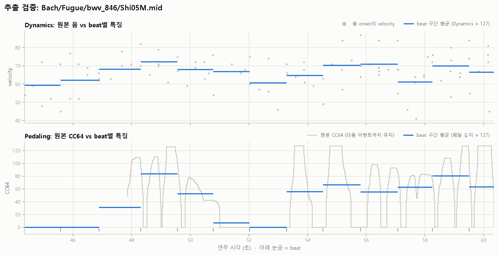
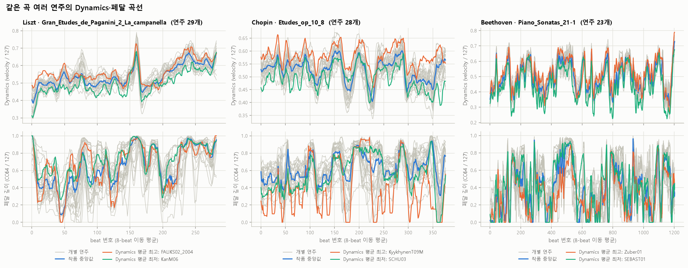
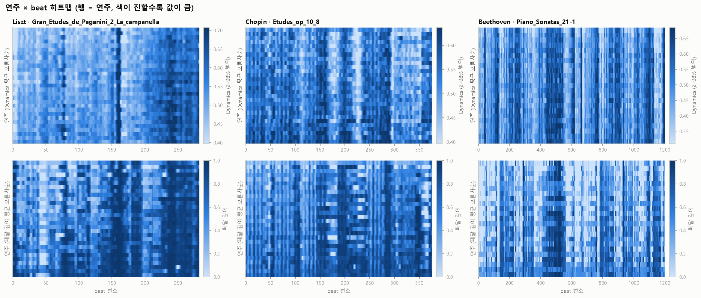
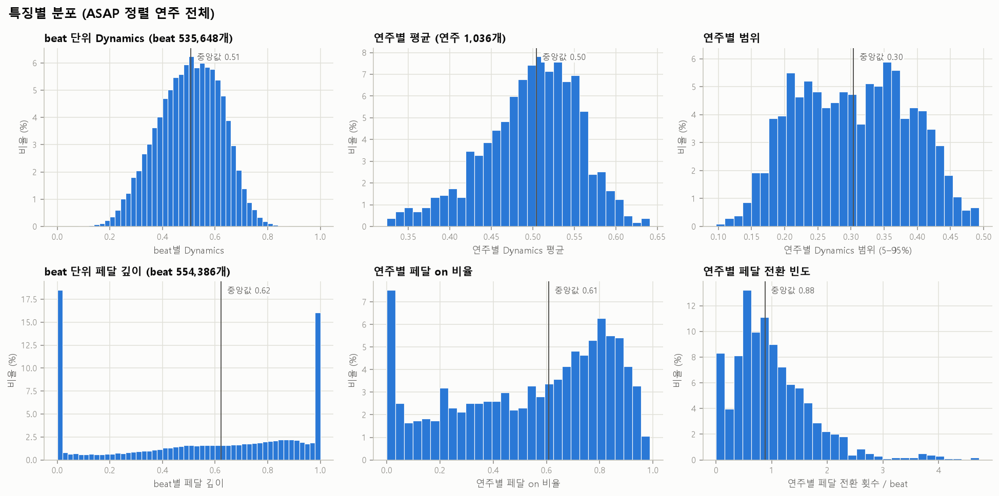
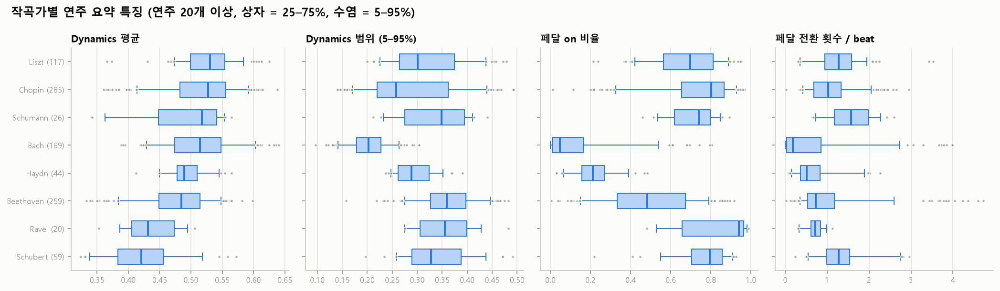
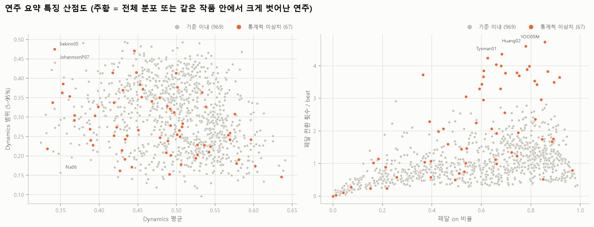
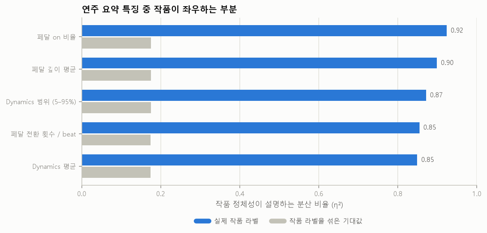

# Dynamics · Pedaling 특징 검증 (ASAP)

`preprocessing.features`의 Dynamics·Pedaling 추출기를 ASAP의 정렬된 연주 전체에 적용해 검증한 결과다. 특징 정의와 시간축 규칙은 `src/preprocessing/features/README.md`에 있다.

- 대상: `aligned=True`인 연주 **1,036개**, 작품 **234개**(ASAP 폴더 기준), beat 구간 **554,386개**
- 수치의 원본은 `stats.json`, 연주별 값은 `performance_summary.csv`, 이상치 목록은 `outliers.csv`다.

## 결론

1. **추출은 정확하다.** 다른 방식으로 다시 계산한 값과 일치한다(Dynamics 3e-8, 페달 깊이 2.7e-4 이하).
2. **같은 곡의 여러 연주에서 두 특징이 서로 다르게 나온다.** 곡의 큰 윤곽은 공유하지만 수준과 세부 모양이 연주마다 다르다. 페달이 Dynamics보다 연주 간 차이가 크다.
3. **요약 특징은 대부분 작품이 정한다.** 연주별 요약값 분산의 85~92%가 작품 정체성으로 설명된다. 절대값 그대로 임베딩에 넣으면 작품을 구분하게 될 위험이 크므로 **작품 기준 정규화가 필수**다.
4. **이상치는 대부분 오류가 아니다.** 페달을 거의 쓰지 않는 Bach 연주와, beat가 긴 느린 곡에서 값이 커지는 지표의 성질이 주된 원인이다. Dynamics는 이상치가 사실상 없다.

## 1. 추출 정확성

특징 추출기와 다른 방식(파이썬 루프, 0.1ms 간격 샘플링)으로 무작위 5곡을 다시 계산해 비교했다.

| 특징 | 최대 절대 오차 | 해석 |
|---|---|---|
| Dynamics | 3e-8 | float32 반올림 수준 |
| 페달 깊이 | 2.7e-4 (폭 50ms 이상 구간) | 샘플링 오차 수준 |



원본 음 velocity와 CC64 위에 beat별 값을 겹친 그림이다. 파란 선이 각 beat 구간의 평균이고, 페달을 두 번 눌렀다 떼고 다시 깊게 밟은 구간(48.3~49.6초)의 평균이 그 시간 가중에 맞게 나온다.

원본 데이터 점검:

- 악기는 전 곡이 1개라 페달 트랙을 합칠 필요가 없다.
- 음 onset의 97.5% 이상(최소 기준)이 beat 범위 안에 있다.
- 페달 값은 ASAP 전체 연주 1,067개 중 1,045개가 20종 이상의 연속값이라 하프 페달이 실제로 기록되어 있다. 깊이(0~1)를 그대로 쓴 이유다.
- beat 구간 중 음이 시작하지 않아 Dynamics가 비는 구간은 3.4%(연주별 최대 26.7%)다.
- velocity 10 이하 음은 어떤 연주에서도 1.9%를 넘지 않는다.

## 2. 같은 곡 여러 연주

연주가 많은 작품 3곡(작곡가가 겹치지 않게 선택)의 곡선이다. 회색이 개별 연주, 파란 선이 작품 중앙값, 주황·청록이 Dynamics 평균이 가장 높은/낮은 연주다.





연주 5개 이상인 작품 71개(중앙값 8개)로 정량화하면:

| | Dynamics | 페달 깊이 |
|---|---|---|
| 연주 간 곡선 상관 (beat별, 중앙값) | 0.72 | 0.55 |
| 8-beat 이동 평균 후 | 0.83 | 0.65 |
| 같은 작품 안 연주별 평균의 표준편차 | 0.019 | 0.074 |
| (참고) 전체 연주별 평균의 표준편차 | 0.058 | 0.262 |

- 연주들은 곡의 윤곽을 크게 공유한다. Dynamics는 특히 그렇다(상관 0.72). beat 평균 velocity에는 악보가 정한 부분(화음, 음역)이 크게 섞여 있다는 뜻이다.
- 그래도 연주 사이에는 분명한 차이가 있다. 같은 작품 안에서도 평균 수준이 다르고(주황 vs 청록), 페달은 상관이 더 낮아 연주자별 개성이 더 크게 드러난다.
- **이 결과만으로는 "해석 차이"라고 단정할 수 없다.** 수준 차이가 해석인지 녹음 조건이나 피아노 상태인지는 구분하지 못했다.

## 3. 분포



| 요약 특징 | 중앙값 | 사분위 범위 |
|---|---|---|
| Dynamics 평균 | 0.50 | 0.46–0.54 |
| Dynamics 범위 (5–95%) | 0.30 | 0.23–0.37 |
| 페달 깊이 평균 | 0.57 | 0.33–0.74 |
| 페달 on 비율 | 0.61 | 0.30–0.80 |
| 페달 전환 횟수 / beat | 0.88 | 0.52–1.36 |

- beat 단위 페달 깊이는 0과 1에 크게 몰린다(각각 약 18%, 16%). 하프 페달은 그 사이를 넓게 채운다.
- 페달 on 비율은 0 근처에 따로 봉우리가 있다. 페달을 거의 쓰지 않은 연주들이다(아래 이상치 절 참고).



작곡가에 따라 분포가 뚜렷이 다르다. Bach는 Dynamics 범위와 페달 사용이 모두 낮고, Ravel은 페달 on 비율이 가장 높다.

## 4. 이상치 점검

규칙 기반과 통계 기반을 나눠 점검했다. 규칙은 데이터 문제를, 통계는 분포에서 벗어난 연주를 찾는다.

| 점검 | 기준 | 연주 수 |
|---|---|---|
| 페달 이벤트 없음 | CC64 이벤트 0개 | 13 |
| 이진에 가까운 페달 | 서로 다른 값 5종 이하 | 3 |
| 너무 짧은 beat | 중앙값의 5% 미만인 beat 간격 존재 | 46 |
| 너무 긴 beat | 중앙값의 20배 초과인 beat 간격 존재 | 15 |
| 빈 beat 과다 | 음이 없는 beat 30% 초과 | 0 |
| 전체 분포 이상치 | 요약 특징의 robust z 3.5 초과 | 25 |
| 작품 내 이상치 | 같은 작품 중앙값 대비 robust z 4 초과 (연주 4개 이상 작품) | 45 |

전체 분포와 작품 내 기준을 합친 통계적 이상치는 67개(6.5%)이고, 규칙까지 합쳐 하나 이상 걸린 연주는 141개다.



성격 분석:

- **Dynamics는 이상치가 사실상 없다.** 전체 분포 이상치는 0개이고, 작품 내 기준으로도 4개 이하다.
- **페달 이벤트가 없는 연주(13개)와 이진에 가까운 연주(3개)는 모두 Bach다.** 오류가 아니라 페달을 쓰지 않은 연주로 보고 0으로 처리한다. 페달 on 비율이 5% 미만인 연주는 93개이고 그중 86개가 Bach다.
- **전체 분포 이상치 25개는 전부 `pedal_change_rate`이고, 이는 beat 길이의 영향이다.** 이 값은 beat 길이와 상관이 높고(ρ = 0.54), 이상치의 84%가 beat 중앙값 1.5초 초과인 느린 곡이다(전체에서는 5%). 같은 작품 안에서는 이 상관이 약하다(ρ = 0.12).
- 통계적 이상치 67개 중 beat 간격 이상과 겹치는 것은 없다.
- 연주자 ID(파일명에서 끝의 숫자를 뗀 값)로 묶으면 3번 이상 걸린 경우는 `Huang` 하나(17개 중 4개)뿐이다. 동명이인이 섞였을 수 있어 연주자별 경향으로 보지는 않는다.

## 5. 작품이 좌우하는 정도



연주별 요약값의 분산 중 작품 정체성이 설명하는 비율(η²)이다. 회색은 작품 라벨을 무작위로 섞었을 때의 기대값으로, 작품 수가 많아서 생기는 우연한 설명력이다.

| 요약 특징 | 실제 | 라벨을 섞은 기대값 |
|---|---|---|
| 페달 on 비율 | 0.92 | 0.18 |
| 페달 깊이 평균 | 0.90 | 0.18 |
| Dynamics 범위 | 0.87 | 0.18 |
| 페달 전환 횟수 / beat | 0.85 | 0.17 |
| Dynamics 평균 | 0.85 | 0.17 |

우연 기대값을 빼도 0.8 이상이다. 절대값을 그대로 쓰면 임베딩이 해석이 아니라 작품을 학습할 가능성이 높다.

## 6. 다음 결정에 필요한 사항

- **정규화**: 작품별 z-score나 같은 작품 후보 안의 percentile처럼 작품 기준으로 상대화하는 방식이 필요하다. 이 결과는 그 선택을 뒷받침하지만, 어떤 방식이 좋은지는 아직 비교하지 않았다. 추론 시 새 작품에는 같은 작품의 다른 연주가 없을 수 있으므로 후보 집합 안에서 계산 가능한지도 함께 봐야 한다.
- **`pedal_change_rate`**: 작품 사이 비교에는 쓰지 말고 작품 내 비교나 작품별 정규화 후에 쓴다.
- **Dynamics의 악보 성분**: beat 평균 velocity에는 악보 구조가 섞인다. 악보 대비 Dynamics는 note 단위 정렬이 필요해서 시도하지 않았다.
- **beat 구간 규칙**: T = beat 수 - 1이다. Tempo·Rubato와 `T × 5`로 합치기 전에 팀원의 구간 규칙과 맞는지 확인해야 한다.
- **처리하지 않은 것**: 정렬되지 않은 연주 31개는 beat를 인덱스로 짝지을 수 없어 제외했다. 페달 이벤트가 없는 연주는 0으로 처리했고 별도 표시(`mask`)는 하지 않았다.

## 재현

`classicfy-ai` 디렉터리에서 실행한다. matplotlib과 pandas가 필요하다(matplotlib은 `requirements.txt`에 없다).

```bash
PYTHONPATH=src python scripts/validate_dynamics_pedaling.py \
    --asap-root /path/to/ASAP --out reports/dynamics_pedaling --cache /tmp/collected.pkl
```

MIDI 1,036개를 읽는 데 몇 분이 걸린다. `--cache`를 주면 다음 실행부터 그림과 표만 다시 만든다.

### 곡을 골라 그리기

`01`, `02`번 그림은 기본으로 연주가 가장 많은 작품 3곡(작곡가가 겹치지 않게)을 쓴다. 다른 곡으로 그리려면 `--works`를 준다. 작품 이름은 ASAP 폴더 경로이고, `--list-works`로 정렬된 연주가 2개 이상인 작품(171개)과 연주 수를 볼 수 있다.

```bash
python scripts/validate_dynamics_pedaling.py --asap-root /path/to/ASAP --list-works
python scripts/validate_dynamics_pedaling.py --asap-root /path/to/ASAP \
    --works Chopin/Etudes_op_10/1 Liszt/Gran_Etudes_de_Paganini/2_La_campanella --out reports/custom
```

- 고른 작품의 연주만 읽어서 수십 초면 끝나고, 그림은 `01_same_work_curves_custom.png`, `02_same_work_heatmaps_custom.png`로 저장한다.
- 다른 그림과 표는 다시 만들지 않는다. 기본 리포트를 덮어쓰지 않도록 `--out`을 따로 주는 것을 권한다.
- 작품 이름을 잘못 쓰면 비슷한 이름을 알려 준다.

## 파일

| 파일 | 내용 |
|---|---|
| `01_same_work_curves.png` | 같은 곡 여러 연주의 Dynamics·페달 곡선 |
| `02_same_work_heatmaps.png` | 같은 곡 연주 × beat 히트맵 |
| `03_distributions.png` | beat 단위와 연주별 요약 분포 |
| `04_by_composer.png` | 작곡가별 요약 특징 |
| `05_work_vs_performance_variance.png` | 작품 정체성이 설명하는 분산 |
| `06_outliers.png` | 이상치 산점도 |
| `07_extraction_check.png` | 원본과 추출값 겹쳐 보기 |
| `performance_summary.csv` | 연주별 요약 특징, 원본 통계, 점검 결과 (모든 그림의 표 버전) |
| `outliers.csv` | 하나 이상 걸린 연주 목록 |
| `same_work_consistency.csv` | 작품별 연주 간 곡선 상관과 수준 차이 |
| `stats.json` | 이 문서의 수치 원본 |
